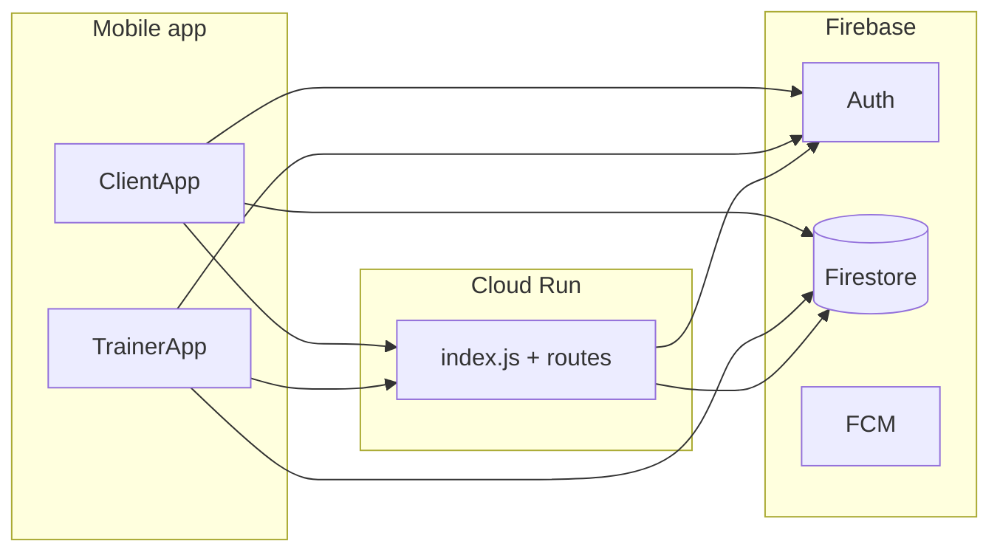

# Coach Connect — Architecture

Expo SDK 54 client + Node.js API on Google Cloud Run, backed by Firebase project **`anatrox-auth`** (do not rename in config).

## System diagram



## Folder map

| Area | Path | Role |
|------|------|------|
| App shells | `src/app/ClientApp.js`, `TrainerApp.js` | Auth role UI, shell context, React Navigation root |
| Client home | `src/client/` | Dashboard, hooks, navigation overlays |
| Trainer CRM | `src/trainer/` | Roster, client detail, navigation overlays |
| Daily metrics | `src/shared/daily-metrics/saveDailyMetricsToFirestore.js` | Canonical writes to `users/{uid}/dailyLogs/{date}` |
| AI coach | `src/ai/`, `server/routes/aiCoachRoutes.js` | Tools, web search, bearer-auth API |
| Food API | `server/routes/foodRoutes.js` | Search, barcode, restaurant nutrition |
| Navigation | `src/navigation/` | Route names, `navigationRef`, linking stubs |

## Daily data flow

1. **Client “today”** uses device local date (`getClientDateKey` / `getLocalDateKey`).
2. **Writes** go through `mergeClientDailyMetrics` / dashboard save helpers → `dailyLogs` only from app code; `daily_tracking` is mirrored inside the service for legacy reads.
3. **Reads** prefer `dailyLogs`, then `daily_tracking` via `parseDailyMetricsFromSnapshots` (`dailyMetricsParse.cjs`).
4. **Midnight rollover** archives prior day via `dailyDashboardDayRollover.js` → `daily_logs/{uid}_{date}`.

## Trainer ↔ client data

| Concept | Canonical path | Legacy fallback |
|---------|----------------|-----------------|
| CRM client row | `trainer_clients/{trainerId}/clients/{clientId}` | `clients/{clientId}` |
| Progress / tasks / notes | Subcollections under canonical client doc | Same subcollections under legacy `clients/{id}` |

Helpers: `src/trainer/lib/trainerClientFirestorePaths.js`. See `docs/FIRESTORE_PATHS.md`.

## AI tool flow

1. Mobile sends authenticated request to `/api/ask` (and related routes).
2. Server loads weekly/daily context, may call DeepSeek / Perplexity / Serper per routing modules.
3. Tool calls parsed server-side; dashboard mutations use `mergeUserDailyMetrics` on the server.

## Tests

```bash
npm run test:quality    # metrics + coach routing + audit fixes + core a11y
npm run test:ci         # test:quality + eslint
npm run test:security   # skips emulator if Java missing
```

Product quality checklist (scalability, performance, a11y): **`docs/PRODUCT_QUALITY.md`**
