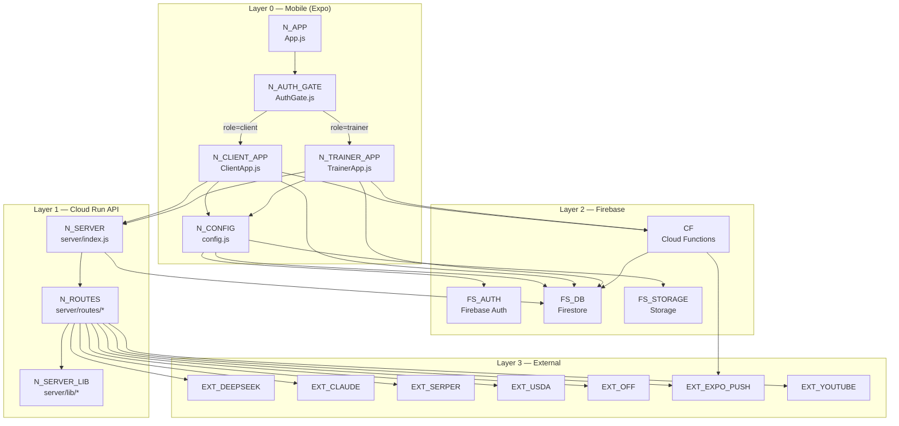
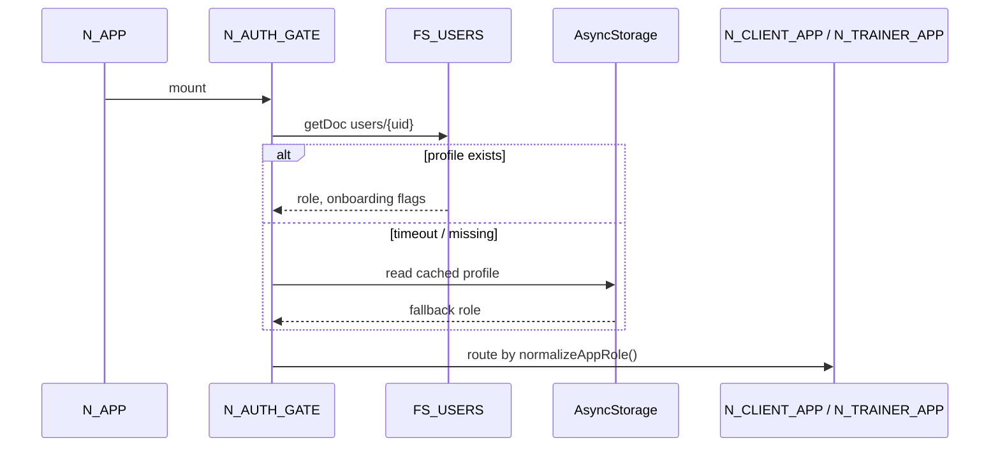
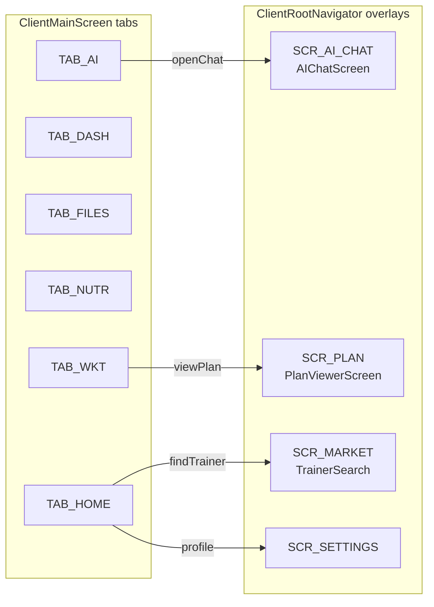
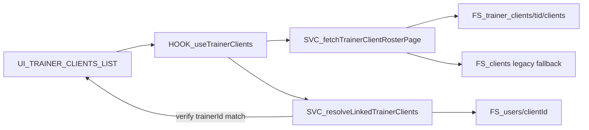
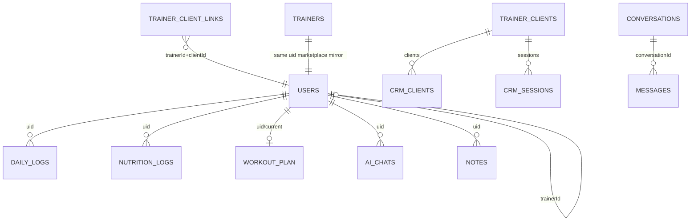
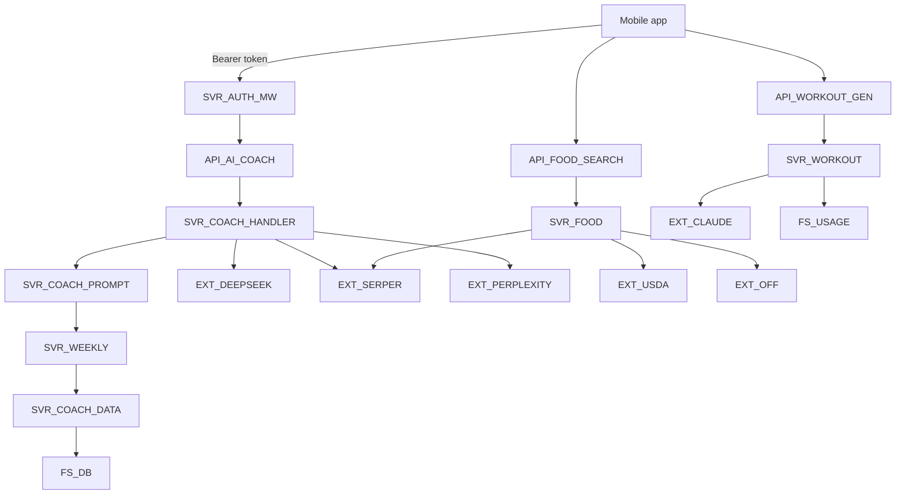

# Coach Connect — Complete Architecture Map (Visual + Every File)

> **Firebase project:** `anatrox-auth`  
> **361 JS/JSX source files** · **927 local import edges** · importance tiers on every file  
> **Stack:** Expo SDK 54 · React Native · Express on Cloud Run · Firestore · Cloud Functions

## Document structure

| Part | Content | Use for |
|------|---------|---------|
| **A — System map (§1–14)** | Layers, navigation, Firestore ERD, API map, feature pipelines | Claude visual diagrams |
| **B — File catalog (§15)** | Every file: imports →, used by ←, ⭐ importance | Trace wiring & blast radius |
| **C — Config & scripts (§16)** | Rules, indexes, docs, scripts | Ops & deployment |

## Importance legend (Part B)

| Icon | Tier | Meaning |
|------|------|---------|
| 🔴 | CRITICAL | Auth, core data path, AI, food, workouts, or API entry — app or feature dead without it |
| 🟠 | HIGH | Major shell, shared service, or route — large blast radius |
| 🟡 | MEDIUM | Single screen/flow — localized breakage |
| ⚪ | LOW | Tests, dev tools, rarely imported utils |

---

## How to use this for visual mapping

Each section uses **stable node IDs** like `N_CLIENT_APP` or `FS_USERS`. When drawing:

| Visual layer | Suggested color | Node prefix |
|--------------|-----------------|-------------|
| Mobile UI | Blue | `UI_*`, `SCR_*` |
| App shell / routing | Purple | `N_*` |
| Client services | Teal | `SVC_*` |
| Server routes | Orange | `API_*` |
| Firestore | Green | `FS_*` |
| External APIs | Red | `EXT_*` |
| Cloud Functions | Yellow | `CF_*` |

**Edge labels** in tables use verbs: `reads`, `writes`, `listens`, `calls`, `routes-to`.

---

## 1. Top-level system (Layer 0)



---

## 2. App boot sequence (Layer 1 — time-ordered)

Connect these nodes **left-to-right** for a timeline diagram.

| Step | Node ID | File | What happens |
|------|---------|------|--------------|
| 1 | `N_EXPO_ENTRY` | `node_modules/expo/AppEntry.js` | Expo loads root component |
| 2 | `N_APP` | `App.js` | `initMonitoring()`, font load, `configureNotifications()` |
| 3 | `N_THEME` | `src/shared/ui/ThemeContext.js` | Theme provider wraps tree |
| 4 | `N_AI_CTX` | `src/contexts/AIContext.js` | AI context provider |
| 5 | `N_AUTH_GATE` | `src/app/AuthGate.js` | Auth listener + profile bootstrap |
| 6a | `N_AUTH_SCREEN` | `src/auth/AuthScreen.js` | If logged out |
| 6b | `N_ONBOARDING` | `src/auth/OnboardingScreen.js` | If onboarding incomplete |
| 7a | `N_CLIENT_APP` | `src/app/ClientApp.js` | Client shell |
| 7b | `N_TRAINER_APP` | `src/app/TrainerApp.js` | Trainer shell |

**Blocking gates (spinner):**
- `N_APP`: `!fontsLoaded`
- `N_AUTH_GATE`: `!keyLoaded || !onboardingChecked`

**Auth bootstrap cascade (inside `N_AUTH_GATE`):**
```
FS_USERS read (7s timeout)
  → retry FS_USERS
    → AsyncStorage auth_profile_{uid}
      → default role=client
```



---

## 3. Client app navigation graph (Layer 2)

### 3.1 Shell hierarchy

```
N_CLIENT_APP (ClientApp.js)
  └── UI_CLIENT_ROOT_NAV (ClientRootNavigator.jsx)
        ├── UI_CLIENT_MAIN (ClientMainScreen.jsx)  ← bottom tabs live here
        └── overlay stack screens (clientOverlayScreens.jsx)
```

### 3.2 Client bottom tabs (`CLIENT_MAIN_TABS`)

| Tab ID | UI node | Primary screen / component | Key services |
|--------|---------|---------------------------|--------------|
| `TAB_HOME` | `ClientMainScreen` home section | Hero, stats, trainer card, sessions | `useClientHomeBootstrap`, `useClientHomeDailyMetrics` |
| `TAB_DASHBOARD` | `MyDashboardScreen.jsx` | Wellness cards, workout log | `dailyMetricsService`, `onSnapshot dailyLogs` |
| `TAB_FILES` | `ClientFilesScreen.jsx` | Notes & files | `notesAndFilesService` |
| `TAB_NUTRITION` | `NutritionContainer.jsx` | Macro tracker, food log | `nutritionService`, `foodSearchProvider` |
| `TAB_WORKOUT` | `workout.js` | Plan generator + active workout | `workoutService`, API `/api/workout/generate` |
| `TAB_AI` | `AIChatHomeScreen.jsx` | AI Coach home | `deepseekService` → `/api/ai-coach` |

### 3.3 Client overlay routes (`CLIENT_ROUTES` → `ClientRootNavigator`)

| Route constant | Screen wrapper | Underlying feature |
|----------------|----------------|-------------------|
| `ClientAIChat` | `ClientAIChatScreen` | `AIChatScreen.jsx` — full chat + tool modals |
| `ClientNutrition` | `ClientNutritionScreen` | Full-screen nutrition |
| `ClientWorkoutPlan` | `ClientWorkoutPlanScreen` | Workout plan UI |
| `ClientPlanViewer` | `ClientPlanViewerScreen` | `PlanViewerScreen.jsx` |
| `ClientTrainerSearch` | `ClientTrainerSearchScreen` | Marketplace find trainer |
| `ClientTrainerProfile` | `ClientTrainerProfileScreen` | Trainer public profile |
| `ClientAIWorkouts` | `ClientAIWorkoutsScreen` | AI workout entry |
| `ClientWeeklyReport` | `ClientWeeklyReportScreen` | Weekly summary view |
| `ClientProfile` / `ClientSettings` | Settings stack | Account, privacy, support |



### 3.4 ClientApp realtime listeners (connect to Firestore)

| Listener ID | File:line area | Firestore query | Drives UI |
|-------------|----------------|-----------------|-----------|
| `L_TRAINER_LINK` | `ClientApp.js` ~487 | `trainer_client_links` where `clientId==uid` | Trainer card, session invites |
| `L_NOTES_FILES` | `ClientApp.js` ~714 | `users/{uid}/notes_and_files` | Files tab freshness |
| `L_PENDING_SESSIONS` | `ClientApp.js` ~761 | `trainer_clients/{tid}/sessions` | Session accept/decline |
| `L_DAILY_LOGS` | `useClientHomeDailyMetrics.js` | `users/{uid}/dailyLogs/{today}` | Home stats |
| `L_AI_CHAT_LIST` | `AIChatHomeScreen.jsx` ~1082 | `users/{uid}/aiChats` | Chat history sidebar |
| `L_NUTRITION` | `NutritionContainer.jsx` ~114 | nutrition logs subcollection | Macro rings |
| `L_MESSAGES` | `trainerMessaging.js` | `conversations`, `messages` | Trainer messaging |

---

## 4. Trainer app navigation graph (Layer 2)

### 4.1 Shell hierarchy

```
N_TRAINER_APP (TrainerApp.js)
  └── UI_TRAINER_ROOT_NAV (TrainerRootNavigator.jsx)
        ├── UI_TRAINER_MAIN (TrainerMainScreen.jsx)
        └── overlay stack (trainerOverlayScreens.jsx)
```

### 4.2 Trainer main views (boolean flags in TrainerAppShellContext)

| View flag | Screen | Purpose |
|-----------|--------|---------|
| default | `TrainerDashboardContent.jsx` | Home dashboard, selected client preview |
| `showClientsList` | `TrainerClientsListScreen.jsx` | Paginated roster |
| `showClientDetail` | `TrainerClientDetailScreen.jsx` | Single client CRM |
| `showTrainerMessaging` | `TrainerMessagingScreen.js` | 1:1 chat |
| `showConversationsList` | `ConversationsListScreen.js` | Inbox |
| `showClientRequests` | `ClientRequestsScreen.js` | Pending marketplace requests |
| `showWorkoutGenerator` | `workout.js` | Generate plan for client |
| `showAIWorkouts` | `AIWorkoutPlansScreen.js` | Client workout library |
| `showPhotoGallery` | `PhotoGalleryScreen.js` | Progress photos |

### 4.3 Trainer data flow for roster



| Node | File |
|------|------|
| `HOOK_useTrainerClients` | `src/trainer/hooks/useTrainerClients.js` |
| `SVC_fetchTrainerClientRosterPage` | `src/trainer/lib/trainerClientFirestorePaths.js` |
| `SVC_resolveLinkedTrainerClients` | `src/trainer/lib/resolveLinkedTrainerClients.js` |

---

## 5. Firestore entity graph (Layer 3 — data model)

**Canonical reference:** `docs/FIRESTORE_PATHS.md`

### 5.1 Core entities (nodes)

| Node ID | Path pattern | Primary fields | Written by |
|---------|--------------|----------------|------------|
| `FS_USERS` | `users/{uid}` | `role`, `trainerId`, macros, `inviteCode`, push tokens | Onboarding, AuthGate cache, profile screens |
| `FS_DAILY_LOGS` | `users/{uid}/dailyLogs/{YYYY-MM-DD}` | water, steps, mood, workout summary | `dailyMetricsService.js` |
| `FS_DAILY_TRACKING` | `users/{uid}/daily_tracking/{date}` | legacy mirror | auto-mirror on write |
| `FS_NUTRITION_LOGS` | `users/{uid}/nutrition_logs/*` | meals, macros | Nutrition screens, AI tools |
| `FS_WORKOUT_PLAN` | `users/{uid}/workoutPlan/current` | `structuredPlan`, `rawPlan` | `workoutService.setCurrentWorkoutPlan` |
| `FS_WORKOUT_PLANS` | `users/{uid}/workoutPlans/{id}` | plan library | `saveGeneratedPlanToCollection` |
| `FS_COMPLETED` | `users/{uid}/completedWorkouts/*` | session history | Active workout screen |
| `FS_AI_CHATS` | `users/{uid}/aiChats/{sessionId}` | `messages[]` | `AIChatScreen.jsx` |
| `FS_NOTES` | `users/{uid}/notes_and_files/*` | files, trainer shares | `notesAndFilesService.js` |
| `FS_TRAINERS` | `trainers/{uid}` | marketplace public profile | `onboardingRoutes` complete |
| `FS_CRM_CLIENT` | `trainer_clients/{tid}/clients/{cid}` | roster row | accept link, onboarding |
| `FS_CRM_SESSIONS` | `trainer_clients/{tid}/sessions/{sid}` | scheduling | `scheduleService.js` |
| `FS_LINK` | `trainer_client_links/{tid}_{cid}` | flat join index | accept, Cloud Function |
| `FS_CONVERSATIONS` | `conversations/{id}` | trainer-client threads | `conversationService.js` |
| `FS_MESSAGES` | `messages/{id}` | chat messages | `trainerMessaging.js` |
| `FS_CLIENTS_LEGACY` | `clients/{cid}` | old CRM | read fallback only |
| `FS_USAGE` | `users/{uid}/usage/workout_generations` | monthly AI workout count | server `workoutGenerationLimit.js` |

### 5.2 Relationship edges (draw as labeled arrows)

| From | To | Cardinality | Link field | Notes |
|------|-----|-------------|------------|-------|
| `FS_USERS` (client) | `FS_USERS` (trainer) | N:1 | `users.trainerId` | Denormalized; may drift |
| `FS_CRM_CLIENT` | `FS_USERS` (client) | 1:1 | doc id = client uid | Canonical roster |
| `FS_LINK` | `FS_CRM_CLIENT` | 1:1 | composite id | Enables client-side listener |
| `FS_CRM_SESSIONS` | `FS_USERS` (client) | N:1 | `clientId` | Session invites |
| `FS_CONVERSATIONS` | both users | N:M | participant ids | Messaging |
| `FS_DAILY_LOGS` | calendar day | 1:1 per day | doc id = date key | Device local date |
| `FS_AI_CHATS` | `FS_USERS` | N:1 | parent uid | Chat history |



### 5.3 Trainer–client link write paths (3 writers — common drift point)

| Trigger | Writes `users.trainerId` | Writes `FS_CRM_CLIENT` | Writes `FS_LINK` |
|---------|--------------------------|------------------------|------------------|
| Onboarding + trainer code | via merge in onboardingData | `POST /api/onboarding/complete` | same |
| Marketplace accept | sometimes | `TrainerMarketplaceModal.js` | same |
| Cloud Function `linkClientWithTrainerCode` | **No** | Yes | Yes |
| ClientApp reconcile listener | Yes (mirror) | No | reads only |

---

## 6. Cloud Run API map (Layer 4)

**Base URL:** `EXPO_PUBLIC_API_BASE_URL` (default Cloud Run production URL in `app.config.js`)  
**Auth:** `Authorization: Bearer {Firebase ID token}` via `server/middleware/auth.js`

### 6.1 Route registry

| API node | Method | Route file | Mobile caller(s) |
|----------|--------|------------|------------------|
| `API_HEALTH` | GET | `/health`, `/api/health` | deploy scripts |
| `API_ME` | GET | `/api/me` | `AuthGate.js` (dead path after early return) |
| `API_WEEKLY_CTX` | GET | `/api/weekly-context/:userId` | AI context clients |
| `API_AI_COACH` | POST | `/api/ai-coach` | `deepseekService.js` |
| `API_AI_COACH_WEB` | POST | `/api/ai-coach/web-search` | web search routing |
| `API_AI_TOOL` | POST | `/api/ai-coach/execute-tool` | `toolExecutor.js` |
| `API_AI_RESET` | POST | `/api/ai-coach/reset-usage` | dev / test suite |
| `API_ASK` | POST | `/api/ask` | legacy `askServer.js` (not main coach path) |
| `API_WORKOUT_GEN` | POST | `/api/workout/generate` | `workout.js` |
| `API_FOOD_SEARCH` | GET | `/api/food/search` | `foodSearchProvider.js` |
| `API_FOOD_BARCODE` | POST | `/api/food/barcode` | barcode scanner |
| `API_FOOD_USDA` | POST | `/api/food/usda` | direct USDA |
| `API_NUTRITION_REST` | POST | `/api/nutrition/restaurant` | restaurant nutrition |
| `API_ONBOARD_CHECK` | POST | `/api/onboarding/check-invite-code` | onboarding |
| `API_ONBOARD_VALIDATE` | POST | `/api/onboarding/validate-trainer-code` | onboarding |
| `API_ONBOARD_COMPLETE` | POST | `/api/onboarding/complete` | onboarding sync |
| `API_NOTIFY_SEND` | POST | `/api/notifications/send` | `pushNotifyApi.js`, messaging |
| `API_MACRO_RECAL` | POST | `/api/macro-recalibration` | macro recalibration |
| `API_FATIGUE` | GET | `/api/fatigue/:userId` | optional coach context |
| `API_YOUTUBE` | GET | `/api/youtube/search` | exercise videos |
| `API_TRAINERS` | GET/POST/PUT/DELETE | `/api/trainers*` | marketplace (server-side) |
| `API_SUPPORT` | POST | `/api/support/contact` | settings support |
| `API_LOG_ERROR` | POST | `/api/log-error`, `/api/sync-errors` | `errorSyncService` |

### 6.2 Server internal pipeline nodes

| Node ID | File | Role |
|---------|------|------|
| `SVR_AUTH_MW` | `server/middleware/auth.js` | Verify Firebase ID token |
| `SVR_WEEKLY` | `server/getWeeklyContext.js` | Aggregate 7-day user data |
| `SVR_COACH_DATA` | `server/lib/coachWeeklyData.js` | Nutrition/workout/sleep aggregation |
| `SVR_COACH_PROMPT` | `server/index.js` `buildCoachPromptForUser` | System prompt assembly |
| `SVR_COACH_HANDLER` | `server/index.js` `handleAICoachRequest` | Main AI coach orchestrator |
| `SVR_FOOD` | `server/routes/foodRoutes.js` | USDA → OFF → Serper pipeline |
| `SVR_WORKOUT` | `server/routes/workoutRoutes.js` | Claude plan generation |
| `SVR_INIT_FB` | `server/lib/initFirebaseAdmin.js` | Admin SDK bootstrap |



---

## 7. Feature pipelines (connect end-to-end)

### 7.1 AI Coach message pipeline

| # | Node | Action |
|---|------|--------|
| 1 | `UI_AI_CHAT` (`AIChatScreen.jsx`) | User sends message |
| 2 | `FS_AI_CHATS` | Save user turn immediately |
| 3 | `SVC_DEEPSEEK` (`deepseekService.js`) | `sendCoachMessageWithRetry` |
| 4 | `API_AI_COACH` | POST with messages + profile |
| 5 | `SVR_COACH_HANDLER` | Build prompt, call DeepSeek / web |
| 6 | `SVR_COACH_PROMPT` | Optional weekly context injection |
| 7 | `PARSE_TOOLS` (`parseCoachToolCalls.js`) | Extract tool JSON from reply |
| 8 | `UI_AI_CHAT` | Render AI bubble; open `ToolConfirmationModal` |
| 9 | `SVC_TOOL_EXEC` (`toolExecutor.js`) | User confirms → `API_AI_TOOL` or client fallback |
| 10 | `FS_DAILY_LOGS` / nutrition / etc. | Tool mutates Firestore |

**15 tool modals** in `src/aiChat/toolModals/` map 1:1 to tool names in `parseCoachToolCalls.js`.

### 7.2 Food search pipeline

| # | Node | Action |
|---|------|--------|
| 1 | `UI_FOOD_SEARCH` (`FoodSearchScreen.js`) | User types query |
| 2 | `SVC_NUTRITION` (`nutritionService.searchFoods`) | Unified entry |
| 3 | `SVC_FOOD_PROVIDER` (`foodSearchProvider.js`) | Cache check → API call |
| 4 | `API_FOOD_SEARCH` | Server-side multi-tier search |
| 5 | Rank + dedupe | `foodRoutes.js` scoring, `dedupeFoodRows` |
| 6 | Fallback | Open Food Facts + AsyncStorage cache on failure |
| 7 | `UI_FOOD_SEARCH` | Display results → log to `FS_NUTRITION_LOGS` |

### 7.3 Workout generation pipeline

| # | Node | Action |
|---|------|--------|
| 1 | `UI_WORKOUT` (`workout.js`) | Validate onboarding fields |
| 2 | `API_WORKOUT_GEN` | POST onboardingData |
| 3 | `SVR_WORKOUT` + `EXT_CLAUDE` | Claude generates JSON plan |
| 4 | `UI_WORKOUT` `parseWorkoutPlan` | Validate 7-day schema |
| 5 | AsyncStorage | Local cache `workout_plan_{uid}` |
| 6 | `SVC_WORKOUT` `setCurrentWorkoutPlan` | Write `FS_WORKOUT_PLAN` + `FS_WORKOUT_PLANS/current` |
| 7 | `UI_PLAN_VIEWER` (`PlanViewerScreen.jsx`) | Display structured plan |

### 7.4 Daily metrics pipeline

| # | Node | Action |
|---|------|--------|
| 1 | Dashboard / AI tools / home cards | User logs water, sleep, etc. |
| 2 | `SVC_DAILY` (`dailyMetricsService.js`) | `mergeClientDailyMetrics` |
| 3 | `FS_DAILY_LOGS` | Canonical write |
| 4 | `FS_DAILY_TRACKING` | Legacy mirror (same service) |
| 5 | `useClientHomeDailyMetrics` | `onSnapshot` → home UI |
| 6 | `SVR_COACH_DATA` | Aggregated into AI weekly context |

**Date key rule:** device local date via `getClientDateKey` / `getLocalDateKey` — not UTC.

### 7.5 Trainer messaging pipeline

| # | Node | Action |
|---|------|--------|
| 1 | `UI_MSG` (`TrainerMessagingScreen.js`) | Send message |
| 2 | `SVC_MSG` (`trainerMessaging.js`) | Write `FS_MESSAGES` |
| 3 | `FS_CONVERSATIONS` | Update thread metadata |
| 4 | `API_NOTIFY_SEND` | Push to recipient Expo token |
| 5 | `EXT_EXPO_PUSH` | Deliver notification |

### 7.6 Marketplace / invite pipeline

| # | Node | Action |
|---|------|--------|
| 1 | `UI_MARKET` (`MarketplaceScreen.jsx`) | Browse trainers |
| 2 | `FS_TRAINERS` | Read marketplace docs |
| 3 | Client enters invite code | `API_ONBOARD_VALIDATE` |
| 4 | Accept / onboarding | `API_ONBOARD_COMPLETE` or `CF_linkClientWithTrainerCode` |
| 5 | `FS_LINK` + `FS_CRM_CLIENT` | Link created |
| 6 | `L_TRAINER_LINK` listener | Client home shows trainer |

---

## 8. Cloud Functions (Layer 5)

| CF node | Trigger | File | Connects to |
|---------|---------|------|-------------|
| `CF_LINK_CLIENT` | callable | `linkClientWithTrainerCode` | `FS_CRM_CLIENT`, `FS_LINK` |
| `CF_REMOVE_LINK` | callable | `removeTrainerClientLink` | deletes link + CRM |
| `CF_SESSION_PUSH` | Firestore create | `onTrainerSessionCreated` | `FS_CRM_SESSIONS` → push |
| `CF_WEEKLY_SUMMARY` | schedule | `generateWeeklySummaries` | batch reports |
| `CF_WEEKLY_ONE` | callable | `generateWeeklySummaryForClient` | single client report |
| `CF_DELETE_ACCOUNT` | callable | `deleteAccount` | user cleanup |

---

## 9. Shared cross-cutting services (hub nodes)

Connect feature screens to these **shared hubs** in a “spoke” diagram:

| Hub ID | File | Used by |
|--------|------|---------|
| `HUB_CONFIG` | `src/app/config.js` | auth, db, storage, functions exports |
| `HUB_DAILY` | `src/shared/daily-metrics/saveDailyMetricsToFirestore.js` | Dashboard, home, AI tools |
| `HUB_API_URL` | `src/shared/services/baseUrl.js` | All API callers (retry bases) |
| `HUB_API_AUTH` | `src/shared/services/apiAuthHeaders.js` | Bearer token for API |
| `HUB_NOTIF` | `src/shared/services/notificationsService.js` | Push token persist |
| `HUB_PUSH_SEND` | `src/shared/services/pushNotifyApi.js` | Outbound push |
| `HUB_NOTES` | `src/shared/services/notesAndFilesService.js` | Files tab both roles |
| `HUB_THEME` | `src/shared/ui/ThemeContext.js` + `src/theme/colors.js` | All screens |
| `HUB_NAV` | `src/navigation/navigationRef.js` | Global navigation |
| `HUB_FS_PAGE` | `src/shared/services/firestorePagedQuery.js` | Index fallback queries |
| `HUB_ONBOARD_SYNC` | `src/shared/services/onboardingSync.js` | Offline onboarding flush |

---

## 10. External services & env vars (attach to API nodes)

| Ext node | Env var | Consumed by |
|----------|---------|-------------|
| `EXT_DEEPSEEK` | `DEEPSEEK_API_KEY` | AI Coach, `/api/ask` |
| `EXT_CLAUDE` | `ANTHROPIC_API_KEY` | Workout generation |
| `EXT_SERPER` | `SERPER_API_KEY` | Food search, coach web |
| `EXT_PERPLEXITY` | `PERPLEXITY_API_KEY` | Coach web search fallback |
| `EXT_USDA` | `USDA_API_KEY` | Food search tier 1 |
| `EXT_OFF` | (public API) | Food search tier 2 |
| `EXT_EXPO_PUSH` | — | Push delivery |
| `EXT_YOUTUBE` | `REACT_NATIVE_YOUTUBE_API_KEY` | Exercise videos |
| `EXT_FIREBASE_ADMIN` | `FIREBASE_SERVICE_ACCOUNT` | Server Admin SDK |

**Client env (Expo):** all `EXPO_PUBLIC_FIREBASE_*`, `EXPO_PUBLIC_API_BASE_URL`, Google OAuth client IDs.

---

## 11. src/ folder map (visual tree — unchanged summary)

```
src/
├── app/           N_AUTH_GATE, N_CLIENT_APP, N_TRAINER_APP, N_CONFIG
├── auth/          Login, onboarding wizard
├── client/        Client tabs, dashboard, files, hooks, overlays
├── trainer/       CRM, roster, calendar, messaging, weekly reports
├── nutrition/     Food log, search, barcode, settings
├── workouts/      workout.js (generator), active session, library services
├── ai/            deepseekService, toolExecutor, context, messaging services
├── aiChat/        Chat UI, 15 tool modals, speech hook
├── marketplace/   Find trainers, filters, profile sheets
├── shared/        Theme, daily metrics, notifications, Firestore helpers (74 files)
├── navigation/    Route constants, bottom nav, navigationRef
├── settings/      Legal, support, account screens
├── components/    WheelPicker, SessionCard, calendars
├── profile/       Profile screen
├── theme/         colors.js tokens
└── utils/         error sync, cache cleanup, xlsx
```

---

## 12. Master connection matrix (for graph tools)

Copy into spreadsheet / graph edge importer. Format: `source → target : label`

```
N_APP → N_AUTH_GATE : mounts
N_AUTH_GATE → FS_USERS : reads profile
N_AUTH_GATE → N_CLIENT_APP : routes client
N_AUTH_GATE → N_TRAINER_APP : routes trainer
N_CLIENT_APP → UI_CLIENT_ROOT_NAV : renders
N_TRAINER_APP → UI_TRAINER_ROOT_NAV : renders
UI_CLIENT_MAIN → TAB_AI : tab
TAB_AI → SCR_AI_CHAT : navigate
SCR_AI_CHAT → SVC_DEEPSEEK : sendMessage
SVC_DEEPSEEK → API_AI_COACH : POST
API_AI_COACH → SVR_COACH_HANDLER : handle
SVR_COACH_HANDLER → SVR_COACH_PROMPT : build prompt
SVR_COACH_PROMPT → SVR_WEEKLY : load context
SVR_WEEKLY → FS_DAILY_LOGS : aggregate
SVR_COACH_HANDLER → EXT_DEEPSEEK : LLM call
SCR_AI_CHAT → FS_AI_CHATS : read/write messages
SCR_AI_CHAT → SVC_TOOL_EXEC : confirm tool
SVC_TOOL_EXEC → API_AI_TOOL : execute
SVC_TOOL_EXEC → FS_DAILY_LOGS : client fallback writes
UI_FOOD_SEARCH → SVC_FOOD_PROVIDER : search
SVC_FOOD_PROVIDER → API_FOOD_SEARCH : GET
API_FOOD_SEARCH → EXT_USDA : tier1
API_FOOD_SEARCH → EXT_SERPER : tier3
UI_WORKOUT → API_WORKOUT_GEN : generate
API_WORKOUT_GEN → EXT_CLAUDE : LLM
UI_WORKOUT → SVC_WORKOUT : save plan
SVC_WORKOUT → FS_WORKOUT_PLAN : write
UI_TRAINER_CLIENTS_LIST → HOOK_useTrainerClients : load roster
HOOK_useTrainerClients → FS_CRM_CLIENT : paginate
HOOK_useTrainerClients → FS_USERS : verify link
L_TRAINER_LINK → FS_LINK : listen
L_TRAINER_LINK → FS_USERS : mirror trainerId
UI_MSG → FS_MESSAGES : write
UI_MSG → API_NOTIFY_SEND : push
API_NOTIFY_SEND → EXT_EXPO_PUSH : deliver
N_ONBOARDING → API_ONBOARD_COMPLETE : finish
API_ONBOARD_COMPLETE → FS_USERS : write
API_ONBOARD_COMPLETE → FS_CRM_CLIENT : link trainer
API_ONBOARD_COMPLETE → FS_LINK : link index
CF_LINK_CLIENT → FS_CRM_CLIENT : admin link
HUB_NOTIF → FS_USERS : save expoPushToken
N_CLIENT_APP → HUB_NOTIF : register on launch
```

---

## 13. Suggested visual map layouts for Claude

Ask Claude to produce **separate diagrams** from this doc:

1. **Map A — System context:** Layer 0 diagram (section 1)  
2. **Map B — Auth boot timeline:** Section 2 sequence  
3. **Map C — Client UX map:** Sections 3.2 + 3.3 (tabs + overlays)  
4. **Map D — Trainer UX map:** Section 4.2 views  
5. **Map E — Firestore ERD:** Section 5.2  
6. **Map F — API hub:** Section 6 + external nodes  
7. **Map G — Feature swimlanes:** Section 7 (one swimlane per pipeline)  
8. **Map H — Realtime listeners:** Section 3.4 + trainer detail listeners  
9. **Map I — Hub-and-spoke:** Section 9 shared services  

**Prompt template for Claude:**

> Using ARCHITECTURE_MAP.md, create a [Mermaid/Figma/excalidraw] diagram for Map [X].  
> Use the node IDs exactly as written. Label every edge with the verb from the connection matrix.  
> Group nodes by layer color from the legend.

---

## 14. Quick entry-point index

| You want to… | Start node | File |
|--------------|------------|------|
| App boot | `N_APP` | `App.js` |
| Auth routing | `N_AUTH_GATE` | `src/app/AuthGate.js` |
| Client home | `UI_CLIENT_MAIN` | `src/client/navigation/ClientMainScreen.jsx` |
| Nutrition | `UI_NUTRITION` | `src/nutrition/screens/NutritionContainer.jsx` |
| Workouts | `UI_WORKOUT` | `src/workouts/screens/workout.js` |
| AI coach | `SCR_AI_CHAT` | `src/aiChat/screens/AIChatScreen.jsx` |
| AI API client | `SVC_DEEPSEEK` | `src/ai/chat-api/aiCoachServerService.js` |
| Trainer roster | `UI_TRAINER_CLIENTS_LIST` | `src/trainer/screens/TrainerClientsListScreen.jsx` |
| Firestore paths | — | `docs/FIRESTORE_PATHS.md` |
| API server | `N_SERVER` | `server/index.js` |
| Firestore rules | — | `firestore.rules` |

---

## 15. (see Part B below)

The exhaustive per-file listing (433 files) lives in git history of this doc §5–§5 (previous version). Regenerate with:

```bash
find src server functions docs -type f \( -name '*.js' -o -name '*.jsx' -o -name '*.md' \) | sort
```

For day-to-day navigation, prefer **sections 1–14** above; use `Cmd+F` on node IDs or filenames.

---

*Last expanded for visual mapping — Coach Connect / anatrox-auth*

---

# PART B — Complete file connection catalog

## CRITICAL files (full connection detail)

#### `App.js` (74 lines)
- **Role:** util
- **imports →** `src/shared/ui/ThemeContext.js`, `src/app/AuthGate.js`, `src/shared/services/notificationsService.js`, `src/shared/services/monitoring.js`, `src/contexts/AIContext.js`
- **used by ←** (0) _none_

#### `functions/index.js` (1199 lines)
- **Role:** Firestore, API
- **imports →** `functions/stripNotificationEmoji.js`, `functions/macroRecalibrationFunction.js`
- **used by ←** (0) _none_

#### `server/index.js` (2688 lines)
- **Role:** Firestore, API
- **imports →** `server/getWeeklyContext.js`, `server/lib/serperWebSearch.js`, `server/lib/coachWebSearch.js`, `server/lib/coachPersonalDataRouting.js`, `server/lib/coachVoice.js`, `server/lib/logger.js`, `server/lib/monitoring.js`, `server/lib/inferCoachToolCall.js`, `server/lib/pushNotificationAuth.js`, `server/lib/workoutPlanPrompt.js`, `server/config/apiCosts.js`, `server/pushHelpers.js`, `server/lib/initFirebaseAdmin.js`, `server/lib/macroRecalibration.js`, `server/middleware/auth.js`, `server/routes/healthRoutes.js`, `server/routes/aiCoachRoutes.js`, `server/routes/notificationsRoutes.js`, `server/routes/mediaRoutes.js`, `server/routes/userRoutes.js`, `server/routes/supportRoutes.js`, `server/routes/onboardingRoutes.js`, `server/routes/workoutRoutes.js`, `server/routes/foodRoutes.js`, `server/routes/devRoutes.js`, `server/routes/marketplaceRoutes.js`, `server/lib/dailyMetricsServer.js`, `src/shared/parseCoachToolCalls.js`
- **used by ←** (0) _none_

#### `server/lib/initFirebaseAdmin.js` (135 lines)
- **Role:** server lib
- **imports →** _none_
- **used by ←** (1) `server/index.js`

#### `server/middleware/auth.js` (59 lines)
- **Role:** util
- **imports →** _none_
- **used by ←** (1) `server/index.js`

#### `server/routes/aiCoachRoutes.js` (62 lines)
- **Role:** HTTP route, API
- **imports →** _none_
- **used by ←** (1) `server/index.js`

#### `server/routes/foodRoutes.js` (1281 lines)
- **Role:** HTTP route, Firestore, API
- **imports →** `src/nutrition/utils/nutritionNormalization.js`, `server/utils/restaurantNutrition.js`, `server/lib/serperWebSearch.js`, `server/nutritionSearchHelpers.js`, `src/nutrition/food-details/formatFoodBrand.js`, `src/nutrition/food-search/formatFoodSearchTitle.js`, `src/nutrition/utils/restaurantSerperQuality.js`
- **used by ←** (1) `server/index.js`

#### `server/routes/onboardingRoutes.js` (246 lines)
- **Role:** HTTP route, Firestore, API
- **imports →** _none_
- **used by ←** (1) `server/index.js`

#### `server/routes/workoutRoutes.js` (129 lines)
- **Role:** HTTP route, API
- **imports →** `server/lib/workoutGenerationLimit.js`
- **used by ←** (1) `server/index.js`

#### `src/ai/chat-api/aiCoachServerService.js` (355 lines)
- **Role:** API
- **imports →** `src/app/config.js`, `src/shared/services/baseUrl.js`, `src/ai/context/CoachContextProvider.js`, `src/ai/tools/executeCoachTool.js`, `src/shared/parseCoachToolCalls.js`, `src/ai/context/gatherCoachContextFromUser.js`
- **used by ←** (2) `src/aiChat/AICoachTestSuite.jsx`, `src/aiChat/screens/AIChatScreen.jsx`

#### `src/ai/tools/executeCoachTool.js` (625 lines)
- **Role:** Firestore, API
- **imports →** `src/app/config.js`, `src/app/dateKey.js`, `src/shared/daily-metrics/saveDailyMetricsToFirestore.js`, `src/shared/services/baseUrl.js`, `src/nutrition/daily-log/logFoodToFirestore.js`
- **used by ←** (5) `src/ai/chat-api/aiCoachServerService.js`, `src/ai/tools/parseUserMessageForTools.js`, `src/aiChat/AICoachTestSuite.jsx`, `src/aiChat/components/ToolConfirmationModal.jsx`, `src/aiChat/screens/AIChatScreen.jsx`

#### `src/aiChat/screens/AIChatScreen.jsx` (1778 lines)
- **Role:** screen, Firestore
- **imports →** `src/shared/services/logger.js`, `src/app/config.js`, `src/shared/components/CoachConnectHeader.js`, `src/navigation/BottomNavBar.js`, `src/navigation/bottomNavMetrics.js`, `src/shared/ui/ThemeContext.js`, `src/ai/context/CoachContextProvider.js`, `src/ai/chat-api/aiCoachServerService.js`, `src/aiChat/components/ToolConfirmationModal.jsx`, `src/ai/tools/executeCoachTool.js`, `src/ai/tools/parseUserMessageForTools.js`, `src/aiChat/hooks/useCoachSpeech.js`, `src/ai/webSearchRouting.js`, `src/shared/accessibility/a11yProps.js`, `src/aiChat/aiCoachUiTokens.js`, `src/aiChat/components/AICoachGlassCard.jsx`, `src/shared/parseCoachToolCalls.js`
- **used by ←** (5) `src/app/ClientApp.js`, `src/app/TrainerApp.js`, `src/client/navigation/ClientMainScreen.jsx`, `src/client/navigation/clientOverlayScreens.jsx`, `src/trainer/navigation/trainerOverlayScreens.jsx`

#### `src/app/AuthGate.js` (631 lines)
- **Role:** Firestore, API
- **imports →** `src/auth/AuthScreen.js`, `src/auth/ForgotPasswordScreen.js`, `src/auth/OnboardingScreen.js`, `src/app/TrainerApp.js`, `src/app/ClientApp.js`, `src/shared/components/AppLoadingScreen.js`, `src/app/config.js`, `src/ai/services/chatStorageService.js`, `src/utils/clearDataOnLogout.js`, `src/shared/services/onboardingSync.js`, `src/shared/services/notificationsService.js`, `src/shared/services/logger.js`
- **used by ←** (1) `App.js`

#### `src/app/ClientApp.js` (1402 lines)
- **Role:** Firestore
- **imports →** `src/shared/ui/BlurBackdropPlate.jsx`, `src/app/config.js`, `src/app/calculations.js`, `src/app/dateKey.js`, `src/shared/utils/getLocalDay.js`, `src/shared/daily-metrics/saveDailyMetricsToFirestore.js`, `src/shared/hooks/useClientHomeDailyMetrics.js`, `src/client/components/home/clientAppStyles.js`, `src/client/components/home/clientHomeComponents.jsx`, `src/client/hooks/useClientHomeBootstrap.js`, `src/client/hooks/useClientHomeNutrition.js`, `src/client/hooks/useClientScreenNavigation.js`, `src/ai/services/conversationService.js`, `src/ai/services/trainerMessaging.js`, `src/aiChat/screens/AIChatHomeScreen.jsx`, `src/aiChat/screens/AIChatScreen.jsx`, `src/aiChat/AICoachTestSuite.jsx`, `src/marketplace/screens/TrainerSearchScreen.js`, `src/client/screens/MyDashboardScreen.jsx`, `src/client/screens/SettingsScreen.js`, `src/settings/screens/HelpFAQScreen.jsx`, `src/settings/screens/TermsOfServiceScreen.jsx`, `src/settings/screens/PrivacyPolicyScreen.jsx`, `src/settings/screens/ContactSupportScreen.jsx`, `src/settings/screens/BugReportScreen.jsx`, `src/navigation/AppNavigationContext.js`, `src/navigation/navigationRef.js`, `src/navigation/routes.js`, `src/navigation/linking.js`, `src/client/navigation/ClientAppShellContext.jsx`, `src/client/navigation/ClientRootNavigator.jsx`, `src/navigation/BottomNavBar.js`, `src/nutrition/daily-log/logFoodToFirestore.js`, `src/nutrition/screens/MealPlanHomeScreen.js`, `src/nutrition/screens/NutritionContainer.jsx`, `src/profile/screens/ProfileScreen.jsx`, `src/shared/components/AddNotesFilesModal.js`, `src/shared/components/AppLoadingScreen.js`, `src/shared/components/CoachConnectHeader.js`, `src/shared/components/DailyQuoteCard.js`, `src/shared/components/DocumentViewerModal.js`, `src/shared/components/EmbedWebViewModal.jsx`, `src/shared/components/FileGalleryGrid.jsx`, `src/shared/components/MediaViewerModal.jsx`, `src/shared/components/PdfViewerModal.js`, `src/shared/components/RemoveTrainerSheet.js`, `src/shared/components/ReviewSubmitSheet.js`, `src/shared/components/SessionMeetingCard.jsx`, `src/shared/components/SpreadsheetViewerModal.js`, `src/shared/components/TrainerSharedFilesModal.jsx`, `src/client/screens/ClientFilesScreen.jsx`, `src/client/components/MarketplaceHeroCard.jsx`, `src/client/components/DashboardHeroCard.jsx`, `src/client/components/FilesNotesHeroCard.jsx`, `src/client/components/files/MyFilesSection.jsx`, `src/client/components/files/TrainerSharedSection.jsx`, `src/client/components/files/NotesFromTrainerSection.jsx`, `src/shared/components/FilesNotesSectionPremium.jsx`, `src/shared/services/notificationsService.js`, `src/shared/services/pushNotifyApi.js`, `src/shared/services/notesAndFilesService.js`, `src/shared/ui/ThemeContext.js`, `src/shared/utils/trainerProfileMedia.js`, `src/shared/utils/notesFileView.js`, `src/trainer/screens/ConversationsListScreen.js`, `src/trainer/screens/PhotoGalleryScreen.js`, `src/trainer/screens/TrainerMessagingScreen.js`, `src/trainer/screens/AIWorkoutPlansScreen.js`, `src/trainer/screens/TrainerWeeklyReportScreen.jsx`, `src/workouts/services/workoutService.js`, `src/workouts/screens/workout.js`, `src/utils/clearDataOnLogout.js`
- **used by ←** (1) `src/app/AuthGate.js`

#### `src/app/TrainerApp.js` (1316 lines)
- **Role:** Firestore
- **imports →** `src/trainer/navigation/TrainerRootNavigator.jsx`, `src/trainer/navigation/TrainerAppShellContext.jsx`, `src/trainer/hooks/useTrainerScreenNavigation.js`, `src/navigation/navigationRef.js`, `src/navigation/linking.js`, `src/shared/ui/BlurBackdropPlate.jsx`, `src/shared/components/DailyQuoteCard.js`, `src/shared/components/HoldToConfirmModal.jsx`, `src/shared/components/CoachConnectHeader.js`, `src/navigation/BottomNavBar.js`, `src/navigation/AppNavigationContext.js`, `src/marketplace/screens/TrainerSearchScreen.js`, `src/trainer/screens/TrainerMessagingScreen.js`, `src/trainer/screens/ConversationsListScreen.js`, `src/aiChat/screens/VoiceAIHomeScreen.jsx`, `src/aiChat/screens/AIChatScreen.jsx`, `src/nutrition/screens/NutritionContainer.jsx`, `src/profile/screens/ProfileScreen.jsx`, `src/client/screens/SettingsScreen.js`, `src/settings/screens/HelpFAQScreen.jsx`, `src/settings/screens/TermsOfServiceScreen.jsx`, `src/settings/screens/PrivacyPolicyScreen.jsx`, `src/settings/screens/ContactSupportScreen.jsx`, `src/settings/screens/BugReportScreen.jsx`, `src/workouts/screens/workout.js`, `src/trainer/screens/ClientRequestsScreen.js`, `src/trainer/screens/SessionSchedulingScreen.jsx`, `src/trainer/screens/SessionFormScreen.jsx`, `src/trainer/hooks/useTrainerClients.js`, `src/trainer/crm/formatClientName.js`, `src/trainer/hooks/useTrainerPendingRequests.js`, `src/shared/services/notificationsService.js`, `src/shared/ui/ThemeContext.js`, `src/app/config.js`, `src/shared/services/latestLoggedWeight.js`, `src/utils/autoLogError.js`, `src/ai/services/trainerMessaging.js`, `src/app/dateKey.js`, `src/shared/utils/getLocalDay.js`, `src/ai/services/conversationService.js`, `src/ai/services/markAllMessagesRead.js`, `src/shared/services/notesAndFilesService.js`, `src/utils/clearDataOnLogout.js`, `src/shared/components/AddNotesFilesModal.js`, `src/shared/components/MediaViewerModal.jsx`, `src/shared/components/EmbedWebViewModal.jsx`, `src/shared/utils/notesFileView.js`, `src/shared/components/PdfViewerModal.js`, `src/shared/components/SpreadsheetViewerModal.js`, `src/trainer/components/documents/DocumentEditorModal.js`, `src/shared/components/QuickActionCard.jsx`, `src/trainer/components/documents/ShareDocumentModal.js`, `src/trainer/components/documents/SpreadsheetEditorModal.js`, `src/shared/components/RemoveTrainerSheet.js`, `src/nutrition/daily-log/logFoodToFirestore.js`, `src/trainer/screens/PhotoGalleryScreen.js`, `src/trainer/screens/AIWorkoutPlansScreen.js`, `src/trainer/screens/ManualWorkoutPlanBuilderScreen.jsx`, `src/shared/components/GradientChatBubblesIcon.jsx`, `src/shared/components/FileGalleryGrid.jsx`, `src/trainer/components/TrainerWeeklyReportSection.jsx`, `src/trainer/screens/TrainerWeeklyReportScreen.jsx`, `src/client/components/FilesNotesHeroCard.jsx`, `src/shared/components/FilesNotesSectionPremium.jsx`, `src/trainer/screens/TrainerProgressTab.jsx`, `src/trainer/screens/TrainerNutritionTab.jsx`, `src/trainer/screens/TrainerCalendarTab.jsx`, `src/trainer/screens/TrainerClientDetailScreen.jsx`, `src/trainer/screens/TrainerClientsListScreen.jsx`, `src/trainer/screens/TrainerDashboardContent.jsx`, `src/trainer/components/dashboard/trainerDashboardUi.jsx`, `src/trainer/lib/trainerFirestoreErrors.js`, `src/trainer/lib/trainerClientFirestorePaths.js`
- **used by ←** (2) `src/app/AuthGate.js`, `src/trainer/services/clientCRMService.js`

#### `src/app/config.js` (157 lines)
- **Role:** Firestore, hub×72
- **imports →** _none_
- **used by ←** (72) `src/ai/context/gatherCoachWeeklyStats.js`, `src/ai/context/CoachContextProvider.js`, `src/ai/chat-api/aiCoachServerService.js`, `src/ai/macro-recalibration/recalculateMacrosFromCoach.js`, `src/ai/services/chatStorageService.js`, `src/ai/services/conversationService.js`, `src/ai/services/markAllMessagesRead.js`, `src/ai/services/trainerMessaging.js`, `src/ai/tools/executeCoachTool.js`, `src/aiChat/screens/AIChatHomeScreen.jsx`

#### `src/client/navigation/ClientMainScreen.jsx` (689 lines)
- **Role:** nav, Firestore
- **imports →** `src/app/config.js`, `src/app/dateKey.js`, `src/shared/daily-metrics/saveDailyMetricsToFirestore.js`, `src/shared/services/notesAndFilesService.js`, `src/trainer/screens/TrainerMessagingScreen.js`, `src/trainer/screens/ConversationsListScreen.js`, `src/client/screens/MyDashboardScreen.jsx`, `src/shared/components/CoachConnectHeader.js`, `src/navigation/BottomNavBar.js`, `src/navigation/AppNavigationContext.js`, `src/client/components/home/clientHomeComponents.jsx`, `src/client/components/FilesNotesHeroCard.jsx`, `src/shared/components/FilesNotesSectionPremium.jsx`, `src/shared/components/SessionMeetingCard.jsx`, `src/shared/components/TrainerSharedFilesModal.jsx`, `src/shared/components/AddNotesFilesModal.js`, `src/shared/components/PdfViewerModal.js`, `src/shared/components/SpreadsheetViewerModal.js`, `src/shared/components/DocumentViewerModal.js`, `src/shared/components/MediaViewerModal.jsx`, `src/shared/components/EmbedWebViewModal.jsx`, `src/shared/components/RemoveTrainerSheet.js`, `src/shared/components/ReviewSubmitSheet.js`, `src/client/components/MarketplaceHeroCard.jsx`, `src/client/components/DashboardHeroCard.jsx`, `src/nutrition/screens/NutritionContainer.jsx`, `src/workouts/screens/workout.js`, `src/aiChat/screens/AIChatHomeScreen.jsx`, `src/aiChat/screens/AIChatScreen.jsx`, `src/client/hooks/useClientScreenNavigation.js`, `src/client/navigation/ClientAppShellContext.jsx`
- **used by ←** (1) `src/client/navigation/ClientRootNavigator.jsx`

#### `src/navigation/BottomNavBar.js` (577 lines)
- **Role:** nav, hub×25
- **imports →** `src/shared/ui/ThemeContext.js`, `src/navigation/AppNavigationContext.js`, `src/shared/ui/BlurBackdropPlate.jsx`, `src/shared/components/GradientGeminiNavIcon.jsx`, `src/contexts/AIContext.js`, `src/shared/ui/brandGradients.js`
- **used by ←** (25) `src/aiChat/screens/AIChatHomeScreen.jsx`, `src/aiChat/screens/AIChatScreen.jsx`, `src/app/ClientApp.js`, `src/app/TrainerApp.js`, `src/client/navigation/ClientMainScreen.jsx`, `src/client/screens/SettingsScreen.js`, `src/marketplace/screens/TrainerProfileScreen.jsx`, `src/marketplace/screens/TrainerSearchScreen.js`, `src/nutrition/screens/MealPlanHomeScreen.js`, `src/nutrition/screens/NutritionContainer.jsx`

#### `src/nutrition/services/foodSearchProvider.js` (601 lines)
- **Role:** service, API
- **imports →** `src/shared/services/baseUrl.js`, `src/shared/services/apiAuthHeaders.js`, `src/shared/services/logger.js`, `src/nutrition/food-search/rankFoodSearchResults.js`, `src/nutrition/utils/nutritionNormalization.js`
- **used by ←** (2) `src/nutrition/screens/BarcodeScannerScreen.js`, `src/nutrition/daily-log/logFoodToFirestore.js`

#### `src/nutrition/daily-log/logFoodToFirestore.js` (589 lines)
- **Role:** service, Firestore, hub×12
- **imports →** `src/app/config.js`, `src/nutrition/services/foodSearchProvider.js`, `src/utils/autoLogError.js`
- **used by ←** (12) `src/ai/macro-recalibration/recalculateMacrosFromCoach.js`, `src/ai/tools/executeCoachTool.js`, `src/app/ClientApp.js`, `src/app/TrainerApp.js`, `src/client/hooks/useClientHomeBootstrap.js`, `src/client/hooks/useClientHomeNutrition.js`, `src/nutrition/screens/BarcodeScannerScreen.js`, `src/nutrition/screens/FoodSearchScreen.js`, `src/nutrition/screens/MacroTrackerScreen.js`, `src/nutrition/screens/MealPlanHomeScreen.js`

#### `src/shared/components/CoachConnectHeader.js` (210 lines)
- **Role:** component, hub×30
- **imports →** `src/shared/ui/BlurBackdropPlate.jsx`, `src/navigation/AppNavigationContext.js`, `src/shared/ui/ThemeContext.js`
- **used by ←** (30) `src/aiChat/AICoachTestSuite.jsx`, `src/aiChat/screens/AIChatHomeScreen.jsx`, `src/aiChat/screens/AIChatScreen.jsx`, `src/app/ClientApp.js`, `src/app/TrainerApp.js`, `src/client/navigation/ClientMainScreen.jsx`, `src/client/screens/SettingsScreen.js`, `src/marketplace/screens/TrainerProfileScreen.jsx`, `src/marketplace/screens/TrainerSearchScreen.js`, `src/nutrition/screens/MealPlanHomeScreen.js`

#### `src/shared/parseCoachToolCalls.js` (193 lines)
- **Role:** util
- **imports →** _none_
- **used by ←** (5) `server/index.js`, `server/lib/inferCoachToolCall.js`, `src/ai/chat-api/aiCoachServerService.js`, `src/ai/tools/parseUserMessageForTools.js`, `src/aiChat/screens/AIChatScreen.jsx`

#### `src/shared/services/baseUrl.js` (266 lines)
- **Role:** service, API, hub×16
- **imports →** _none_
- **used by ←** (16) `src/ai/context/CoachContextProvider.js`, `src/ai/chat-api/aiCoachServerService.js`, `src/ai/services/askServer.js`, `src/ai/services/openaiClient.js`, `src/ai/services/webSearch.js`, `src/ai/tools/executeCoachTool.js`, `src/auth/OnboardingScreen.js`, `src/nutrition/services/foodSearchProvider.js`, `src/settings/screens/BugReportScreen.jsx`, `src/settings/screens/ContactSupportScreen.jsx`

#### `src/shared/daily-metrics/saveDailyMetricsToFirestore.js` (90 lines)
- **Role:** service, Firestore
- **imports →** `src/app/config.js`, `src/shared/utils/getLocalDay.js`, `src/shared/services/dailyMetricsParse.cjs`
- **used by ←** (6) `src/ai/tools/executeCoachTool.js`, `src/app/ClientApp.js`, `src/client/hooks/useClientHomeBootstrap.js`, `src/client/navigation/ClientMainScreen.jsx`, `src/client/screens/MyDashboardScreen.jsx`, `src/shared/hooks/useClientHomeDailyMetrics.js`

#### `src/shared/services/notesAndFilesService.js` (512 lines)
- **Role:** service, Firestore, hub×14
- **imports →** `src/utils/xlsx.js`, `src/app/config.js`, `src/shared/services/pushNotifyApi.js`, `src/shared/notifications/pushCopy.js`
- **used by ←** (14) `src/app/ClientApp.js`, `src/app/TrainerApp.js`, `src/client/components/files/MyFilesSection.jsx`, `src/client/navigation/ClientMainScreen.jsx`, `src/client/screens/ClientFilesScreen.jsx`, `src/shared/components/AddNotesFilesModal.js`, `src/shared/components/DocumentViewerModal.js`, `src/trainer/components/dashboard/trainerDashboardUi.jsx`, `src/trainer/components/documents/DocumentEditorModal.js`, `src/trainer/components/documents/ShareDocumentModal.js`

#### `src/shared/services/notificationsService.js` (225 lines)
- **Role:** service, Firestore
- **imports →** `src/app/config.js`
- **used by ←** (5) `App.js`, `src/app/AuthGate.js`, `src/app/ClientApp.js`, `src/app/TrainerApp.js`, `src/settings/screens/NotificationsOverviewScreen.jsx`

#### `src/shared/ui/ThemeContext.js` (80 lines)
- **Role:** hub×63
- **imports →** `src/shared/ui/theme.js`
- **used by ←** (63) `App.js`, `src/ai/components/ApiKeyInput.js`, `src/aiChat/screens/AIChatHomeScreen.jsx`, `src/aiChat/screens/AIChatScreen.jsx`, `src/aiChat/screens/ChatListScreen.js`, `src/app/ClientApp.js`, `src/app/RoleMigrationScreen.js`, `src/app/TrainerApp.js`, `src/auth/AuthScreen.js`, `src/auth/OnboardingScreen.js`

#### `src/trainer/lib/trainerClientFirestorePaths.js` (246 lines)
- **Role:** Firestore
- **imports →** `src/app/config.js`, `src/shared/services/firestorePagedQuery.js`
- **used by ←** (2) `src/app/TrainerApp.js`, `src/trainer/hooks/useTrainerClients.js`

#### `src/trainer/navigation/TrainerMainScreen.jsx` (364 lines)
- **Role:** nav, Firestore
- **imports →** `src/shared/components/CoachConnectHeader.js`, `src/navigation/BottomNavBar.js`, `src/trainer/screens/TrainerMessagingScreen.js`, `src/trainer/screens/ConversationsListScreen.js`, `src/trainer/screens/ClientRequestsScreen.js`, `src/trainer/screens/TrainerClientsListScreen.jsx`, `src/trainer/screens/TrainerDashboardContent.jsx`, `src/trainer/screens/PhotoGalleryScreen.js`, `src/trainer/screens/AIWorkoutPlansScreen.js`, `src/workouts/screens/workout.js`, `src/shared/components/AddNotesFilesModal.js`, `src/shared/components/PdfViewerModal.js`, `src/trainer/components/documents/SpreadsheetEditorModal.js`, `src/trainer/components/documents/DocumentEditorModal.js`, `src/trainer/components/dashboard/trainerDashboardUi.jsx`, `src/trainer/navigation/TrainerAppShellContext.jsx`
- **used by ←** (1) `src/trainer/navigation/TrainerRootNavigator.jsx`

#### `src/workouts/screens/workout.js` (5578 lines)
- **Role:** screen, Firestore
- **imports →** `src/shared/ui/ThemeContext.js`, `src/app/config.js`, `src/shared/ui/liquid/liquidTokens.js`, `src/navigation/BottomNavBar.js`, `src/navigation/bottomNavMetrics.js`, `src/shared/components/CoachConnectHeader.js`, `src/workouts/screens/workoutPlanBuilderFieldEditBody.js`, `src/shared/components/ProfileCardIcon.jsx`, `src/shared/workout/profileCardIcons.js`, `src/shared/workout/profileCardVisibility.js`, `src/workouts/services/workoutService.js`, `src/contexts/AIContext.js`, `src/ai/services/trainerMessaging.js`, `src/shared/services/apiAuthHeaders.js`, `src/shared/services/baseUrl.js`, `src/shared/services/apiFetch.js`, `src/workouts/services/workoutPlanPdfService.js`, `src/workouts/components/WorkoutPlanPdfViewerModal.js`, `src/screens/PlanViewerScreen.jsx`, `src/workouts/components/WorkoutExerciseLibraryTab.jsx`, `src/workouts/components/EditModalForm_RN.jsx`
- **used by ←** (7) `src/app/ClientApp.js`, `src/app/TrainerApp.js`, `src/client/navigation/ClientMainScreen.jsx`, `src/client/navigation/clientOverlayScreens.jsx`, `src/trainer/navigation/TrainerMainScreen.jsx`, `src/trainer/navigation/trainerOverlayScreens.jsx`, `src/workouts/screens/WorkoutPlanGeneratorScreenUI.js`

---

## Every file by folder

### `functions/` (5)

| File | ⭐ | Imports (local) | Used by | Tags |
|------|-----|-----------------|--------|------|
| `index.js` | 🔴 | `functions/stripNotificationEmoji.js` `functions/macroRecalibrationFunction.js` | 0 | Firestore, API |
| `macroRecalibrationFunction.js` | ⚪ | `lib/macroRecalibration.js` | 1 | util |
| `onFirstMessageTrigger.js` | ⚪ | — | 0 | Firestore |
| `scripts/verifyWeeklySummaryJob.js` | ⚪ | — | 0 | Firestore |
| `stripNotificationEmoji.js` | ⚪ | — | 1 | util |

### `root/` (2)

| File | ⭐ | Imports (local) | Used by | Tags |
|------|-----|-----------------|--------|------|
| `App.js` | 🔴 | `ui/ThemeContext.js` `app/AuthGate.js` `services/notificationsService.js` `services/monitoring.js` +1 | 0 | util |
| `app.config.js` | 🟠 | — | 0 | util |

### `server/` (9)

| File | ⭐ | Imports (local) | Used by | Tags |
|------|-----|-----------------|--------|------|
| `clientProfileFirestore.js` | ⚪ | `services/clientProfileFirestore.js` | 0 | Firestore |
| `cloudFunctions.js` | ⚪ | `server/stripNotificationEmoji.js` | 0 | Firestore |
| `getWeeklyContext.js` | 🟠 | `lib/coachWeeklyData.js` `lib/coachExtendedContext.js` | 2 | Firestore |
| `index.js` | 🔴 | `server/getWeeklyContext.js` `lib/serperWebSearch.js` `lib/coachWebSearch.js` `lib/coachPersonalDataRouting.js` +24 | 0 | Firestore, API |
| `nutritionSearchHelpers.js` | ⚪ | `services/foodSearchQueryMatch.js` `utils/restaurantSerperQuality.js` `utils/foodSearchTitle.js` | 1 | util |
| `pushHelpers.js` | ⚪ | `server/stripNotificationEmoji.js` | 2 | util |
| `stripNotificationEmoji.js` | ⚪ | — | 2 | util |
| `supportEmail.js` | ⚪ | — | 1 | util |
| `voice-index.js` | ⚪ | — | 0 | API |

### `server/config/apiCosts.js/` (1)

| File | ⭐ | Imports (local) | Used by | Tags |
|------|-----|-----------------|--------|------|
| `server/config/apiCosts.js` | ⚪ | — | 2 | util |

### `server/lib/coachExtendedContext.js/` (1)

| File | ⭐ | Imports (local) | Used by | Tags |
|------|-----|-----------------|--------|------|
| `server/lib/coachExtendedContext.js` | ⚪ | `lib/logger.js` | 1 | server lib, Firestore |

### `server/lib/coachPersonalDataRouting.js/` (1)

| File | ⭐ | Imports (local) | Used by | Tags |
|------|-----|-----------------|--------|------|
| `server/lib/coachPersonalDataRouting.js` | ⚪ | — | 1 | server lib |

### `server/lib/coachVoice.js/` (1)

| File | ⭐ | Imports (local) | Used by | Tags |
|------|-----|-----------------|--------|------|
| `server/lib/coachVoice.js` | ⚪ | — | 1 | server lib |

### `server/lib/coachWebSearch.js/` (1)

| File | ⭐ | Imports (local) | Used by | Tags |
|------|-----|-----------------|--------|------|
| `server/lib/coachWebSearch.js` | ⚪ | — | 1 | server lib |

### `server/lib/coachWeeklyData.js/` (1)

| File | ⭐ | Imports (local) | Used by | Tags |
|------|-----|-----------------|--------|------|
| `server/lib/coachWeeklyData.js` | ⚪ | `lib/logger.js` | 1 | server lib, Firestore |

### `server/lib/dailyMetricsServer.js/` (1)

| File | ⭐ | Imports (local) | Used by | Tags |
|------|-----|-----------------|--------|------|
| `server/lib/dailyMetricsServer.js` | 🟠 | `services/dailyMetricsParse.cjs` | 1 | server lib, Firestore |

### `server/lib/inferCoachToolCall.js/` (1)

| File | ⭐ | Imports (local) | Used by | Tags |
|------|-----|-----------------|--------|------|
| `server/lib/inferCoachToolCall.js` | ⚪ | `shared/parseCoachToolCalls.js` | 1 | server lib |

### `server/lib/initFirebaseAdmin.js/` (1)

| File | ⭐ | Imports (local) | Used by | Tags |
|------|-----|-----------------|--------|------|
| `server/lib/initFirebaseAdmin.js` | 🔴 | — | 1 | server lib |

### `server/lib/logger.js/` (1)

| File | ⭐ | Imports (local) | Used by | Tags |
|------|-----|-----------------|--------|------|
| `server/lib/logger.js` | ⚪ | — | 4 | server lib |

### `server/lib/macroRecalibration.js/` (1)

| File | ⭐ | Imports (local) | Used by | Tags |
|------|-----|-----------------|--------|------|
| `server/lib/macroRecalibration.js` | ⚪ | — | 3 | server lib, Firestore |

### `server/lib/monitoring.js/` (1)

| File | ⭐ | Imports (local) | Used by | Tags |
|------|-----|-----------------|--------|------|
| `server/lib/monitoring.js` | ⚪ | `lib/logger.js` | 1 | server lib |

### `server/lib/pushNotificationAuth.js/` (1)

| File | ⭐ | Imports (local) | Used by | Tags |
|------|-----|-----------------|--------|------|
| `server/lib/pushNotificationAuth.js` | ⚪ | — | 2 | server lib, Firestore |

### `server/lib/serperWebSearch.js/` (1)

| File | ⭐ | Imports (local) | Used by | Tags |
|------|-----|-----------------|--------|------|
| `server/lib/serperWebSearch.js` | ⚪ | — | 2 | server lib |

### `server/lib/workoutGenerationLimit.js/` (1)

| File | ⭐ | Imports (local) | Used by | Tags |
|------|-----|-----------------|--------|------|
| `server/lib/workoutGenerationLimit.js` | ⚪ | — | 1 | server lib |

### `server/lib/workoutPlanPrompt.js/` (1)

| File | ⭐ | Imports (local) | Used by | Tags |
|------|-----|-----------------|--------|------|
| `server/lib/workoutPlanPrompt.js` | ⚪ | — | 1 | server lib |

### `server/middleware/auth.js/` (1)

| File | ⭐ | Imports (local) | Used by | Tags |
|------|-----|-----------------|--------|------|
| `server/middleware/auth.js` | 🔴 | — | 1 | util |

### `server/routes/aiCoachRoutes.js/` (1)

| File | ⭐ | Imports (local) | Used by | Tags |
|------|-----|-----------------|--------|------|
| `server/routes/aiCoachRoutes.js` | 🔴 | — | 1 | HTTP route, API |

### `server/routes/devRoutes.js/` (1)

| File | ⭐ | Imports (local) | Used by | Tags |
|------|-----|-----------------|--------|------|
| `server/routes/devRoutes.js` | ⚪ | `config/apiCosts.js` | 1 | HTTP route, API |

### `server/routes/foodRoutes.js/` (1)

| File | ⭐ | Imports (local) | Used by | Tags |
|------|-----|-----------------|--------|------|
| `server/routes/foodRoutes.js` | 🔴 | `utils/nutritionNormalization.js` `utils/restaurantNutrition.js` `lib/serperWebSearch.js` `server/nutritionSearchHelpers.js` +3 | 1 | HTTP route, Firestore, API |

### `server/routes/healthRoutes.js/` (1)

| File | ⭐ | Imports (local) | Used by | Tags |
|------|-----|-----------------|--------|------|
| `server/routes/healthRoutes.js` | 🟠 | — | 1 | HTTP route, API |

### `server/routes/marketplaceRoutes.js/` (1)

| File | ⭐ | Imports (local) | Used by | Tags |
|------|-----|-----------------|--------|------|
| `server/routes/marketplaceRoutes.js` | 🟠 | — | 1 | HTTP route, Firestore, API |

### `server/routes/mediaRoutes.js/` (1)

| File | ⭐ | Imports (local) | Used by | Tags |
|------|-----|-----------------|--------|------|
| `server/routes/mediaRoutes.js` | 🟠 | — | 1 | HTTP route |

### `server/routes/notificationsRoutes.js/` (1)

| File | ⭐ | Imports (local) | Used by | Tags |
|------|-----|-----------------|--------|------|
| `server/routes/notificationsRoutes.js` | 🟠 | `lib/pushNotificationAuth.js` `server/pushHelpers.js` | 1 | HTTP route, Firestore, API |

### `server/routes/onboardingRoutes.js/` (1)

| File | ⭐ | Imports (local) | Used by | Tags |
|------|-----|-----------------|--------|------|
| `server/routes/onboardingRoutes.js` | 🔴 | — | 1 | HTTP route, Firestore, API |

### `server/routes/supportRoutes.js/` (1)

| File | ⭐ | Imports (local) | Used by | Tags |
|------|-----|-----------------|--------|------|
| `server/routes/supportRoutes.js` | 🟠 | `server/supportEmail.js` | 1 | HTTP route, Firestore, API |

### `server/routes/userRoutes.js/` (1)

| File | ⭐ | Imports (local) | Used by | Tags |
|------|-----|-----------------|--------|------|
| `server/routes/userRoutes.js` | 🟠 | `server/getWeeklyContext.js` `lib/macroRecalibration.js` | 1 | HTTP route, Firestore, API |

### `server/routes/workoutRoutes.js/` (1)

| File | ⭐ | Imports (local) | Used by | Tags |
|------|-----|-----------------|--------|------|
| `server/routes/workoutRoutes.js` | 🔴 | `lib/workoutGenerationLimit.js` | 1 | HTTP route, API |

### `server/scripts/seedUserDoc.js/` (1)

| File | ⭐ | Imports (local) | Used by | Tags |
|------|-----|-----------------|--------|------|
| `server/scripts/seedUserDoc.js` | ⚪ | — | 0 | Firestore |

### `server/utils/restaurantNutrition.js/` (1)

| File | ⭐ | Imports (local) | Used by | Tags |
|------|-----|-----------------|--------|------|
| `server/utils/restaurantNutrition.js` | ⚪ | `services/foodSearchQueryMatch.js` | 1 | util |

### `src/` (1)

| File | ⭐ | Imports (local) | Used by | Tags |
|------|-----|-----------------|--------|------|
| `Loader.js` | ⚪ | — | 4 | util |

### `src/ai/aiCoachService.js/` (1)

| File | ⭐ | Imports (local) | Used by | Tags |
|------|-----|-----------------|--------|------|
| `src/ai/aiCoachService.js` | ⚪ | — | 0 | util |

### `src/ai/context/gatherCoachContextFromUser.js/` (1)

| File | ⭐ | Imports (local) | Used by | Tags |
|------|-----|-----------------|--------|------|
| `src/ai/context/gatherCoachContextFromUser.js` | ⚪ | — | 1 | util |

### `src/ai/context/gatherCoachWeeklyStats.js/` (1)

| File | ⭐ | Imports (local) | Used by | Tags |
|------|-----|-----------------|--------|------|
| `src/ai/context/gatherCoachWeeklyStats.js` | ⚪ | `app/config.js` | 1 | Firestore |

### `src/ai/components/` (2)

| File | ⭐ | Imports (local) | Used by | Tags |
|------|-----|-----------------|--------|------|
| `ApiKeyInput.js` | 🟡 | `ui/ThemeContext.js` `services/apiKeyService.js` | 0 | component |
| `useChat.js` | 🟡 | `services/chatService.js` `services/apiKeyService.js` `services/chatStorageService.js` | 0 | component |

### `src/ai/context/CoachContextProvider.js/` (1)

| File | ⭐ | Imports (local) | Used by | Tags |
|------|-----|-----------------|--------|------|
| `src/ai/context/CoachContextProvider.js` | 🟠 | `app/config.js` `services/baseUrl.js` `utils/formatOnboardingDisplay.js` `ai/context/gatherCoachWeeklyStats.js` | 3 | Firestore, API |

### `src/ai/chat-api/aiCoachServerService.js/` (1)

| File | ⭐ | Imports (local) | Used by | Tags |
|------|-----|-----------------|--------|------|
| `src/ai/chat-api/aiCoachServerService.js` | 🔴 | `app/config.js` `services/baseUrl.js` `ai/context/CoachContextProvider.js` `ai/tools/executeCoachTool.js` +2 | 2 | API |

### `src/ai/tools/parseUserMessageForTools.js/` (1)

| File | ⭐ | Imports (local) | Used by | Tags |
|------|-----|-----------------|--------|------|
| `src/ai/tools/parseUserMessageForTools.js` | ⚪ | `shared/parseCoachToolCalls.js` `ai/tools/executeCoachTool.js` | 1 | util |

### `src/ai/macro-recalibration/recalculateMacrosFromCoach.js/` (1)

| File | ⭐ | Imports (local) | Used by | Tags |
|------|-----|-----------------|--------|------|
| `src/ai/macro-recalibration/recalculateMacrosFromCoach.js` | ⚪ | `app/config.js` `services/nutritionService.js` | 0 | Firestore |

### `src/ai/perplexityService.js/` (1)

| File | ⭐ | Imports (local) | Used by | Tags |
|------|-----|-----------------|--------|------|
| `src/ai/perplexityService.js` | ⚪ | — | 2 | util |

### `src/ai/services/` (10)

| File | ⭐ | Imports (local) | Used by | Tags |
|------|-----|-----------------|--------|------|
| `apiKeyService.js` | 🟡 | — | 3 | service |
| `askServer.js` | 🟡 | `services/baseUrl.js` `services/apiAuthHeaders.js` | 1 | service |
| `chatService.js` | 🟡 | `services/openaiClient.js` `services/imageService.js` `services/logger.js` | 2 | service |
| `chatStorageService.js` | 🟡 | `app/config.js` | 4 | service |
| `conversationService.js` | 🟠 | `app/config.js` `services/trainerMessaging.js` `services/firestorePagedQuery.js` | 3 | service, Firestore |
| `imageService.js` | 🟡 | — | 2 | service |
| `markAllMessagesRead.js` | 🟡 | `app/config.js` | 1 | service, Firestore |
| `openaiClient.js` | 🟡 | `services/askServer.js` `services/baseUrl.js` | 1 | service |
| `trainerMessaging.js` | 🟠 | `app/config.js` `services/firestorePagedQuery.js` `services/pushNotifyApi.js` `notifications/pushCopy.js` | 9 | service, Firestore, hub×9 |
| `webSearch.js` | 🟡 | `services/baseUrl.js` `services/apiAuthHeaders.js` | 0 | service, API |

### `src/ai/tools/executeCoachTool.js/` (1)

| File | ⭐ | Imports (local) | Used by | Tags |
|------|-----|-----------------|--------|------|
| `src/ai/tools/executeCoachTool.js` | 🔴 | `app/config.js` `app/dateKey.js` `services/dailyMetricsService.js` `services/baseUrl.js` +1 | 5 | Firestore, API |

### `src/ai/webSearchRouting.js/` (1)

| File | ⭐ | Imports (local) | Used by | Tags |
|------|-----|-----------------|--------|------|
| `src/ai/webSearchRouting.js` | ⚪ | `ai/perplexityService.js` | 1 | util |

### `src/aiChat/AICoachTestSuite.jsx/` (1)

| File | ⭐ | Imports (local) | Used by | Tags |
|------|-----|-----------------|--------|------|
| `src/aiChat/AICoachTestSuite.jsx` | ⚪ | `ai/context/CoachContextProvider.js` `ai/chat-api/aiCoachServerService.js` `ai/perplexityService.js` `ai/tools/executeCoachTool.js` +1 | 2 | util |

### `src/aiChat/aiCoachUiTokens.js/` (1)

| File | ⭐ | Imports (local) | Used by | Tags |
|------|-----|-----------------|--------|------|
| `src/aiChat/aiCoachUiTokens.js` | ⚪ | — | 6 | util |

### `src/aiChat/components/` (5)

| File | ⭐ | Imports (local) | Used by | Tags |
|------|-----|-----------------|--------|------|
| `AICoachGlassCard.jsx` | 🟡 | `aiChat/aiCoachUiTokens.js` | 1 | component |
| `AttachActionSheet.jsx` | 🟡 | — | 1 | component |
| `ContextChips.jsx` | 🟡 | `aiChat/aiCoachUiTokens.js` | 0 | component |
| `MiniOrb.jsx` | 🟡 | — | 0 | component |
| `ToolConfirmationModal.jsx` | 🟡 | `toolModals/UpdateWorkoutModal.jsx` `toolModals/AdjustMacrosModal.jsx` `toolModals/LogNutritionModal.jsx` `toolModals/BookSessionModal.jsx` +14 | 1 | component |

### `src/aiChat/hooks/` (1)

| File | ⭐ | Imports (local) | Used by | Tags |
|------|-----|-----------------|--------|------|
| `useCoachSpeech.js` | 🟡 | — | 2 | hook |

### `src/aiChat/lib/` (1)

| File | ⭐ | Imports (local) | Used by | Tags |
|------|-----|-----------------|--------|------|
| `coachAttachmentPickers.js` | ⚪ | — | 1 | util |

### `src/aiChat/screens/` (5)

| File | ⭐ | Imports (local) | Used by | Tags |
|------|-----|-----------------|--------|------|
| `AIChatHomeScreen.jsx` | 🟠 | `components/AttachActionSheet.jsx` `lib/coachAttachmentPickers.js` `app/config.js` `navigation/BottomNavBar.js` +5 | 3 | screen, Firestore |
| `AIChatScreen.jsx` | 🔴 | `services/logger.js` `app/config.js` `components/CoachConnectHeader.js` `navigation/BottomNavBar.js` +13 | 5 | screen, Firestore |
| `ChatListScreen.js` | 🟡 | `ui/ThemeContext.js` `services/chatStorageService.js` `src/Loader.js` | 0 | screen |
| `VoiceAIChatScreen.jsx` | 🟠 | — | 0 | screen |
| `VoiceAIHomeScreen.jsx` | 🟡 | — | 2 | screen |

### `src/aiChat/toolModals/` (16)

| File | ⭐ | Imports (local) | Used by | Tags |
|------|-----|-----------------|--------|------|
| `AdjustMacrosModal.jsx` | ⚪ | `toolModals/toolModalShared.js` `app/config.js` | 1 | AI tool modal, Firestore |
| `BookSessionModal.jsx` | ⚪ | `toolModals/toolModalShared.js` | 1 | AI tool modal |
| `GenerateDeloadModal.jsx` | ⚪ | `toolModals/toolModalShared.js` | 1 | AI tool modal |
| `LogMoodModal.jsx` | ⚪ | `toolModals/toolModalShared.js` | 1 | AI tool modal |
| `LogNutritionModal.jsx` | ⚪ | `toolModals/toolModalShared.js` | 1 | AI tool modal |
| `LogRestDayModal.jsx` | ⚪ | `toolModals/toolModalShared.js` | 1 | AI tool modal |
| `LogSleepModal.jsx` | ⚪ | `toolModals/toolModalShared.js` | 1 | AI tool modal |
| `LogStepsModal.jsx` | ⚪ | `toolModals/toolModalShared.js` | 1 | AI tool modal |
| `LogWaterModal.jsx` | ⚪ | `toolModals/toolModalShared.js` | 1 | AI tool modal |
| `NotifyTrainerModal.jsx` | ⚪ | `toolModals/toolModalShared.js` | 1 | AI tool modal |
| `OpenWorkoutPlanModal.jsx` | ⚪ | `toolModals/toolModalShared.js` | 1 | AI tool modal |
| `RateEnergyModal.jsx` | ⚪ | `toolModals/toolModalShared.js` | 1 | AI tool modal |
| `RateWorkoutModal.jsx` | ⚪ | `toolModals/toolModalShared.js` | 1 | AI tool modal |
| `UpdateGoalModal.jsx` | ⚪ | `toolModals/toolModalShared.js` `utils/formatOnboardingDisplay.js` | 1 | AI tool modal |
| `UpdateWorkoutModal.jsx` | ⚪ | `toolModals/toolModalShared.js` | 1 | AI tool modal |
| `toolModalShared.js` | ⚪ | `aiChat/aiCoachUiTokens.js` | 16 | AI tool modal, hub×16 |

### `src/app/AuthGate.js/` (1)

| File | ⭐ | Imports (local) | Used by | Tags |
|------|-----|-----------------|--------|------|
| `src/app/AuthGate.js` | 🔴 | `auth/AuthScreen.js` `auth/ForgotPasswordScreen.js` `auth/OnboardingScreen.js` `app/TrainerApp.js` +8 | 1 | Firestore, API |

### `src/app/ClientApp.js/` (1)

| File | ⭐ | Imports (local) | Used by | Tags |
|------|-----|-----------------|--------|------|
| `src/app/ClientApp.js` | 🔴 | `ui/BlurBackdropPlate.jsx` `app/config.js` `app/calculations.js` `app/dateKey.js` +68 | 1 | Firestore |

### `src/app/RoleMigrationScreen.js/` (1)

| File | ⭐ | Imports (local) | Used by | Tags |
|------|-----|-----------------|--------|------|
| `src/app/RoleMigrationScreen.js` | ⚪ | `ui/ThemeContext.js` | 0 | util |

### `src/app/TrainerApp.js/` (1)

| File | ⭐ | Imports (local) | Used by | Tags |
|------|-----|-----------------|--------|------|
| `src/app/TrainerApp.js` | 🔴 | `navigation/TrainerRootNavigator.jsx` `navigation/TrainerAppShellContext.jsx` `hooks/useTrainerScreenNavigation.js` `navigation/navigationRef.js` +69 | 2 | Firestore |

### `src/app/calculations.js/` (1)

| File | ⭐ | Imports (local) | Used by | Tags |
|------|-----|-----------------|--------|------|
| `src/app/calculations.js` | ⚪ | — | 2 | util |

### `src/app/config.js/` (1)

| File | ⭐ | Imports (local) | Used by | Tags |
|------|-----|-----------------|--------|------|
| `src/app/config.js` | 🔴 | — | 72 | Firestore, hub×72 |

### `src/app/dateKey.js/` (1)

| File | ⭐ | Imports (local) | Used by | Tags |
|------|-----|-----------------|--------|------|
| `src/app/dateKey.js` | ⚪ | `utils/localDay.js` | 7 | util |

### `src/app/permissions.js/` (1)

| File | ⭐ | Imports (local) | Used by | Tags |
|------|-----|-----------------|--------|------|
| `src/app/permissions.js` | ⚪ | — | 0 | util |

### `src/auth/AuthScreen.js/` (1)

| File | ⭐ | Imports (local) | Used by | Tags |
|------|-----|-----------------|--------|------|
| `src/auth/AuthScreen.js` | ⚪ | `ui/ThemeContext.js` `app/config.js` `services/imageService.js` `services/storage.js` +6 | 1 | Firestore |

### `src/auth/ForgotPasswordScreen.js/` (1)

| File | ⭐ | Imports (local) | Used by | Tags |
|------|-----|-----------------|--------|------|
| `src/auth/ForgotPasswordScreen.js` | ⚪ | — | 1 | util |

### `src/auth/OnboardingScreen.js/` (1)

| File | ⭐ | Imports (local) | Used by | Tags |
|------|-----|-----------------|--------|------|
| `src/auth/OnboardingScreen.js` | ⚪ | `ui/ThemeContext.js` `app/config.js` `ui/BlurBackdropPlate.jsx` `services/baseUrl.js` +8 | 1 | Firestore, API |

### `src/client/components/` (13)

| File | ⭐ | Imports (local) | Used by | Tags |
|------|-----|-----------------|--------|------|
| `DashboardHeroCard.jsx` | 🟡 | — | 2 | component |
| `FilesNotesHeroCard.jsx` | 🟡 | — | 4 | component |
| `MarketplaceHeroCard.jsx` | 🟡 | — | 3 | component |
| `PremiumStatsSection.jsx` | 🟡 | — | 1 | component |
| `PremiumTrainerCard.jsx` | 🟡 | `utils/trainerProfileMedia.js` | 1 | component |
| `PremiumWelcomeCard.jsx` | 🟡 | — | 0 | component |
| `files/FileCard.jsx` | 🟡 | `utils/fileFormatting.js` | 2 | component |
| `files/MyFilesSection.jsx` | 🟡 | `files/FileCard.jsx` `services/notesAndFilesService.js` `utils/fileFormatting.js` | 1 | component |
| `files/NotesFromTrainerSection.jsx` | 🟡 | `utils/fileFormatting.js` | 1 | component |
| `files/TrainerSharedSection.jsx` | 🟡 | `files/FileCard.jsx` `utils/fileFormatting.js` | 1 | component |
| `home/clientAppStyles.js` | 🟡 | — | 2 | component |
| `home/clientHomeComponents.jsx` | 🟡 | `ui/BlurBackdropPlate.jsx` `home/homeStatGradients.js` `components/DailyQuoteCard.js` `components/AuroraHeroBanner.jsx` +2 | 3 | component |
| `home/homeStatGradients.js` | 🟡 | — | 4 | component |

### `src/client/hooks/` (3)

| File | ⭐ | Imports (local) | Used by | Tags |
|------|-----|-----------------|--------|------|
| `useClientHomeBootstrap.js` | 🟡 | `utils/localDay.js` `services/dailyMetricsService.js` `services/nutritionService.js` `services/workoutService.js` +1 | 1 | hook, Firestore |
| `useClientHomeNutrition.js` | 🟡 | `utils/localDay.js` `services/nutritionService.js` | 1 | hook |
| `useClientScreenNavigation.js` | 🟡 | `navigation/routes.js` `navigation/navigationRef.js` | 2 | hook |

### `src/client/navigation/` (4)

| File | ⭐ | Imports (local) | Used by | Tags |
|------|-----|-----------------|--------|------|
| `ClientAppShellContext.jsx` | 🟠 | — | 4 | nav |
| `ClientMainScreen.jsx` | 🔴 | `app/config.js` `app/dateKey.js` `services/dailyMetricsService.js` `services/notesAndFilesService.js` +27 | 1 | nav, Firestore |
| `ClientRootNavigator.jsx` | 🟠 | `navigation/routes.js` `navigation/ClientMainScreen.jsx` `navigation/clientOverlayScreens.jsx` | 1 | nav |
| `clientOverlayScreens.jsx` | 🟡 | `navigation/AppNavigationContext.js` `navigation/ClientAppShellContext.jsx` `screens/ProfileScreen.jsx` `screens/SettingsScreen.js` +18 | 1 | nav, Firestore |

### `src/client/screens/` (10)

| File | ⭐ | Imports (local) | Used by | Tags |
|------|-----|-----------------|--------|------|
| `AccountProfileScreen.jsx` | 🟡 | `ui/ThemeContext.js` | 0 | screen |
| `ClientFilesScreen.jsx` | 🟡 | `services/notesAndFilesService.js` `utils/notesFileView.js` `utils/fileFormatting.js` `components/PdfViewerModal.js` +4 | 1 | screen, Firestore |
| `DataStorageScreen.jsx` | 🟡 | `ui/ThemeContext.js` | 0 | screen |
| `GoalsTargetsScreen.jsx` | 🟡 | `ui/ThemeContext.js` | 0 | screen |
| `MyDashboardScreen.jsx` | 🟡 | `app/config.js` `services/pushNotifyApi.js` `utils/localDay.js` `hooks/useLocalTodayDateKey.js` +9 | 2 | screen, Firestore |
| `NotificationsSettingsScreen.jsx` | 🟡 | `ui/ThemeContext.js` | 0 | screen |
| `PrivacySecurityScreen.jsx` | 🟡 | `ui/ThemeContext.js` | 0 | screen |
| `SettingsScreen.js` | 🟡 | `ui/ThemeContext.js` `app/config.js` `components/CoachConnectHeader.js` `navigation/BottomNavBar.js` +4 | 4 | screen, Firestore |
| `SocialSharingScreen.jsx` | 🟡 | `ui/ThemeContext.js` | 0 | screen |
| `UnitsMeasurementsScreen.jsx` | 🟡 | `ui/ThemeContext.js` | 0 | screen |

### `src/components/ErrorModal.jsx/` (1)

| File | ⭐ | Imports (local) | Used by | Tags |
|------|-----|-----------------|--------|------|
| `src/components/ErrorModal.jsx` | 🟡 | — | 1 | component |

### `src/components/MonthCalendar.jsx/` (1)

| File | ⭐ | Imports (local) | Used by | Tags |
|------|-----|-----------------|--------|------|
| `src/components/MonthCalendar.jsx` | 🟡 | — | 1 | component |

### `src/components/SessionCalendar.jsx/` (1)

| File | ⭐ | Imports (local) | Used by | Tags |
|------|-----|-----------------|--------|------|
| `src/components/SessionCalendar.jsx` | 🟡 | — | 0 | component |

### `src/components/SessionCard.jsx/` (1)

| File | ⭐ | Imports (local) | Used by | Tags |
|------|-----|-----------------|--------|------|
| `src/components/SessionCard.jsx` | 🟡 | `lib/sessions.js` | 1 | component |

### `src/components/WheelPicker.jsx/` (1)

| File | ⭐ | Imports (local) | Used by | Tags |
|------|-----|-----------------|--------|------|
| `src/components/WheelPicker.jsx` | 🟡 | — | 1 | component |

### `src/contexts/AIContext.js/` (1)

| File | ⭐ | Imports (local) | Used by | Tags |
|------|-----|-----------------|--------|------|
| `src/contexts/AIContext.js` | ⚪ | `app/config.js` | 5 | util |

### `src/hooks/use-sessions.js/` (1)

| File | ⭐ | Imports (local) | Used by | Tags |
|------|-----|-----------------|--------|------|
| `src/hooks/use-sessions.js` | 🟡 | `app/config.js` `hooks/useTrainerClients.js` `services/pushSessionNotification.js` `services/pushNotifyApi.js` +1 | 2 | hook, Firestore |

### `src/lib/sessions.js/` (1)

| File | ⭐ | Imports (local) | Used by | Tags |
|------|-----|-----------------|--------|------|
| `src/lib/sessions.js` | ⚪ | — | 3 | util |

### `src/marketplace/components/` (8)

| File | ⭐ | Imports (local) | Used by | Tags |
|------|-----|-----------------|--------|------|
| `FilterModal.js` | 🟡 | `utils/marketplaceFilters.js` `components/MarketplaceUI.jsx` `ui/BlurBackdropPlate.jsx` | 1 | component |
| `MarketplaceGlass.jsx` | 🟡 | `ui/BlurBackdropPlate.jsx` `utils/marketplaceFilters.js` | 1 | component |
| `MarketplaceTrainerProfileSheet.jsx` | 🟡 | `utils/marketplaceFilters.js` `components/MarketplaceUI.jsx` `utils/trainerProfileMedia.js` | 1 | component |
| `MarketplaceUI.jsx` | 🟡 | `utils/marketplaceFilters.js` `components/MarketplaceGlass.jsx` `ui/BlurBackdropPlate.jsx` | 4 | component |
| `TrainerCard.js` | 🟡 | — | 1 | component |
| `TrainerCard.jsx` | 🟡 | `utils/marketplaceFilters.js` `components/MarketplaceUI.jsx` `utils/trainerProfileMedia.js` | 0 | component |
| `TrainerRequestConfirmModal.jsx` | 🟡 | `utils/trainerProfileMedia.js` | 1 | component |
| `TrainerRequestIntroModal.jsx` | 🟡 | — | 1 | component |

### `src/marketplace/screens/` (4)

| File | ⭐ | Imports (local) | Used by | Tags |
|------|-----|-----------------|--------|------|
| `FindTrainerScreen.js` | 🟡 | `components/TrainerCard.js` `components/MarketplaceUI.jsx` `utils/marketplaceFilters.js` | 1 | screen |
| `MarketplaceScreen.jsx` | 🟡 | — | 0 | screen |
| `TrainerProfileScreen.jsx` | 🟡 | `app/config.js` `components/CoachConnectHeader.js` `navigation/BottomNavBar.js` `components/ReviewSubmitSheet.js` | 0 | screen, Firestore |
| `TrainerSearchScreen.js` | 🟡 | `app/config.js` `utils/trainerProfileMedia.js` `components/CoachConnectHeader.js` `navigation/BottomNavBar.js` +6 | 4 | screen, Firestore |

### `src/marketplace/utils/` (1)

| File | ⭐ | Imports (local) | Used by | Tags |
|------|-----|-----------------|--------|------|
| `marketplaceFilters.js` | ⚪ | — | 7 | util |

### `src/navigation/AppNavigationContext.js/` (1)

| File | ⭐ | Imports (local) | Used by | Tags |
|------|-----|-----------------|--------|------|
| `src/navigation/AppNavigationContext.js` | 🟠 | — | 7 | nav |

### `src/navigation/BottomNavBar.js/` (1)

| File | ⭐ | Imports (local) | Used by | Tags |
|------|-----|-----------------|--------|------|
| `src/navigation/BottomNavBar.js` | 🔴 | `ui/ThemeContext.js` `navigation/AppNavigationContext.js` `ui/BlurBackdropPlate.jsx` `components/GradientGeminiNavIcon.jsx` +2 | 25 | nav, hub×25 |

### `src/navigation/CustomNavigationBar.jsx/` (1)

| File | ⭐ | Imports (local) | Used by | Tags |
|------|-----|-----------------|--------|------|
| `src/navigation/CustomNavigationBar.jsx` | 🟡 | `ui/ThemeContext.js` | 0 | nav |

### `src/navigation/bottomNavMetrics.js/` (1)

| File | ⭐ | Imports (local) | Used by | Tags |
|------|-----|-----------------|--------|------|
| `src/navigation/bottomNavMetrics.js` | 🟠 | — | 6 | nav |

### `src/navigation/linking.js/` (1)

| File | ⭐ | Imports (local) | Used by | Tags |
|------|-----|-----------------|--------|------|
| `src/navigation/linking.js` | 🟡 | `navigation/routes.js` | 2 | nav |

### `src/navigation/navigationRef.js/` (1)

| File | ⭐ | Imports (local) | Used by | Tags |
|------|-----|-----------------|--------|------|
| `src/navigation/navigationRef.js` | 🟡 | — | 5 | nav |

### `src/navigation/routes.js/` (1)

| File | ⭐ | Imports (local) | Used by | Tags |
|------|-----|-----------------|--------|------|
| `src/navigation/routes.js` | 🟠 | — | 6 | nav |

### `src/navigation/shellNavigate.js/` (1)

| File | ⭐ | Imports (local) | Used by | Tags |
|------|-----|-----------------|--------|------|
| `src/navigation/shellNavigate.js` | 🟡 | `navigation/ClientAppShellContext.jsx` `navigation/TrainerAppShellContext.jsx` | 3 | nav |

### `src/nutrition/components/` (6)

| File | ⭐ | Imports (local) | Used by | Tags |
|------|-----|-----------------|--------|------|
| `EditServingModal.jsx` | 🟡 | `components/GradientFieldFrame.jsx` | 1 | component |
| `FoodItem.js` | 🟡 | `ui/ThemeContext.js` | 1 | component |
| `FoodSearchAccuracyHeroCard.jsx` | 🟡 | — | 1 | component |
| `GradientFieldFrame.jsx` | 🟡 | — | 1 | component |
| `MacroBar.js` | 🟡 | `ui/ThemeContext.js` | 2 | component |
| `MealCard.js` | 🟡 | `ui/ThemeContext.js` `components/FoodItem.js` `ui/FluidGlass.jsx` | 1 | component |

### `src/nutrition/screens/` (10)

| File | ⭐ | Imports (local) | Used by | Tags |
|------|-----|-----------------|--------|------|
| `BarcodeScannerScreen.js` | 🟡 | `ui/ThemeContext.js` `services/foodSearchProvider.js` `services/nutritionService.js` | 2 | screen |
| `FoodSearchScreen.js` | 🟡 | `services/nutritionService.js` `utils/foodBrandDisplay.js` `utils/foodSearchTitle.js` `components/BrandGradientStrokeText.jsx` +3 | 2 | screen |
| `MacroTrackerScreen.js` | 🟡 | `ui/ThemeContext.js` `app/config.js` `services/nutritionService.js` `components/MacroBar.js` +2 | 0 | screen |
| `MealPlanHomeScreen.js` | 🟡 | `ui/ThemeContext.js` `app/config.js` `services/nutritionService.js` `screens/FoodSearchScreen.js` +9 | 1 | screen, Firestore |
| `NutritionContainer.jsx` | 🟠 | `app/config.js` `app/dateKey.js` `ui/ThemeContext.js` `components/CoachConnectHeader.js` +9 | 5 | screen, Firestore |
| `NutritionOnboardingScreen.jsx` | 🟡 | — | 1 | screen, Firestore |
| `NutritionScreen.jsx` | 🟡 | `ui/ThemeContext.js` | 1 | screen |
| `NutritionSettingsScreen.js` | 🟡 | `ui/ThemeContext.js` | 2 | screen |
| `QuickAddNutrition.jsx` | 🟡 | `ui/ThemeContext.js` | 1 | screen |
| `QuickAddScreen.jsx` | 🟡 | `ui/ThemeContext.js` | 0 | screen |

### `src/nutrition/services/` (3)

| File | ⭐ | Imports (local) | Used by | Tags |
|------|-----|-----------------|--------|------|
| `foodSearchProvider.js` | 🔴 | `services/baseUrl.js` `services/apiAuthHeaders.js` `services/logger.js` `services/foodSearchQueryMatch.js` +1 | 2 | service, API |
| `foodSearchQueryMatch.js` | 🟠 | — | 6 | service |
| `nutritionService.js` | 🔴 | `app/config.js` `services/foodSearchProvider.js` `utils/autoLogError.js` | 12 | service, Firestore, hub×12 |

### `src/nutrition/utils/` (4)

| File | ⭐ | Imports (local) | Used by | Tags |
|------|-----|-----------------|--------|------|
| `foodBrandDisplay.js` | ⚪ | — | 2 | util |
| `foodSearchTitle.js` | ⚪ | `services/foodSearchQueryMatch.js` `utils/restaurantSerperQuality.js` | 3 | util |
| `nutritionNormalization.js` | ⚪ | — | 2 | util |
| `restaurantSerperQuality.js` | ⚪ | `services/foodSearchQueryMatch.js` | 3 | util |

### `src/profile/screens/` (1)

| File | ⭐ | Imports (local) | Used by | Tags |
|------|-----|-----------------|--------|------|
| `ProfileScreen.jsx` | 🟡 | `app/config.js` `components/CoachConnectHeader.js` `navigation/BottomNavBar.js` `navigation/bottomNavMetrics.js` +6 | 4 | screen, Firestore |

### `src/screens/PlanViewerScreen.jsx/` (1)

| File | ⭐ | Imports (local) | Used by | Tags |
|------|-----|-----------------|--------|------|
| `src/screens/PlanViewerScreen.jsx` | 🟡 | — | 1 | screen |

### `src/screens/settings/` (2)

| File | ⭐ | Imports (local) | Used by | Tags |
|------|-----|-----------------|--------|------|
| `ForgotPassword.js` | 🟡 | `app/config.js` `ui/ThemeContext.js` | 0 | screen |
| `shared/useSettingsChrome.js` | 🟡 | `ui/ThemeContext.js` `theme/colors.js` | 0 | screen |

### `src/settings/screens/` (12)

| File | ⭐ | Imports (local) | Used by | Tags |
|------|-----|-----------------|--------|------|
| `AboutAppScreen.jsx` | 🟡 | `ui/ThemeContext.js` | 0 | screen |
| `BugReportScreen.jsx` | 🟡 | `ui/ThemeContext.js` `settings/supportConfig.js` `services/baseUrl.js` `components/CoachConnectHeader.js` +1 | 4 | screen, API |
| `ChangePasswordScreen.jsx` | 🟡 | `ui/ThemeContext.js` | 0 | screen |
| `ContactSupportScreen.jsx` | 🟡 | `ui/ThemeContext.js` `settings/supportConfig.js` `services/baseUrl.js` `components/CoachConnectHeader.js` +1 | 4 | screen, API |
| `EditProfileScreen.jsx` | 🟡 | `ui/ThemeContext.js` | 0 | screen |
| `EmailPreferencesScreen.jsx` | 🟡 | `ui/ThemeContext.js` | 0 | screen |
| `HelpFAQScreen.jsx` | 🟡 | `ui/ThemeContext.js` `settings/supportConfig.js` `components/CoachConnectHeader.js` `navigation/BottomNavBar.js` | 4 | screen |
| `NotificationsOverviewScreen.jsx` | 🟡 | `ui/ThemeContext.js` `services/notificationsService.js` | 0 | screen |
| `PrivacyPolicyScreen.jsx` | 🟡 | `ui/ThemeContext.js` `settings/supportConfig.js` `components/CoachConnectHeader.js` `navigation/BottomNavBar.js` | 4 | screen |
| `RestTimerSettingsScreen.jsx` | 🟡 | `ui/ThemeContext.js` | 0 | screen |
| `TermsOfServiceScreen.jsx` | 🟡 | `ui/ThemeContext.js` `settings/supportConfig.js` `components/CoachConnectHeader.js` `navigation/BottomNavBar.js` | 4 | screen |
| `WorkoutRemindersSettingsScreen.jsx` | 🟡 | `ui/ThemeContext.js` | 0 | screen |

### `src/settings/supportConfig.js/` (1)

| File | ⭐ | Imports (local) | Used by | Tags |
|------|-----|-----------------|--------|------|
| `src/settings/supportConfig.js` | ⚪ | — | 5 | util |

### `src/shared/accessibility/` (1)

| File | ⭐ | Imports (local) | Used by | Tags |
|------|-----|-----------------|--------|------|
| `a11yProps.js` | ⚪ | — | 1 | util |

### `src/shared/assets/` (2)

| File | ⭐ | Imports (local) | Used by | Tags |
|------|-----|-----------------|--------|------|
| `onboardingIconRegistry.generated.js` | ⚪ | — | 1 | util |
| `onboardingIconRegistry.js` | ⚪ | `assets/onboardingIconRegistry.generated.js` | 2 | util |

### `src/shared/components/` (24)

| File | ⭐ | Imports (local) | Used by | Tags |
|------|-----|-----------------|--------|------|
| `AddNotesFilesModal.js` | 🟠 | `app/config.js` `services/notesAndFilesService.js` | 7 | component, Firestore |
| `AppLoadingScreen.js` | 🟡 | — | 2 | component |
| `AuroraHeroBanner.jsx` | 🟡 | `components/DailyQuoteCard.js` | 2 | component |
| `BrandGradientStrokeText.jsx` | 🟡 | — | 2 | component |
| `CoachConnectHeader.js` | 🔴 | `ui/BlurBackdropPlate.jsx` `navigation/AppNavigationContext.js` `ui/ThemeContext.js` | 30 | component, hub×30 |
| `DailyQuoteCard.js` | 🟡 | `ui/ThemeContext.js` | 5 | component |
| `DocumentViewerModal.js` | 🟡 | `services/notesAndFilesService.js` | 3 | component, Firestore |
| `EmbedWebViewModal.jsx` | 🟡 | — | 5 | component |
| `FileGalleryGrid.jsx` | 🟡 | `utils/fileFormatting.js` | 3 | component |
| `FilesNotesSectionPremium.jsx` | 🟡 | `utils/fileFormatting.js` | 4 | component |
| `GradientChatBubblesIcon.jsx` | 🟡 | `ui/brandGradients.js` | 2 | component |
| `GradientGeminiNavIcon.jsx` | 🟡 | `ui/brandGradients.js` | 1 | component |
| `HoldToConfirmModal.jsx` | 🟡 | — | 3 | component |
| `MediaViewerModal.jsx` | 🟡 | — | 5 | component |
| `PdfViewerModal.js` | 🟠 | — | 6 | component |
| `ProfileCardIcon.jsx` | 🟡 | `workout/profileCardIcons.js` | 2 | component |
| `QuickActionCard.jsx` | 🟡 | — | 3 | component |
| `RemoveTrainerSheet.js` | 🟡 | `app/config.js` | 4 | component |
| `ReviewSubmitSheet.js` | 🟡 | `app/config.js` | 3 | component, Firestore |
| `SessionMeetingCard.jsx` | 🟡 | `lib/sessions.js` | 3 | component |
| `SpreadsheetViewerModal.js` | 🟠 | `utils/xlsx.js` | 6 | component, API |
| `TrainerSharedFilesModal.jsx` | 🟡 | `components/FileGalleryGrid.jsx` | 2 | component |
| `onboarding/AIOptInStep.jsx` | 🟡 | `onboarding/onboardingAiDeps.jsx` | 1 | component |
| `onboarding/onboardingAiDeps.jsx` | 🟡 | — | 2 | component |

### `src/shared/hooks/` (4)

| File | ⭐ | Imports (local) | Used by | Tags |
|------|-----|-----------------|--------|------|
| `useChat.js` | 🟡 | `services/chatService.js` `services/apiKeyService.js` `services/chatStorageService.js` | 0 | hook |
| `useClientHomeDailyMetrics.js` | 🟡 | `app/config.js` `hooks/useLocalTodayDateKey.js` `services/dailyDashboardDayRollover.js` `services/dailyMetricsService.js` | 1 | hook, Firestore |
| `useExercises.js` | 🟡 | — | 0 | hook |
| `useLocalTodayDateKey.js` | 🟡 | `utils/localDay.js` | 2 | hook |

### `src/shared/icons/` (1)

| File | ⭐ | Imports (local) | Used by | Tags |
|------|-----|-----------------|--------|------|
| `LucideLike.js` | ⚪ | — | 0 | util |

### `src/shared/notifications/` (2)

| File | ⭐ | Imports (local) | Used by | Tags |
|------|-----|-----------------|--------|------|
| `pushCopy.js` | ⚪ | — | 4 | util |
| `stripNotificationEmoji.js` | ⚪ | — | 1 | util |

### `src/shared/parseCoachToolCalls.js/` (1)

| File | ⭐ | Imports (local) | Used by | Tags |
|------|-----|-----------------|--------|------|
| `src/shared/parseCoachToolCalls.js` | 🔴 | — | 5 | util |

### `src/shared/services/` (18)

| File | ⭐ | Imports (local) | Used by | Tags |
|------|-----|-----------------|--------|------|
| `apiAuthHeaders.js` | 🟠 | `app/config.js` | 8 | service, hub×8 |
| `apiFetch.js` | 🟡 | `services/logger.js` | 1 | service |
| `baseUrl.js` | 🔴 | — | 16 | service, API, hub×16 |
| `clientProfileFirestore.js` | 🟡 | — | 2 | service, Firestore |
| `clientRegistryFirestore.js` | 🟡 | `app/config.js` `services/clientProfileFirestore.js` | 0 | service, Firestore |
| `dailyDashboardDayRollover.js` | 🟡 | `app/config.js` `utils/localDay.js` | 2 | service, Firestore |
| `dailyMetricsParse.cjs` | 🟠 | — | 2 | service |
| `dailyMetricsService.js` | 🔴 | `app/config.js` `utils/localDay.js` `services/dailyMetricsParse.cjs` | 6 | service, Firestore |
| `firestorePagedQuery.js` | 🟡 | `services/logger.js` | 3 | service, Firestore |
| `latestLoggedWeight.js` | 🟡 | `app/config.js` | 2 | service, Firestore |
| `logger.js` | 🟠 | `services/monitoring.js` | 6 | service |
| `monitoring.js` | 🟡 | — | 3 | service |
| `notesAndFilesService.js` | 🔴 | `utils/xlsx.js` `app/config.js` `services/pushNotifyApi.js` `notifications/pushCopy.js` | 14 | service, Firestore, hub×14 |
| `notificationsService.js` | 🔴 | `app/config.js` | 5 | service, Firestore |
| `onboardingSync.js` | 🟡 | `services/baseUrl.js` | 2 | service |
| `pushNotifyApi.js` | 🟡 | `services/baseUrl.js` `services/apiAuthHeaders.js` `notifications/stripNotificationEmoji.js` | 5 | service, API |
| `storage.js` | 🟡 | `app/config.js` | 1 | service |
| `trainerMarketplaceSync.js` | 🟡 | — | 1 | service, Firestore |

### `src/shared/ui/` (13)

| File | ⭐ | Imports (local) | Used by | Tags |
|------|-----|-----------------|--------|------|
| `BlurBackdropPlate.jsx` | ⚪ | — | 13 | hub×13 |
| `FluidGlass.examples.jsx` | ⚪ | `ui/FluidGlass.jsx` | 0 | util |
| `FluidGlass.jsx` | ⚪ | — | 5 | util |
| `ThemeContext.js` | 🔴 | `ui/theme.js` | 63 | hub×63 |
| `brandGradients.js` | ⚪ | — | 3 | util |
| `ios18Theme.js` | ⚪ | — | 0 | util |
| `liquid/LiquidBackground.jsx` | ⚪ | `liquid/liquidTokens.js` | 2 | util |
| `liquid/LiquidBackgroundLight.jsx` | ⚪ | — | 2 | util |
| `liquid/LiquidGlassCard.jsx` | ⚪ | `ui/BlurBackdropPlate.jsx` `liquid/liquidTokens.js` | 1 | util |
| `liquid/LiquidGradientButton.jsx` | ⚪ | `liquid/liquidTokens.js` | 1 | util |
| `liquid/LiquidIconHalo.jsx` | ⚪ | `liquid/liquidTokens.js` | 0 | util |
| `liquid/liquidTokens.js` | ⚪ | — | 6 | util |
| `theme.js` | ⚪ | — | 2 | util |

### `src/shared/utils/` (7)

| File | ⭐ | Imports (local) | Used by | Tags |
|------|-----|-----------------|--------|------|
| `fileFormatting.js` | ⚪ | — | 7 | util |
| `formatOnboardingDisplay.js` | ⚪ | — | 3 | util |
| `heightFeetInches.js` | ⚪ | — | 1 | util |
| `localDay.js` | ⚪ | — | 10 | hub×10 |
| `notesFileView.js` | ⚪ | — | 4 | util |
| `trainerProfileMedia.js` | ⚪ | — | 6 | util |
| `workoutDayLabels.js` | ⚪ | — | 1 | util |

### `src/shared/workout/` (2)

| File | ⭐ | Imports (local) | Used by | Tags |
|------|-----|-----------------|--------|------|
| `profileCardIcons.js` | ⚪ | `assets/onboardingIconRegistry.js` | 3 | util |
| `profileCardVisibility.js` | ⚪ | — | 1 | util |

### `src/splash/SplashScreen.jsx/` (1)

| File | ⭐ | Imports (local) | Used by | Tags |
|------|-----|-----------------|--------|------|
| `src/splash/SplashScreen.jsx` | ⚪ | — | 0 | util |

### `src/tests/workoutGeneration.test.js/` (1)

| File | ⭐ | Imports (local) | Used by | Tags |
|------|-----|-----------------|--------|------|
| `src/tests/workoutGeneration.test.js` | ⚪ | — | 0 | API |

### `src/theme/colors.js/` (1)

| File | ⭐ | Imports (local) | Used by | Tags |
|------|-----|-----------------|--------|------|
| `src/theme/colors.js` | ⚪ | — | 1 | util |

### `src/trainer/components/` (13)

| File | ⭐ | Imports (local) | Used by | Tags |
|------|-----|-----------------|--------|------|
| `TrainerMarketplaceModal.js` | 🟡 | `app/config.js` `services/clientCRMService.js` `services/trainerMessaging.js` `ui/ThemeContext.js` | 1 | component, Firestore |
| `TrainerWeeklyReportSection.jsx` | 🟡 | `app/config.js` `weeklyReport/WeeklyReportHeroCard.jsx` | 2 | component, Firestore |
| `WorkoutCard.jsx` | 🟡 | — | 0 | component |
| `dashboard/trainerDashboardUi.jsx` | 🟠 | `ui/BlurBackdropPlate.jsx` `components/DailyQuoteCard.js` `components/AuroraHeroBanner.jsx` `components/FilesNotesHeroCard.jsx` +7 | 8 | component, hub×8 |
| `documents/DocumentEditorModal.js` | 🟡 | `services/notesAndFilesService.js` `app/config.js` `documents/ShareDocumentModal.js` `components/CoachConnectHeader.js` +5 | 3 | component, Firestore |
| `documents/EditorHeaderActions.jsx` | 🟡 | `documents/editorGradients.jsx` | 2 | component |
| `documents/EditorStatusPill.js` | 🟡 | `documents/editorGradients.jsx` | 2 | component |
| `documents/ShareDocumentModal.js` | 🟡 | `services/clientCRMService.js` `services/notesAndFilesService.js` | 4 | component, Firestore |
| `documents/SpreadsheetEditorModal.js` | 🟡 | `services/notesAndFilesService.js` `app/config.js` `components/CoachConnectHeader.js` `navigation/BottomNavBar.js` +4 | 3 | component, Firestore |
| `documents/editorGradients.jsx` | 🟡 | — | 5 | component |
| `documents/editorTheme.js` | 🟡 | `ui/theme.js` `documents/editorGradients.jsx` | 2 | component |
| `weeklyReport/WeeklyReportHeroCard.jsx` | 🟡 | `weeklyReport/WeeklyReportPremium.jsx` | 1 | component |
| `weeklyReport/WeeklyReportPremium.jsx` | 🟡 | `components/BrandGradientStrokeText.jsx` `home/homeStatGradients.js` | 2 | component |

### `src/trainer/data/` (1)

| File | ⭐ | Imports (local) | Used by | Tags |
|------|-----|-----------------|--------|------|
| `manualExerciseLibrarySeed.js` | ⚪ | — | 1 | util |

### `src/trainer/hooks/` (3)

| File | ⭐ | Imports (local) | Used by | Tags |
|------|-----|-----------------|--------|------|
| `useTrainerClients.js` | 🟠 | `lib/trainerClientFirestorePaths.js` `lib/resolveLinkedTrainerClients.js` | 2 | hook |
| `useTrainerPendingRequests.js` | 🟡 | `services/trainerPendingRequestsService.js` | 2 | hook |
| `useTrainerScreenNavigation.js` | 🟡 | `navigation/routes.js` `navigation/navigationRef.js` | 1 | hook |

### `src/trainer/lib/` (4)

| File | ⭐ | Imports (local) | Used by | Tags |
|------|-----|-----------------|--------|------|
| `resolveLinkedTrainerClients.js` | ⚪ | `app/config.js` `lib/trainerClientDisplayName.js` | 1 | Firestore |
| `trainerClientDisplayName.js` | ⚪ | — | 2 | util |
| `trainerClientFirestorePaths.js` | 🔴 | `app/config.js` `services/firestorePagedQuery.js` | 2 | Firestore |
| `trainerFirestoreErrors.js` | ⚪ | — | 3 | util |

### `src/trainer/navigation/` (4)

| File | ⭐ | Imports (local) | Used by | Tags |
|------|-----|-----------------|--------|------|
| `TrainerAppShellContext.jsx` | 🟠 | — | 5 | nav |
| `TrainerMainScreen.jsx` | 🔴 | `components/CoachConnectHeader.js` `navigation/BottomNavBar.js` `screens/TrainerMessagingScreen.js` `screens/ConversationsListScreen.js` +12 | 1 | nav, Firestore |
| `TrainerRootNavigator.jsx` | 🟠 | `navigation/routes.js` `navigation/TrainerMainScreen.jsx` `navigation/trainerOverlayScreens.jsx` | 1 | nav |
| `trainerOverlayScreens.jsx` | 🟡 | `navigation/AppNavigationContext.js` `navigation/TrainerAppShellContext.jsx` `navigation/shellNavigate.js` `screens/ProfileScreen.jsx` +15 | 1 | nav |

### `src/trainer/screens/` (20)

| File | ⭐ | Imports (local) | Used by | Tags |
|------|-----|-----------------|--------|------|
| `AIWorkoutPlansScreen.js` | 🟡 | `ui/ThemeContext.js` `components/CoachConnectHeader.js` `app/config.js` `services/clientWorkoutPlansLibrary.js` | 4 | screen, Firestore |
| `AssignWorkoutScreen.js` | 🟡 | — | 0 | screen |
| `ClientDetailScreen.js` | 🟡 | — | 0 | screen |
| `ClientManagementScreen.js` | 🟡 | — | 0 | screen |
| `ClientRequestsScreen.js` | 🟡 | `ui/ThemeContext.js` `app/config.js` `components/CoachConnectHeader.js` `hooks/useTrainerPendingRequests.js` +2 | 2 | screen |
| `ConversationSettingsScreen.js` | 🟡 | — | 0 | screen |
| `ConversationsListScreen.js` | 🟡 | `ui/BlurBackdropPlate.jsx` `ui/ThemeContext.js` `app/config.js` `services/conversationService.js` +4 | 4 | screen, Firestore |
| `ManualWorkoutPlanBuilderScreen.jsx` | 🟡 | `ui/ThemeContext.js` `components/CoachConnectHeader.js` `services/manualWorkoutPlanService.js` | 2 | screen |
| `PaymentsScreen.jsx` | 🟡 | `ui/ThemeContext.js` `components/CoachConnectHeader.js` `navigation/BottomNavBar.js` `navigation/bottomNavMetrics.js` +2 | 1 | screen |
| `PhotoGalleryScreen.js` | 🟡 | `app/config.js` `ui/ThemeContext.js` | 4 | screen, Firestore |
| `SessionFormScreen.jsx` | 🟡 | `hooks/use-sessions.js` `components/MarketplaceHeroCard.jsx` `components/WheelPicker.jsx` | 2 | screen |
| `SessionSchedulingScreen.jsx` | 🟡 | `hooks/use-sessions.js` `components/MonthCalendar.jsx` `components/SessionCard.jsx` `lib/sessions.js` | 2 | screen |
| `TrainerCalendarTab.jsx` | 🟡 | `screens/SessionFormScreen.jsx` `screens/SessionSchedulingScreen.jsx` | 3 | screen |
| `TrainerClientDetailScreen.jsx` | 🟡 | `app/config.js` `app/dateKey.js` `services/notesAndFilesService.js` `components/PdfViewerModal.js` +8 | 1 | screen, Firestore |
| `TrainerClientsListScreen.jsx` | 🟡 | `app/config.js` `components/CoachConnectHeader.js` `navigation/BottomNavBar.js` `dashboard/trainerDashboardUi.jsx` | 2 | screen |
| `TrainerDashboardContent.jsx` | 🟡 | `app/config.js` `app/dateKey.js` `utils/localDay.js` `services/latestLoggedWeight.js` +12 | 2 | screen, Firestore |
| `TrainerMessagingScreen.js` | 🟡 | `ui/BlurBackdropPlate.jsx` `ui/ThemeContext.js` `services/trainerMessaging.js` `app/config.js` +2 | 4 | screen, Firestore |
| `TrainerNutritionTab.jsx` | 🟡 | `dashboard/trainerDashboardUi.jsx` | 2 | screen |
| `TrainerProgressTab.jsx` | 🟡 | `home/homeStatGradients.js` `dashboard/trainerDashboardUi.jsx` | 2 | screen |
| `TrainerWeeklyReportScreen.jsx` | 🟡 | `components/CoachConnectHeader.js` `navigation/BottomNavBar.js` `app/config.js` `weeklyReport/WeeklyReportPremium.jsx` | 4 | screen, Firestore |

### `src/trainer/services/` (5)

| File | ⭐ | Imports (local) | Used by | Tags |
|------|-----|-----------------|--------|------|
| `clientCRMService.js` | 🟡 | `app/TrainerApp.js` | 4 | service |
| `manualWorkoutPlanService.js` | 🟡 | `app/config.js` `data/manualExerciseLibrarySeed.js` | 1 | service, Firestore |
| `pushSessionNotification.js` | 🟡 | `app/config.js` `services/baseUrl.js` `services/apiAuthHeaders.js` `notifications/pushCopy.js` | 1 | service, Firestore, API |
| `scheduleService.js` | 🟡 | `app/config.js` | 0 | service, Firestore |
| `trainerPendingRequestsService.js` | 🟡 | `app/config.js` `services/trainerMessaging.js` | 1 | service, Firestore |

### `src/utils/autoLogError.js/` (1)

| File | ⭐ | Imports (local) | Used by | Tags |
|------|-----|-----------------|--------|------|
| `src/utils/autoLogError.js` | ⚪ | `services/monitoring.js` | 4 | util |

### `src/utils/clearDataOnLogout.js/` (1)

| File | ⭐ | Imports (local) | Used by | Tags |
|------|-----|-----------------|--------|------|
| `src/utils/clearDataOnLogout.js` | ⚪ | — | 4 | util |

### `src/utils/migrateTrainers.js/` (1)

| File | ⭐ | Imports (local) | Used by | Tags |
|------|-----|-----------------|--------|------|
| `src/utils/migrateTrainers.js` | ⚪ | `app/config.js` | 0 | Firestore |

### `src/utils/restaurantNutrition.js/` (1)

| File | ⭐ | Imports (local) | Used by | Tags |
|------|-----|-----------------|--------|------|
| `src/utils/restaurantNutrition.js` | ⚪ | `app/config.js` `services/baseUrl.js` `services/apiAuthHeaders.js` `services/foodSearchQueryMatch.js` | 0 | Firestore, API |

### `src/utils/xlsx.js/` (1)

| File | ⭐ | Imports (local) | Used by | Tags |
|------|-----|-----------------|--------|------|
| `src/utils/xlsx.js` | ⚪ | — | 2 | util |

### `src/utils/xlsx.native.js/` (1)

| File | ⭐ | Imports (local) | Used by | Tags |
|------|-----|-----------------|--------|------|
| `src/utils/xlsx.native.js` | ⚪ | — | 0 | util |

### `src/utils/xlsx.web.js/` (1)

| File | ⭐ | Imports (local) | Used by | Tags |
|------|-----|-----------------|--------|------|
| `src/utils/xlsx.web.js` | ⚪ | — | 0 | util |

### `src/workouts/components/` (8)

| File | ⭐ | Imports (local) | Used by | Tags |
|------|-----|-----------------|--------|------|
| `EditModalForm_RN.jsx` | 🟡 | — | 1 | component |
| `ExerciseCard.js` | 🟡 | — | 1 | component |
| `ExerciseRow.jsx` | 🟡 | — | 0 | component |
| `ExerciseSection.js` | 🟡 | — | 1 | component |
| `ShortsCard.js` | 🟡 | — | 1 | component |
| `VideoPlayerModal.jsx` | 🟡 | — | 1 | component |
| `WorkoutExerciseLibraryTab.jsx` | 🟡 | `hooks/useYouTubeAPI.js` `components/VideoPlayerModal.jsx` `components/ExerciseSection.js` `components/ExerciseCard.js` +1 | 1 | component |
| `WorkoutPlanPdfViewerModal.js` | 🟡 | `services/notesAndFilesService.js` `app/config.js` | 1 | component |

### `src/workouts/hooks/` (1)

| File | ⭐ | Imports (local) | Used by | Tags |
|------|-----|-----------------|--------|------|
| `useYouTubeAPI.js` | 🟡 | `services/baseUrl.js` `services/apiAuthHeaders.js` | 1 | hook, API |

### `src/workouts/screens/` (5)

| File | ⭐ | Imports (local) | Used by | Tags |
|------|-----|-----------------|--------|------|
| `ActiveWorkoutScreen.jsx` | 🟡 | `ui/ThemeContext.js` `app/config.js` `services/workoutService.js` `ui/FluidGlass.jsx` +3 | 0 | screen |
| `WorkoutHistoryScreen.jsx` | 🟡 | `ui/ThemeContext.js` `app/config.js` `services/workoutService.js` `ui/FluidGlass.jsx` +1 | 0 | screen |
| `WorkoutPlanGeneratorScreenUI.js` | 🟡 | `ui/ThemeContext.js` `screens/workout.js` | 0 | screen |
| `workout.js` | 🔴 | `ui/ThemeContext.js` `app/config.js` `liquid/liquidTokens.js` `navigation/BottomNavBar.js` +17 | 7 | screen, Firestore |
| `workoutPlanBuilderFieldEditBody.js` | 🟡 | — | 1 | screen |

### `src/workouts/services/` (3)

| File | ⭐ | Imports (local) | Used by | Tags |
|------|-----|-----------------|--------|------|
| `clientWorkoutPlansLibrary.js` | 🟡 | `app/config.js` `services/workoutService.js` | 1 | service, Firestore |
| `workoutPlanPdfService.js` | 🟡 | `app/config.js` | 1 | service, Firestore |
| `workoutService.js` | 🟠 | `app/config.js` | 6 | service, Firestore |

---

## Import graph (all local edges)

```
App.js → src/shared/ui/ThemeContext.js
App.js → src/app/AuthGate.js
App.js → src/shared/services/notificationsService.js
App.js → src/shared/services/monitoring.js
App.js → src/contexts/AIContext.js
functions/index.js → functions/stripNotificationEmoji.js
functions/index.js → functions/macroRecalibrationFunction.js
functions/macroRecalibrationFunction.js → server/lib/macroRecalibration.js
server/clientProfileFirestore.js → src/shared/services/clientProfileFirestore.js
server/cloudFunctions.js → server/stripNotificationEmoji.js
server/getWeeklyContext.js → server/lib/coachWeeklyData.js
server/getWeeklyContext.js → server/lib/coachExtendedContext.js
server/index.js → server/getWeeklyContext.js
server/index.js → server/lib/serperWebSearch.js
server/index.js → server/lib/coachWebSearch.js
server/index.js → server/lib/coachPersonalDataRouting.js
server/index.js → server/lib/coachVoice.js
server/index.js → server/lib/logger.js
server/index.js → server/lib/monitoring.js
server/index.js → server/lib/inferCoachToolCall.js
server/index.js → server/lib/pushNotificationAuth.js
server/index.js → server/lib/workoutPlanPrompt.js
server/index.js → server/config/apiCosts.js
server/index.js → server/pushHelpers.js
server/index.js → server/lib/initFirebaseAdmin.js
server/index.js → server/lib/macroRecalibration.js
server/index.js → server/middleware/auth.js
server/index.js → server/routes/healthRoutes.js
server/index.js → server/routes/aiCoachRoutes.js
server/index.js → server/routes/notificationsRoutes.js
server/index.js → server/routes/mediaRoutes.js
server/index.js → server/routes/userRoutes.js
server/index.js → server/routes/supportRoutes.js
server/index.js → server/routes/onboardingRoutes.js
server/index.js → server/routes/workoutRoutes.js
server/index.js → server/routes/foodRoutes.js
server/index.js → server/routes/devRoutes.js
server/index.js → server/routes/marketplaceRoutes.js
server/index.js → server/lib/dailyMetricsServer.js
server/index.js → src/shared/parseCoachToolCalls.js
server/lib/coachExtendedContext.js → server/lib/logger.js
server/lib/coachWeeklyData.js → server/lib/logger.js
server/lib/dailyMetricsServer.js → src/shared/services/dailyMetricsParse.cjs
server/lib/inferCoachToolCall.js → src/shared/parseCoachToolCalls.js
server/lib/monitoring.js → server/lib/logger.js
server/nutritionSearchHelpers.js → src/nutrition/food-search/rankFoodSearchResults.js
server/nutritionSearchHelpers.js → src/nutrition/utils/restaurantSerperQuality.js
server/nutritionSearchHelpers.js → src/nutrition/food-search/formatFoodSearchTitle.js
server/pushHelpers.js → server/stripNotificationEmoji.js
server/routes/devRoutes.js → server/config/apiCosts.js
server/routes/foodRoutes.js → src/nutrition/utils/nutritionNormalization.js
server/routes/foodRoutes.js → server/utils/restaurantNutrition.js
server/routes/foodRoutes.js → server/lib/serperWebSearch.js
server/routes/foodRoutes.js → server/nutritionSearchHelpers.js
server/routes/foodRoutes.js → src/nutrition/food-details/formatFoodBrand.js
server/routes/foodRoutes.js → src/nutrition/food-search/formatFoodSearchTitle.js
server/routes/foodRoutes.js → src/nutrition/utils/restaurantSerperQuality.js
server/routes/notificationsRoutes.js → server/lib/pushNotificationAuth.js
server/routes/notificationsRoutes.js → server/pushHelpers.js
server/routes/supportRoutes.js → server/supportEmail.js
server/routes/userRoutes.js → server/getWeeklyContext.js
server/routes/userRoutes.js → server/lib/macroRecalibration.js
server/routes/workoutRoutes.js → server/lib/workoutGenerationLimit.js
server/utils/restaurantNutrition.js → src/nutrition/food-search/rankFoodSearchResults.js
src/ai/context/gatherCoachWeeklyStats.js → src/app/config.js
src/ai/components/ApiKeyInput.js → src/shared/ui/ThemeContext.js
src/ai/components/ApiKeyInput.js → src/ai/services/apiKeyService.js
src/ai/components/useChat.js → src/ai/services/chatService.js
src/ai/components/useChat.js → src/ai/services/apiKeyService.js
src/ai/components/useChat.js → src/ai/services/chatStorageService.js
src/ai/context/CoachContextProvider.js → src/app/config.js
src/ai/context/CoachContextProvider.js → src/shared/services/baseUrl.js
src/ai/context/CoachContextProvider.js → src/shared/utils/formatOnboardingDisplay.js
src/ai/context/CoachContextProvider.js → src/ai/context/gatherCoachWeeklyStats.js
src/ai/chat-api/aiCoachServerService.js → src/app/config.js
src/ai/chat-api/aiCoachServerService.js → src/shared/services/baseUrl.js
src/ai/chat-api/aiCoachServerService.js → src/ai/context/CoachContextProvider.js
src/ai/chat-api/aiCoachServerService.js → src/ai/tools/executeCoachTool.js
src/ai/chat-api/aiCoachServerService.js → src/shared/parseCoachToolCalls.js
src/ai/chat-api/aiCoachServerService.js → src/ai/context/gatherCoachContextFromUser.js
src/ai/tools/parseUserMessageForTools.js → src/shared/parseCoachToolCalls.js
src/ai/tools/parseUserMessageForTools.js → src/ai/tools/executeCoachTool.js
src/ai/macro-recalibration/recalculateMacrosFromCoach.js → src/app/config.js
src/ai/macro-recalibration/recalculateMacrosFromCoach.js → src/nutrition/daily-log/logFoodToFirestore.js
src/ai/services/askServer.js → src/shared/services/baseUrl.js
src/ai/services/askServer.js → src/shared/services/apiAuthHeaders.js
src/ai/services/chatService.js → src/ai/services/openaiClient.js
src/ai/services/chatService.js → src/ai/services/imageService.js
src/ai/services/chatService.js → src/shared/services/logger.js
src/ai/services/chatStorageService.js → src/app/config.js
src/ai/services/conversationService.js → src/app/config.js
src/ai/services/conversationService.js → src/ai/services/trainerMessaging.js
src/ai/services/conversationService.js → src/shared/services/firestorePagedQuery.js
src/ai/services/markAllMessagesRead.js → src/app/config.js
src/ai/services/openaiClient.js → src/ai/services/askServer.js
src/ai/services/openaiClient.js → src/shared/services/baseUrl.js
src/ai/services/trainerMessaging.js → src/app/config.js
src/ai/services/trainerMessaging.js → src/shared/services/firestorePagedQuery.js
src/ai/services/trainerMessaging.js → src/shared/services/pushNotifyApi.js
src/ai/services/trainerMessaging.js → src/shared/notifications/pushCopy.js
src/ai/services/webSearch.js → src/shared/services/baseUrl.js
src/ai/services/webSearch.js → src/shared/services/apiAuthHeaders.js
src/ai/tools/executeCoachTool.js → src/app/config.js
src/ai/tools/executeCoachTool.js → src/app/dateKey.js
src/ai/tools/executeCoachTool.js → src/shared/daily-metrics/saveDailyMetricsToFirestore.js
src/ai/tools/executeCoachTool.js → src/shared/services/baseUrl.js
src/ai/tools/executeCoachTool.js → src/nutrition/daily-log/logFoodToFirestore.js
src/ai/webSearchRouting.js → src/ai/perplexityService.js
src/aiChat/AICoachTestSuite.jsx → src/ai/context/CoachContextProvider.js
src/aiChat/AICoachTestSuite.jsx → src/ai/chat-api/aiCoachServerService.js
src/aiChat/AICoachTestSuite.jsx → src/ai/perplexityService.js
src/aiChat/AICoachTestSuite.jsx → src/ai/tools/executeCoachTool.js
src/aiChat/AICoachTestSuite.jsx → src/shared/components/CoachConnectHeader.js
src/aiChat/components/AICoachGlassCard.jsx → src/aiChat/aiCoachUiTokens.js
src/aiChat/components/ContextChips.jsx → src/aiChat/aiCoachUiTokens.js
src/aiChat/components/ToolConfirmationModal.jsx → src/aiChat/toolModals/UpdateWorkoutModal.jsx
src/aiChat/components/ToolConfirmationModal.jsx → src/aiChat/toolModals/AdjustMacrosModal.jsx
src/aiChat/components/ToolConfirmationModal.jsx → src/aiChat/toolModals/LogNutritionModal.jsx
src/aiChat/components/ToolConfirmationModal.jsx → src/aiChat/toolModals/BookSessionModal.jsx
src/aiChat/components/ToolConfirmationModal.jsx → src/aiChat/toolModals/GenerateDeloadModal.jsx
src/aiChat/components/ToolConfirmationModal.jsx → src/aiChat/toolModals/UpdateGoalModal.jsx
src/aiChat/components/ToolConfirmationModal.jsx → src/aiChat/toolModals/NotifyTrainerModal.jsx
src/aiChat/components/ToolConfirmationModal.jsx → src/aiChat/toolModals/LogSleepModal.jsx
src/aiChat/components/ToolConfirmationModal.jsx → src/aiChat/toolModals/LogWaterModal.jsx
src/aiChat/components/ToolConfirmationModal.jsx → src/aiChat/toolModals/LogStepsModal.jsx
src/aiChat/components/ToolConfirmationModal.jsx → src/aiChat/toolModals/RateEnergyModal.jsx
src/aiChat/components/ToolConfirmationModal.jsx → src/aiChat/toolModals/LogMoodModal.jsx
src/aiChat/components/ToolConfirmationModal.jsx → src/aiChat/toolModals/RateWorkoutModal.jsx
src/aiChat/components/ToolConfirmationModal.jsx → src/aiChat/toolModals/OpenWorkoutPlanModal.jsx
src/aiChat/components/ToolConfirmationModal.jsx → src/aiChat/toolModals/LogRestDayModal.jsx
src/aiChat/components/ToolConfirmationModal.jsx → src/ai/tools/executeCoachTool.js
src/aiChat/components/ToolConfirmationModal.jsx → src/aiChat/toolModals/toolModalShared.js
src/aiChat/components/ToolConfirmationModal.jsx → src/aiChat/aiCoachUiTokens.js
src/aiChat/screens/AIChatHomeScreen.jsx → src/aiChat/components/AttachActionSheet.jsx
src/aiChat/screens/AIChatHomeScreen.jsx → src/aiChat/lib/coachAttachmentPickers.js
src/aiChat/screens/AIChatHomeScreen.jsx → src/app/config.js
src/aiChat/screens/AIChatHomeScreen.jsx → src/navigation/BottomNavBar.js
src/aiChat/screens/AIChatHomeScreen.jsx → src/navigation/bottomNavMetrics.js
src/aiChat/screens/AIChatHomeScreen.jsx → src/shared/components/CoachConnectHeader.js
src/aiChat/screens/AIChatHomeScreen.jsx → src/shared/ui/ThemeContext.js
src/aiChat/screens/AIChatHomeScreen.jsx → src/aiChat/hooks/useCoachSpeech.js
src/aiChat/screens/AIChatHomeScreen.jsx → src/aiChat/aiCoachUiTokens.js
src/aiChat/screens/AIChatScreen.jsx → src/shared/services/logger.js
src/aiChat/screens/AIChatScreen.jsx → src/app/config.js
src/aiChat/screens/AIChatScreen.jsx → src/shared/components/CoachConnectHeader.js
src/aiChat/screens/AIChatScreen.jsx → src/navigation/BottomNavBar.js
src/aiChat/screens/AIChatScreen.jsx → src/navigation/bottomNavMetrics.js
src/aiChat/screens/AIChatScreen.jsx → src/shared/ui/ThemeContext.js
src/aiChat/screens/AIChatScreen.jsx → src/ai/context/CoachContextProvider.js
src/aiChat/screens/AIChatScreen.jsx → src/ai/chat-api/aiCoachServerService.js
src/aiChat/screens/AIChatScreen.jsx → src/aiChat/components/ToolConfirmationModal.jsx
src/aiChat/screens/AIChatScreen.jsx → src/ai/tools/executeCoachTool.js
src/aiChat/screens/AIChatScreen.jsx → src/ai/tools/parseUserMessageForTools.js
src/aiChat/screens/AIChatScreen.jsx → src/aiChat/hooks/useCoachSpeech.js
src/aiChat/screens/AIChatScreen.jsx → src/ai/webSearchRouting.js
src/aiChat/screens/AIChatScreen.jsx → src/shared/accessibility/a11yProps.js
src/aiChat/screens/AIChatScreen.jsx → src/aiChat/aiCoachUiTokens.js
src/aiChat/screens/AIChatScreen.jsx → src/aiChat/components/AICoachGlassCard.jsx
src/aiChat/screens/AIChatScreen.jsx → src/shared/parseCoachToolCalls.js
src/aiChat/screens/ChatListScreen.js → src/shared/ui/ThemeContext.js
src/aiChat/screens/ChatListScreen.js → src/ai/services/chatStorageService.js
src/aiChat/screens/ChatListScreen.js → src/Loader.js
src/aiChat/toolModals/AdjustMacrosModal.jsx → src/aiChat/toolModals/toolModalShared.js
src/aiChat/toolModals/AdjustMacrosModal.jsx → src/app/config.js
src/aiChat/toolModals/BookSessionModal.jsx → src/aiChat/toolModals/toolModalShared.js
src/aiChat/toolModals/GenerateDeloadModal.jsx → src/aiChat/toolModals/toolModalShared.js
src/aiChat/toolModals/LogMoodModal.jsx → src/aiChat/toolModals/toolModalShared.js
src/aiChat/toolModals/LogNutritionModal.jsx → src/aiChat/toolModals/toolModalShared.js
src/aiChat/toolModals/LogRestDayModal.jsx → src/aiChat/toolModals/toolModalShared.js
src/aiChat/toolModals/LogSleepModal.jsx → src/aiChat/toolModals/toolModalShared.js
src/aiChat/toolModals/LogStepsModal.jsx → src/aiChat/toolModals/toolModalShared.js
src/aiChat/toolModals/LogWaterModal.jsx → src/aiChat/toolModals/toolModalShared.js
src/aiChat/toolModals/NotifyTrainerModal.jsx → src/aiChat/toolModals/toolModalShared.js
src/aiChat/toolModals/OpenWorkoutPlanModal.jsx → src/aiChat/toolModals/toolModalShared.js
src/aiChat/toolModals/RateEnergyModal.jsx → src/aiChat/toolModals/toolModalShared.js
src/aiChat/toolModals/RateWorkoutModal.jsx → src/aiChat/toolModals/toolModalShared.js
src/aiChat/toolModals/UpdateGoalModal.jsx → src/aiChat/toolModals/toolModalShared.js
src/aiChat/toolModals/UpdateGoalModal.jsx → src/shared/utils/formatOnboardingDisplay.js
src/aiChat/toolModals/UpdateWorkoutModal.jsx → src/aiChat/toolModals/toolModalShared.js
src/aiChat/toolModals/toolModalShared.js → src/aiChat/aiCoachUiTokens.js
src/app/AuthGate.js → src/auth/AuthScreen.js
src/app/AuthGate.js → src/auth/ForgotPasswordScreen.js
src/app/AuthGate.js → src/auth/OnboardingScreen.js
src/app/AuthGate.js → src/app/TrainerApp.js
src/app/AuthGate.js → src/app/ClientApp.js
src/app/AuthGate.js → src/shared/components/AppLoadingScreen.js
src/app/AuthGate.js → src/app/config.js
src/app/AuthGate.js → src/ai/services/chatStorageService.js
src/app/AuthGate.js → src/utils/clearDataOnLogout.js
src/app/AuthGate.js → src/shared/services/onboardingSync.js
src/app/AuthGate.js → src/shared/services/notificationsService.js
src/app/AuthGate.js → src/shared/services/logger.js
src/app/ClientApp.js → src/shared/ui/BlurBackdropPlate.jsx
src/app/ClientApp.js → src/app/config.js
src/app/ClientApp.js → src/app/calculations.js
src/app/ClientApp.js → src/app/dateKey.js
src/app/ClientApp.js → src/shared/utils/getLocalDay.js
src/app/ClientApp.js → src/shared/daily-metrics/saveDailyMetricsToFirestore.js
src/app/ClientApp.js → src/shared/hooks/useClientHomeDailyMetrics.js
src/app/ClientApp.js → src/client/components/home/clientAppStyles.js
src/app/ClientApp.js → src/client/components/home/clientHomeComponents.jsx
src/app/ClientApp.js → src/client/hooks/useClientHomeBootstrap.js
src/app/ClientApp.js → src/client/hooks/useClientHomeNutrition.js
src/app/ClientApp.js → src/client/hooks/useClientScreenNavigation.js
src/app/ClientApp.js → src/ai/services/conversationService.js
src/app/ClientApp.js → src/ai/services/trainerMessaging.js
src/app/ClientApp.js → src/aiChat/screens/AIChatHomeScreen.jsx
src/app/ClientApp.js → src/aiChat/screens/AIChatScreen.jsx
src/app/ClientApp.js → src/aiChat/AICoachTestSuite.jsx
src/app/ClientApp.js → src/marketplace/screens/TrainerSearchScreen.js
src/app/ClientApp.js → src/client/screens/MyDashboardScreen.jsx
src/app/ClientApp.js → src/client/screens/SettingsScreen.js
src/app/ClientApp.js → src/settings/screens/HelpFAQScreen.jsx
src/app/ClientApp.js → src/settings/screens/TermsOfServiceScreen.jsx
src/app/ClientApp.js → src/settings/screens/PrivacyPolicyScreen.jsx
src/app/ClientApp.js → src/settings/screens/ContactSupportScreen.jsx
src/app/ClientApp.js → src/settings/screens/BugReportScreen.jsx
src/app/ClientApp.js → src/navigation/AppNavigationContext.js
src/app/ClientApp.js → src/navigation/navigationRef.js
src/app/ClientApp.js → src/navigation/routes.js
src/app/ClientApp.js → src/navigation/linking.js
src/app/ClientApp.js → src/client/navigation/ClientAppShellContext.jsx
src/app/ClientApp.js → src/client/navigation/ClientRootNavigator.jsx
src/app/ClientApp.js → src/navigation/BottomNavBar.js
src/app/ClientApp.js → src/nutrition/daily-log/logFoodToFirestore.js
src/app/ClientApp.js → src/nutrition/screens/MealPlanHomeScreen.js
src/app/ClientApp.js → src/nutrition/screens/NutritionContainer.jsx
src/app/ClientApp.js → src/profile/screens/ProfileScreen.jsx
src/app/ClientApp.js → src/shared/components/AddNotesFilesModal.js
src/app/ClientApp.js → src/shared/components/AppLoadingScreen.js
src/app/ClientApp.js → src/shared/components/CoachConnectHeader.js
src/app/ClientApp.js → src/shared/components/DailyQuoteCard.js
src/app/ClientApp.js → src/shared/components/DocumentViewerModal.js
src/app/ClientApp.js → src/shared/components/EmbedWebViewModal.jsx
src/app/ClientApp.js → src/shared/components/FileGalleryGrid.jsx
src/app/ClientApp.js → src/shared/components/MediaViewerModal.jsx
src/app/ClientApp.js → src/shared/components/PdfViewerModal.js
src/app/ClientApp.js → src/shared/components/RemoveTrainerSheet.js
src/app/ClientApp.js → src/shared/components/ReviewSubmitSheet.js
src/app/ClientApp.js → src/shared/components/SessionMeetingCard.jsx
src/app/ClientApp.js → src/shared/components/SpreadsheetViewerModal.js
src/app/ClientApp.js → src/shared/components/TrainerSharedFilesModal.jsx
src/app/ClientApp.js → src/client/screens/ClientFilesScreen.jsx
src/app/ClientApp.js → src/client/components/MarketplaceHeroCard.jsx
src/app/ClientApp.js → src/client/components/DashboardHeroCard.jsx
src/app/ClientApp.js → src/client/components/FilesNotesHeroCard.jsx
src/app/ClientApp.js → src/client/components/files/MyFilesSection.jsx
src/app/ClientApp.js → src/client/components/files/TrainerSharedSection.jsx
src/app/ClientApp.js → src/client/components/files/NotesFromTrainerSection.jsx
src/app/ClientApp.js → src/shared/components/FilesNotesSectionPremium.jsx
src/app/ClientApp.js → src/shared/services/notificationsService.js
src/app/ClientApp.js → src/shared/services/pushNotifyApi.js
src/app/ClientApp.js → src/shared/services/notesAndFilesService.js
src/app/ClientApp.js → src/shared/ui/ThemeContext.js
src/app/ClientApp.js → src/shared/utils/trainerProfileMedia.js
src/app/ClientApp.js → src/shared/utils/notesFileView.js
src/app/ClientApp.js → src/trainer/screens/ConversationsListScreen.js
src/app/ClientApp.js → src/trainer/screens/PhotoGalleryScreen.js
src/app/ClientApp.js → src/trainer/screens/TrainerMessagingScreen.js
src/app/ClientApp.js → src/trainer/screens/AIWorkoutPlansScreen.js
src/app/ClientApp.js → src/trainer/screens/TrainerWeeklyReportScreen.jsx
src/app/ClientApp.js → src/workouts/services/workoutService.js
src/app/ClientApp.js → src/workouts/screens/workout.js
src/app/ClientApp.js → src/utils/clearDataOnLogout.js
src/app/RoleMigrationScreen.js → src/shared/ui/ThemeContext.js
src/app/TrainerApp.js → src/trainer/navigation/TrainerRootNavigator.jsx
src/app/TrainerApp.js → src/trainer/navigation/TrainerAppShellContext.jsx
src/app/TrainerApp.js → src/trainer/hooks/useTrainerScreenNavigation.js
src/app/TrainerApp.js → src/navigation/navigationRef.js
src/app/TrainerApp.js → src/navigation/linking.js
src/app/TrainerApp.js → src/shared/ui/BlurBackdropPlate.jsx
src/app/TrainerApp.js → src/shared/components/DailyQuoteCard.js
src/app/TrainerApp.js → src/shared/components/HoldToConfirmModal.jsx
src/app/TrainerApp.js → src/shared/components/CoachConnectHeader.js
src/app/TrainerApp.js → src/navigation/BottomNavBar.js
src/app/TrainerApp.js → src/navigation/AppNavigationContext.js
src/app/TrainerApp.js → src/marketplace/screens/TrainerSearchScreen.js
src/app/TrainerApp.js → src/trainer/screens/TrainerMessagingScreen.js
src/app/TrainerApp.js → src/trainer/screens/ConversationsListScreen.js
src/app/TrainerApp.js → src/aiChat/screens/VoiceAIHomeScreen.jsx
src/app/TrainerApp.js → src/aiChat/screens/AIChatScreen.jsx
src/app/TrainerApp.js → src/nutrition/screens/NutritionContainer.jsx
src/app/TrainerApp.js → src/profile/screens/ProfileScreen.jsx
src/app/TrainerApp.js → src/client/screens/SettingsScreen.js
src/app/TrainerApp.js → src/settings/screens/HelpFAQScreen.jsx
src/app/TrainerApp.js → src/settings/screens/TermsOfServiceScreen.jsx
src/app/TrainerApp.js → src/settings/screens/PrivacyPolicyScreen.jsx
src/app/TrainerApp.js → src/settings/screens/ContactSupportScreen.jsx
src/app/TrainerApp.js → src/settings/screens/BugReportScreen.jsx
src/app/TrainerApp.js → src/workouts/screens/workout.js
src/app/TrainerApp.js → src/trainer/screens/ClientRequestsScreen.js
src/app/TrainerApp.js → src/trainer/screens/SessionSchedulingScreen.jsx
src/app/TrainerApp.js → src/trainer/screens/SessionFormScreen.jsx
src/app/TrainerApp.js → src/trainer/hooks/useTrainerClients.js
src/app/TrainerApp.js → src/trainer/crm/formatClientName.js
src/app/TrainerApp.js → src/trainer/hooks/useTrainerPendingRequests.js
src/app/TrainerApp.js → src/shared/services/notificationsService.js
src/app/TrainerApp.js → src/shared/ui/ThemeContext.js
src/app/TrainerApp.js → src/app/config.js
src/app/TrainerApp.js → src/shared/services/latestLoggedWeight.js
src/app/TrainerApp.js → src/utils/autoLogError.js
src/app/TrainerApp.js → src/ai/services/trainerMessaging.js
src/app/TrainerApp.js → src/app/dateKey.js
src/app/TrainerApp.js → src/shared/utils/getLocalDay.js
src/app/TrainerApp.js → src/ai/services/conversationService.js
src/app/TrainerApp.js → src/ai/services/markAllMessagesRead.js
src/app/TrainerApp.js → src/shared/services/notesAndFilesService.js
src/app/TrainerApp.js → src/utils/clearDataOnLogout.js
src/app/TrainerApp.js → src/shared/components/AddNotesFilesModal.js
src/app/TrainerApp.js → src/shared/components/MediaViewerModal.jsx
src/app/TrainerApp.js → src/shared/components/EmbedWebViewModal.jsx
src/app/TrainerApp.js → src/shared/utils/notesFileView.js
src/app/TrainerApp.js → src/shared/components/PdfViewerModal.js
src/app/TrainerApp.js → src/shared/components/SpreadsheetViewerModal.js
src/app/TrainerApp.js → src/trainer/components/documents/DocumentEditorModal.js
src/app/TrainerApp.js → src/shared/components/QuickActionCard.jsx
src/app/TrainerApp.js → src/trainer/components/documents/ShareDocumentModal.js
src/app/TrainerApp.js → src/trainer/components/documents/SpreadsheetEditorModal.js
src/app/TrainerApp.js → src/shared/components/RemoveTrainerSheet.js
src/app/TrainerApp.js → src/nutrition/daily-log/logFoodToFirestore.js
src/app/TrainerApp.js → src/trainer/screens/PhotoGalleryScreen.js
src/app/TrainerApp.js → src/trainer/screens/AIWorkoutPlansScreen.js
src/app/TrainerApp.js → src/trainer/screens/ManualWorkoutPlanBuilderScreen.jsx
src/app/TrainerApp.js → src/shared/components/GradientChatBubblesIcon.jsx
src/app/TrainerApp.js → src/shared/components/FileGalleryGrid.jsx
src/app/TrainerApp.js → src/trainer/components/TrainerWeeklyReportSection.jsx
src/app/TrainerApp.js → src/trainer/screens/TrainerWeeklyReportScreen.jsx
src/app/TrainerApp.js → src/client/components/FilesNotesHeroCard.jsx
src/app/TrainerApp.js → src/shared/components/FilesNotesSectionPremium.jsx
src/app/TrainerApp.js → src/trainer/screens/TrainerProgressTab.jsx
src/app/TrainerApp.js → src/trainer/screens/TrainerNutritionTab.jsx
src/app/TrainerApp.js → src/trainer/screens/TrainerCalendarTab.jsx
src/app/TrainerApp.js → src/trainer/screens/TrainerClientDetailScreen.jsx
src/app/TrainerApp.js → src/trainer/screens/TrainerClientsListScreen.jsx
src/app/TrainerApp.js → src/trainer/screens/TrainerDashboardContent.jsx
src/app/TrainerApp.js → src/trainer/components/dashboard/trainerDashboardUi.jsx
src/app/TrainerApp.js → src/trainer/lib/trainerFirestoreErrors.js
src/app/TrainerApp.js → src/trainer/lib/trainerClientFirestorePaths.js
src/app/dateKey.js → src/shared/utils/getLocalDay.js
src/auth/AuthScreen.js → src/shared/ui/ThemeContext.js
src/auth/AuthScreen.js → src/app/config.js
src/auth/AuthScreen.js → src/ai/services/imageService.js
src/auth/AuthScreen.js → src/shared/services/storage.js
src/auth/AuthScreen.js → src/shared/ui/liquid/LiquidBackground.jsx
src/auth/AuthScreen.js → src/shared/ui/liquid/LiquidBackgroundLight.jsx
src/auth/AuthScreen.js → src/shared/ui/liquid/LiquidGlassCard.jsx
src/auth/AuthScreen.js → src/components/ErrorModal.jsx
src/auth/AuthScreen.js → src/shared/ui/liquid/LiquidGradientButton.jsx
src/auth/AuthScreen.js → src/shared/ui/liquid/liquidTokens.js
src/auth/OnboardingScreen.js → src/shared/ui/ThemeContext.js
src/auth/OnboardingScreen.js → src/app/config.js
src/auth/OnboardingScreen.js → src/shared/ui/BlurBackdropPlate.jsx
src/auth/OnboardingScreen.js → src/shared/services/baseUrl.js
src/auth/OnboardingScreen.js → src/shared/services/onboardingSync.js
src/auth/OnboardingScreen.js → src/contexts/AIContext.js
src/auth/OnboardingScreen.js → src/shared/components/onboarding/AIOptInStep.jsx
src/auth/OnboardingScreen.js → src/shared/ui/liquid/LiquidBackground.jsx
src/auth/OnboardingScreen.js → src/shared/ui/liquid/LiquidBackgroundLight.jsx
src/auth/OnboardingScreen.js → src/shared/assets/onboardingIconRegistry.js
src/auth/OnboardingScreen.js → src/shared/utils/heightFeetInches.js
src/auth/OnboardingScreen.js → src/shared/components/onboarding/onboardingAiDeps.jsx
src/client/components/PremiumTrainerCard.jsx → src/shared/utils/trainerProfileMedia.js
src/client/components/files/FileCard.jsx → src/shared/utils/fileFormatting.js
src/client/components/files/MyFilesSection.jsx → src/client/components/files/FileCard.jsx
src/client/components/files/MyFilesSection.jsx → src/shared/services/notesAndFilesService.js
src/client/components/files/MyFilesSection.jsx → src/shared/utils/fileFormatting.js
src/client/components/files/NotesFromTrainerSection.jsx → src/shared/utils/fileFormatting.js
src/client/components/files/TrainerSharedSection.jsx → src/client/components/files/FileCard.jsx
src/client/components/files/TrainerSharedSection.jsx → src/shared/utils/fileFormatting.js
src/client/components/home/clientHomeComponents.jsx → src/shared/ui/BlurBackdropPlate.jsx
src/client/components/home/clientHomeComponents.jsx → src/client/components/home/homeStatGradients.js
src/client/components/home/clientHomeComponents.jsx → src/shared/components/DailyQuoteCard.js
src/client/components/home/clientHomeComponents.jsx → src/shared/components/AuroraHeroBanner.jsx
src/client/components/home/clientHomeComponents.jsx → src/app/calculations.js
src/client/components/home/clientHomeComponents.jsx → src/client/components/home/clientAppStyles.js
src/client/hooks/useClientHomeBootstrap.js → src/shared/utils/getLocalDay.js
src/client/hooks/useClientHomeBootstrap.js → src/shared/daily-metrics/saveDailyMetricsToFirestore.js
src/client/hooks/useClientHomeBootstrap.js → src/nutrition/daily-log/logFoodToFirestore.js
src/client/hooks/useClientHomeBootstrap.js → src/workouts/services/workoutService.js
src/client/hooks/useClientHomeBootstrap.js → src/client/components/home/clientHomeComponents.jsx
src/client/hooks/useClientHomeNutrition.js → src/shared/utils/getLocalDay.js
src/client/hooks/useClientHomeNutrition.js → src/nutrition/daily-log/logFoodToFirestore.js
src/client/hooks/useClientScreenNavigation.js → src/navigation/routes.js
src/client/hooks/useClientScreenNavigation.js → src/navigation/navigationRef.js
src/client/navigation/ClientMainScreen.jsx → src/app/config.js
src/client/navigation/ClientMainScreen.jsx → src/app/dateKey.js
src/client/navigation/ClientMainScreen.jsx → src/shared/daily-metrics/saveDailyMetricsToFirestore.js
src/client/navigation/ClientMainScreen.jsx → src/shared/services/notesAndFilesService.js
src/client/navigation/ClientMainScreen.jsx → src/trainer/screens/TrainerMessagingScreen.js
src/client/navigation/ClientMainScreen.jsx → src/trainer/screens/ConversationsListScreen.js
src/client/navigation/ClientMainScreen.jsx → src/client/screens/MyDashboardScreen.jsx
src/client/navigation/ClientMainScreen.jsx → src/shared/components/CoachConnectHeader.js
src/client/navigation/ClientMainScreen.jsx → src/navigation/BottomNavBar.js
src/client/navigation/ClientMainScreen.jsx → src/navigation/AppNavigationContext.js
src/client/navigation/ClientMainScreen.jsx → src/client/components/home/clientHomeComponents.jsx
src/client/navigation/ClientMainScreen.jsx → src/client/components/FilesNotesHeroCard.jsx
src/client/navigation/ClientMainScreen.jsx → src/shared/components/FilesNotesSectionPremium.jsx
src/client/navigation/ClientMainScreen.jsx → src/shared/components/SessionMeetingCard.jsx
src/client/navigation/ClientMainScreen.jsx → src/shared/components/TrainerSharedFilesModal.jsx
src/client/navigation/ClientMainScreen.jsx → src/shared/components/AddNotesFilesModal.js
src/client/navigation/ClientMainScreen.jsx → src/shared/components/PdfViewerModal.js
src/client/navigation/ClientMainScreen.jsx → src/shared/components/SpreadsheetViewerModal.js
src/client/navigation/ClientMainScreen.jsx → src/shared/components/DocumentViewerModal.js
src/client/navigation/ClientMainScreen.jsx → src/shared/components/MediaViewerModal.jsx
src/client/navigation/ClientMainScreen.jsx → src/shared/components/EmbedWebViewModal.jsx
src/client/navigation/ClientMainScreen.jsx → src/shared/components/RemoveTrainerSheet.js
src/client/navigation/ClientMainScreen.jsx → src/shared/components/ReviewSubmitSheet.js
src/client/navigation/ClientMainScreen.jsx → src/client/components/MarketplaceHeroCard.jsx
src/client/navigation/ClientMainScreen.jsx → src/client/components/DashboardHeroCard.jsx
src/client/navigation/ClientMainScreen.jsx → src/nutrition/screens/NutritionContainer.jsx
src/client/navigation/ClientMainScreen.jsx → src/workouts/screens/workout.js
src/client/navigation/ClientMainScreen.jsx → src/aiChat/screens/AIChatHomeScreen.jsx
src/client/navigation/ClientMainScreen.jsx → src/aiChat/screens/AIChatScreen.jsx
src/client/navigation/ClientMainScreen.jsx → src/client/hooks/useClientScreenNavigation.js
src/client/navigation/ClientMainScreen.jsx → src/client/navigation/ClientAppShellContext.jsx
src/client/navigation/ClientRootNavigator.jsx → src/navigation/routes.js
src/client/navigation/ClientRootNavigator.jsx → src/client/navigation/ClientMainScreen.jsx
src/client/navigation/ClientRootNavigator.jsx → src/client/navigation/clientOverlayScreens.jsx
src/client/navigation/clientOverlayScreens.jsx → src/navigation/AppNavigationContext.js
src/client/navigation/clientOverlayScreens.jsx → src/client/navigation/ClientAppShellContext.jsx
src/client/navigation/clientOverlayScreens.jsx → src/profile/screens/ProfileScreen.jsx
src/client/navigation/clientOverlayScreens.jsx → src/client/screens/SettingsScreen.js
src/client/navigation/clientOverlayScreens.jsx → src/settings/screens/HelpFAQScreen.jsx
src/client/navigation/clientOverlayScreens.jsx → src/settings/screens/TermsOfServiceScreen.jsx
src/client/navigation/clientOverlayScreens.jsx → src/settings/screens/PrivacyPolicyScreen.jsx
src/client/navigation/clientOverlayScreens.jsx → src/settings/screens/ContactSupportScreen.jsx
src/client/navigation/clientOverlayScreens.jsx → src/settings/screens/BugReportScreen.jsx
src/client/navigation/clientOverlayScreens.jsx → src/nutrition/screens/NutritionContainer.jsx
src/client/navigation/clientOverlayScreens.jsx → src/shared/components/AddNotesFilesModal.js
src/client/navigation/clientOverlayScreens.jsx → src/marketplace/screens/TrainerSearchScreen.js
src/client/navigation/clientOverlayScreens.jsx → src/trainer/screens/TrainerWeeklyReportScreen.jsx
src/client/navigation/clientOverlayScreens.jsx → src/trainer/screens/PhotoGalleryScreen.js
src/client/navigation/clientOverlayScreens.jsx → src/trainer/screens/AIWorkoutPlansScreen.js
src/client/navigation/clientOverlayScreens.jsx → src/workouts/screens/workout.js
src/client/navigation/clientOverlayScreens.jsx → src/aiChat/screens/AIChatHomeScreen.jsx
src/client/navigation/clientOverlayScreens.jsx → src/aiChat/screens/AIChatScreen.jsx
src/client/navigation/clientOverlayScreens.jsx → src/aiChat/AICoachTestSuite.jsx
src/client/navigation/clientOverlayScreens.jsx → src/app/config.js
src/client/navigation/clientOverlayScreens.jsx → src/navigation/navigationRef.js
src/client/navigation/clientOverlayScreens.jsx → src/navigation/shellNavigate.js
src/client/screens/AccountProfileScreen.jsx → src/shared/ui/ThemeContext.js
src/client/screens/ClientFilesScreen.jsx → src/shared/services/notesAndFilesService.js
src/client/screens/ClientFilesScreen.jsx → src/shared/utils/notesFileView.js
src/client/screens/ClientFilesScreen.jsx → src/shared/utils/fileFormatting.js
src/client/screens/ClientFilesScreen.jsx → src/shared/components/PdfViewerModal.js
src/client/screens/ClientFilesScreen.jsx → src/shared/components/SpreadsheetViewerModal.js
src/client/screens/ClientFilesScreen.jsx → src/shared/components/DocumentViewerModal.js
src/client/screens/ClientFilesScreen.jsx → src/shared/components/MediaViewerModal.jsx
src/client/screens/ClientFilesScreen.jsx → src/shared/components/EmbedWebViewModal.jsx
src/client/screens/DataStorageScreen.jsx → src/shared/ui/ThemeContext.js
src/client/screens/GoalsTargetsScreen.jsx → src/shared/ui/ThemeContext.js
src/client/screens/MyDashboardScreen.jsx → src/app/config.js
src/client/screens/MyDashboardScreen.jsx → src/shared/services/pushNotifyApi.js
src/client/screens/MyDashboardScreen.jsx → src/shared/utils/getLocalDay.js
src/client/screens/MyDashboardScreen.jsx → src/shared/hooks/useLocalTodayDateKey.js
src/client/screens/MyDashboardScreen.jsx → src/shared/services/dailyDashboardDayRollover.js
src/client/screens/MyDashboardScreen.jsx → src/shared/daily-metrics/saveDailyMetricsToFirestore.js
src/client/screens/MyDashboardScreen.jsx → src/shared/ui/ThemeContext.js
src/client/screens/MyDashboardScreen.jsx → src/shared/components/SessionMeetingCard.jsx
src/client/screens/MyDashboardScreen.jsx → src/client/components/PremiumTrainerCard.jsx
src/client/screens/MyDashboardScreen.jsx → src/client/components/PremiumStatsSection.jsx
src/client/screens/MyDashboardScreen.jsx → src/shared/components/QuickActionCard.jsx
src/client/screens/MyDashboardScreen.jsx → src/client/components/home/homeStatGradients.js
src/client/screens/MyDashboardScreen.jsx → src/shared/utils/workoutDayLabels.js
src/client/screens/NotificationsSettingsScreen.jsx → src/shared/ui/ThemeContext.js
src/client/screens/PrivacySecurityScreen.jsx → src/shared/ui/ThemeContext.js
src/client/screens/SettingsScreen.js → src/shared/ui/ThemeContext.js
src/client/screens/SettingsScreen.js → src/app/config.js
src/client/screens/SettingsScreen.js → src/shared/components/CoachConnectHeader.js
src/client/screens/SettingsScreen.js → src/navigation/BottomNavBar.js
src/client/screens/SettingsScreen.js → src/navigation/shellNavigate.js
src/client/screens/SettingsScreen.js → src/navigation/bottomNavMetrics.js
src/client/screens/SettingsScreen.js → src/contexts/AIContext.js
src/client/screens/SettingsScreen.js → src/shared/components/HoldToConfirmModal.jsx
src/client/screens/SocialSharingScreen.jsx → src/shared/ui/ThemeContext.js
src/client/screens/UnitsMeasurementsScreen.jsx → src/shared/ui/ThemeContext.js
src/components/SessionCard.jsx → src/lib/sessions.js
src/contexts/AIContext.js → src/app/config.js
src/hooks/use-sessions.js → src/app/config.js
src/hooks/use-sessions.js → src/trainer/hooks/useTrainerClients.js
src/hooks/use-sessions.js → src/trainer/services/pushSessionNotification.js
src/hooks/use-sessions.js → src/shared/services/pushNotifyApi.js
src/hooks/use-sessions.js → src/shared/notifications/pushCopy.js
src/marketplace/components/FilterModal.js → src/marketplace/utils/marketplaceFilters.js
src/marketplace/components/FilterModal.js → src/marketplace/components/MarketplaceUI.jsx
src/marketplace/components/FilterModal.js → src/shared/ui/BlurBackdropPlate.jsx
src/marketplace/components/MarketplaceGlass.jsx → src/shared/ui/BlurBackdropPlate.jsx
src/marketplace/components/MarketplaceGlass.jsx → src/marketplace/utils/marketplaceFilters.js
src/marketplace/components/MarketplaceTrainerProfileSheet.jsx → src/marketplace/utils/marketplaceFilters.js
src/marketplace/components/MarketplaceTrainerProfileSheet.jsx → src/marketplace/components/MarketplaceUI.jsx
src/marketplace/components/MarketplaceTrainerProfileSheet.jsx → src/shared/utils/trainerProfileMedia.js
src/marketplace/components/MarketplaceUI.jsx → src/marketplace/utils/marketplaceFilters.js
src/marketplace/components/MarketplaceUI.jsx → src/marketplace/components/MarketplaceGlass.jsx
src/marketplace/components/MarketplaceUI.jsx → src/shared/ui/BlurBackdropPlate.jsx
src/marketplace/components/TrainerCard.jsx → src/marketplace/utils/marketplaceFilters.js
src/marketplace/components/TrainerCard.jsx → src/marketplace/components/MarketplaceUI.jsx
src/marketplace/components/TrainerCard.jsx → src/shared/utils/trainerProfileMedia.js
src/marketplace/components/TrainerRequestConfirmModal.jsx → src/shared/utils/trainerProfileMedia.js
src/marketplace/screens/FindTrainerScreen.js → src/marketplace/components/TrainerCard.js
src/marketplace/screens/FindTrainerScreen.js → src/marketplace/components/MarketplaceUI.jsx
src/marketplace/screens/FindTrainerScreen.js → src/marketplace/utils/marketplaceFilters.js
src/marketplace/screens/TrainerProfileScreen.jsx → src/app/config.js
src/marketplace/screens/TrainerProfileScreen.jsx → src/shared/components/CoachConnectHeader.js
src/marketplace/screens/TrainerProfileScreen.jsx → src/navigation/BottomNavBar.js
src/marketplace/screens/TrainerProfileScreen.jsx → src/shared/components/ReviewSubmitSheet.js
src/marketplace/screens/TrainerSearchScreen.js → src/app/config.js
src/marketplace/screens/TrainerSearchScreen.js → src/shared/utils/trainerProfileMedia.js
src/marketplace/screens/TrainerSearchScreen.js → src/shared/components/CoachConnectHeader.js
src/marketplace/screens/TrainerSearchScreen.js → src/navigation/BottomNavBar.js
src/marketplace/screens/TrainerSearchScreen.js → src/marketplace/components/TrainerRequestConfirmModal.jsx
src/marketplace/screens/TrainerSearchScreen.js → src/marketplace/components/TrainerRequestIntroModal.jsx
src/marketplace/screens/TrainerSearchScreen.js → src/marketplace/screens/FindTrainerScreen.js
src/marketplace/screens/TrainerSearchScreen.js → src/marketplace/components/FilterModal.js
src/marketplace/screens/TrainerSearchScreen.js → src/marketplace/components/MarketplaceTrainerProfileSheet.jsx
src/marketplace/screens/TrainerSearchScreen.js → src/marketplace/utils/marketplaceFilters.js
src/navigation/BottomNavBar.js → src/shared/ui/ThemeContext.js
src/navigation/BottomNavBar.js → src/navigation/AppNavigationContext.js
src/navigation/BottomNavBar.js → src/shared/ui/BlurBackdropPlate.jsx
src/navigation/BottomNavBar.js → src/shared/components/GradientGeminiNavIcon.jsx
src/navigation/BottomNavBar.js → src/contexts/AIContext.js
src/navigation/BottomNavBar.js → src/shared/ui/brandGradients.js
src/navigation/CustomNavigationBar.jsx → src/shared/ui/ThemeContext.js
src/navigation/linking.js → src/navigation/routes.js
src/navigation/shellNavigate.js → src/client/navigation/ClientAppShellContext.jsx
src/navigation/shellNavigate.js → src/trainer/navigation/TrainerAppShellContext.jsx
src/nutrition/components/EditServingModal.jsx → src/nutrition/components/GradientFieldFrame.jsx
src/nutrition/components/FoodItem.js → src/shared/ui/ThemeContext.js
src/nutrition/components/MacroBar.js → src/shared/ui/ThemeContext.js
src/nutrition/components/MealCard.js → src/shared/ui/ThemeContext.js
src/nutrition/components/MealCard.js → src/nutrition/components/FoodItem.js
src/nutrition/components/MealCard.js → src/shared/ui/FluidGlass.jsx
src/nutrition/screens/BarcodeScannerScreen.js → src/shared/ui/ThemeContext.js
src/nutrition/screens/BarcodeScannerScreen.js → src/nutrition/services/foodSearchProvider.js
src/nutrition/screens/BarcodeScannerScreen.js → src/nutrition/daily-log/logFoodToFirestore.js
src/nutrition/screens/FoodSearchScreen.js → src/nutrition/daily-log/logFoodToFirestore.js
src/nutrition/screens/FoodSearchScreen.js → src/nutrition/food-details/formatFoodBrand.js
src/nutrition/screens/FoodSearchScreen.js → src/nutrition/food-search/formatFoodSearchTitle.js
src/nutrition/screens/FoodSearchScreen.js → src/shared/components/BrandGradientStrokeText.jsx
src/nutrition/screens/FoodSearchScreen.js → src/nutrition/components/FoodSearchAccuracyHeroCard.jsx
src/nutrition/screens/FoodSearchScreen.js → src/app/config.js
src/nutrition/screens/FoodSearchScreen.js → src/shared/ui/ThemeContext.js
src/nutrition/screens/MacroTrackerScreen.js → src/shared/ui/ThemeContext.js
src/nutrition/screens/MacroTrackerScreen.js → src/app/config.js
src/nutrition/screens/MacroTrackerScreen.js → src/nutrition/daily-log/logFoodToFirestore.js
src/nutrition/screens/MacroTrackerScreen.js → src/nutrition/components/MacroBar.js
src/nutrition/screens/MacroTrackerScreen.js → src/Loader.js
src/nutrition/screens/MacroTrackerScreen.js → src/utils/autoLogError.js
src/nutrition/screens/MealPlanHomeScreen.js → src/shared/ui/ThemeContext.js
src/nutrition/screens/MealPlanHomeScreen.js → src/app/config.js
src/nutrition/screens/MealPlanHomeScreen.js → src/nutrition/daily-log/logFoodToFirestore.js
src/nutrition/screens/MealPlanHomeScreen.js → src/nutrition/screens/FoodSearchScreen.js
src/nutrition/screens/MealPlanHomeScreen.js → src/utils/autoLogError.js
src/nutrition/screens/MealPlanHomeScreen.js → src/Loader.js
src/nutrition/screens/MealPlanHomeScreen.js → src/nutrition/screens/BarcodeScannerScreen.js
src/nutrition/screens/MealPlanHomeScreen.js → src/nutrition/screens/NutritionSettingsScreen.js
src/nutrition/screens/MealPlanHomeScreen.js → src/nutrition/components/MealCard.js
src/nutrition/screens/MealPlanHomeScreen.js → src/nutrition/components/MacroBar.js
src/nutrition/screens/MealPlanHomeScreen.js → src/shared/ui/FluidGlass.jsx
src/nutrition/screens/MealPlanHomeScreen.js → src/navigation/BottomNavBar.js
src/nutrition/screens/MealPlanHomeScreen.js → src/shared/components/CoachConnectHeader.js
src/nutrition/screens/NutritionContainer.jsx → src/app/config.js
src/nutrition/screens/NutritionContainer.jsx → src/app/dateKey.js
src/nutrition/screens/NutritionContainer.jsx → src/shared/ui/ThemeContext.js
src/nutrition/screens/NutritionContainer.jsx → src/shared/components/CoachConnectHeader.js
src/nutrition/screens/NutritionContainer.jsx → src/navigation/BottomNavBar.js
src/nutrition/screens/NutritionContainer.jsx → src/nutrition/daily-log/logFoodToFirestore.js
src/nutrition/screens/NutritionContainer.jsx → src/nutrition/screens/NutritionOnboardingScreen.jsx
src/nutrition/screens/NutritionContainer.jsx → src/nutrition/screens/NutritionScreen.jsx
src/nutrition/screens/NutritionContainer.jsx → src/nutrition/screens/QuickAddNutrition.jsx
src/nutrition/screens/NutritionContainer.jsx → src/nutrition/screens/FoodSearchScreen.js
src/nutrition/screens/NutritionContainer.jsx → src/nutrition/screens/BarcodeScannerScreen.js
src/nutrition/screens/NutritionContainer.jsx → src/nutrition/screens/NutritionSettingsScreen.js
src/nutrition/screens/NutritionContainer.jsx → src/nutrition/components/EditServingModal.jsx
src/nutrition/screens/NutritionScreen.jsx → src/shared/ui/ThemeContext.js
src/nutrition/screens/NutritionSettingsScreen.js → src/shared/ui/ThemeContext.js
src/nutrition/screens/QuickAddNutrition.jsx → src/shared/ui/ThemeContext.js
src/nutrition/screens/QuickAddScreen.jsx → src/shared/ui/ThemeContext.js
src/nutrition/services/foodSearchProvider.js → src/shared/services/baseUrl.js
src/nutrition/services/foodSearchProvider.js → src/shared/services/apiAuthHeaders.js
src/nutrition/services/foodSearchProvider.js → src/shared/services/logger.js
src/nutrition/services/foodSearchProvider.js → src/nutrition/food-search/rankFoodSearchResults.js
src/nutrition/services/foodSearchProvider.js → src/nutrition/utils/nutritionNormalization.js
src/nutrition/daily-log/logFoodToFirestore.js → src/app/config.js
src/nutrition/daily-log/logFoodToFirestore.js → src/nutrition/services/foodSearchProvider.js
src/nutrition/daily-log/logFoodToFirestore.js → src/utils/autoLogError.js
src/nutrition/food-search/formatFoodSearchTitle.js → src/nutrition/food-search/rankFoodSearchResults.js
src/nutrition/food-search/formatFoodSearchTitle.js → src/nutrition/utils/restaurantSerperQuality.js
src/nutrition/utils/restaurantSerperQuality.js → src/nutrition/food-search/rankFoodSearchResults.js
src/profile/screens/ProfileScreen.jsx → src/app/config.js
src/profile/screens/ProfileScreen.jsx → src/shared/components/CoachConnectHeader.js
src/profile/screens/ProfileScreen.jsx → src/navigation/BottomNavBar.js
src/profile/screens/ProfileScreen.jsx → src/navigation/bottomNavMetrics.js
src/profile/screens/ProfileScreen.jsx → src/shared/components/ProfileCardIcon.jsx
src/profile/screens/ProfileScreen.jsx → src/shared/workout/profileCardIcons.js
src/profile/screens/ProfileScreen.jsx → src/shared/ui/ThemeContext.js
src/profile/screens/ProfileScreen.jsx → src/utils/clearDataOnLogout.js
src/profile/screens/ProfileScreen.jsx → src/shared/services/trainerMarketplaceSync.js
src/profile/screens/ProfileScreen.jsx → src/shared/utils/formatOnboardingDisplay.js
src/screens/settings/ForgotPassword.js → src/app/config.js
src/screens/settings/ForgotPassword.js → src/shared/ui/ThemeContext.js
src/screens/settings/shared/useSettingsChrome.js → src/shared/ui/ThemeContext.js
src/screens/settings/shared/useSettingsChrome.js → src/theme/colors.js
src/settings/screens/AboutAppScreen.jsx → src/shared/ui/ThemeContext.js
src/settings/screens/BugReportScreen.jsx → src/shared/ui/ThemeContext.js
src/settings/screens/BugReportScreen.jsx → src/settings/supportConfig.js
src/settings/screens/BugReportScreen.jsx → src/shared/services/baseUrl.js
src/settings/screens/BugReportScreen.jsx → src/shared/components/CoachConnectHeader.js
src/settings/screens/BugReportScreen.jsx → src/navigation/BottomNavBar.js
src/settings/screens/ChangePasswordScreen.jsx → src/shared/ui/ThemeContext.js
src/settings/screens/ContactSupportScreen.jsx → src/shared/ui/ThemeContext.js
src/settings/screens/ContactSupportScreen.jsx → src/settings/supportConfig.js
src/settings/screens/ContactSupportScreen.jsx → src/shared/services/baseUrl.js
src/settings/screens/ContactSupportScreen.jsx → src/shared/components/CoachConnectHeader.js
src/settings/screens/ContactSupportScreen.jsx → src/navigation/BottomNavBar.js
src/settings/screens/EditProfileScreen.jsx → src/shared/ui/ThemeContext.js
src/settings/screens/EmailPreferencesScreen.jsx → src/shared/ui/ThemeContext.js
src/settings/screens/HelpFAQScreen.jsx → src/shared/ui/ThemeContext.js
src/settings/screens/HelpFAQScreen.jsx → src/settings/supportConfig.js
src/settings/screens/HelpFAQScreen.jsx → src/shared/components/CoachConnectHeader.js
src/settings/screens/HelpFAQScreen.jsx → src/navigation/BottomNavBar.js
src/settings/screens/NotificationsOverviewScreen.jsx → src/shared/ui/ThemeContext.js
src/settings/screens/NotificationsOverviewScreen.jsx → src/shared/services/notificationsService.js
src/settings/screens/PrivacyPolicyScreen.jsx → src/shared/ui/ThemeContext.js
src/settings/screens/PrivacyPolicyScreen.jsx → src/settings/supportConfig.js
src/settings/screens/PrivacyPolicyScreen.jsx → src/shared/components/CoachConnectHeader.js
src/settings/screens/PrivacyPolicyScreen.jsx → src/navigation/BottomNavBar.js
src/settings/screens/RestTimerSettingsScreen.jsx → src/shared/ui/ThemeContext.js
src/settings/screens/TermsOfServiceScreen.jsx → src/shared/ui/ThemeContext.js
src/settings/screens/TermsOfServiceScreen.jsx → src/settings/supportConfig.js
src/settings/screens/TermsOfServiceScreen.jsx → src/shared/components/CoachConnectHeader.js
src/settings/screens/TermsOfServiceScreen.jsx → src/navigation/BottomNavBar.js
src/settings/screens/WorkoutRemindersSettingsScreen.jsx → src/shared/ui/ThemeContext.js
src/shared/assets/onboardingIconRegistry.js → src/shared/assets/onboardingIconRegistry.generated.js
src/shared/components/AddNotesFilesModal.js → src/app/config.js
src/shared/components/AddNotesFilesModal.js → src/shared/services/notesAndFilesService.js
src/shared/components/AuroraHeroBanner.jsx → src/shared/components/DailyQuoteCard.js
src/shared/components/CoachConnectHeader.js → src/shared/ui/BlurBackdropPlate.jsx
src/shared/components/CoachConnectHeader.js → src/navigation/AppNavigationContext.js
src/shared/components/CoachConnectHeader.js → src/shared/ui/ThemeContext.js
src/shared/components/DailyQuoteCard.js → src/shared/ui/ThemeContext.js
src/shared/components/DocumentViewerModal.js → src/shared/services/notesAndFilesService.js
src/shared/components/FileGalleryGrid.jsx → src/shared/utils/fileFormatting.js
src/shared/components/FilesNotesSectionPremium.jsx → src/shared/utils/fileFormatting.js
src/shared/components/GradientChatBubblesIcon.jsx → src/shared/ui/brandGradients.js
src/shared/components/GradientGeminiNavIcon.jsx → src/shared/ui/brandGradients.js
src/shared/components/ProfileCardIcon.jsx → src/shared/workout/profileCardIcons.js
src/shared/components/RemoveTrainerSheet.js → src/app/config.js
src/shared/components/ReviewSubmitSheet.js → src/app/config.js
src/shared/components/SessionMeetingCard.jsx → src/lib/sessions.js
src/shared/components/SpreadsheetViewerModal.js → src/utils/xlsx.js
src/shared/components/TrainerSharedFilesModal.jsx → src/shared/components/FileGalleryGrid.jsx
src/shared/components/onboarding/AIOptInStep.jsx → src/shared/components/onboarding/onboardingAiDeps.jsx
src/shared/hooks/useChat.js → src/ai/services/chatService.js
src/shared/hooks/useChat.js → src/ai/services/apiKeyService.js
src/shared/hooks/useChat.js → src/ai/services/chatStorageService.js
src/shared/hooks/useClientHomeDailyMetrics.js → src/app/config.js
src/shared/hooks/useClientHomeDailyMetrics.js → src/shared/hooks/useLocalTodayDateKey.js
src/shared/hooks/useClientHomeDailyMetrics.js → src/shared/services/dailyDashboardDayRollover.js
src/shared/hooks/useClientHomeDailyMetrics.js → src/shared/daily-metrics/saveDailyMetricsToFirestore.js
src/shared/hooks/useLocalTodayDateKey.js → src/shared/utils/getLocalDay.js
src/shared/services/apiAuthHeaders.js → src/app/config.js
src/shared/services/apiFetch.js → src/shared/services/logger.js
src/shared/services/clientRegistryFirestore.js → src/app/config.js
src/shared/services/clientRegistryFirestore.js → src/shared/services/clientProfileFirestore.js
src/shared/services/dailyDashboardDayRollover.js → src/app/config.js
src/shared/services/dailyDashboardDayRollover.js → src/shared/utils/getLocalDay.js
src/shared/daily-metrics/saveDailyMetricsToFirestore.js → src/app/config.js
src/shared/daily-metrics/saveDailyMetricsToFirestore.js → src/shared/utils/getLocalDay.js
src/shared/daily-metrics/saveDailyMetricsToFirestore.js → src/shared/services/dailyMetricsParse.cjs
src/shared/services/firestorePagedQuery.js → src/shared/services/logger.js
src/shared/services/latestLoggedWeight.js → src/app/config.js
src/shared/services/logger.js → src/shared/services/monitoring.js
src/shared/services/notesAndFilesService.js → src/utils/xlsx.js
src/shared/services/notesAndFilesService.js → src/app/config.js
src/shared/services/notesAndFilesService.js → src/shared/services/pushNotifyApi.js
src/shared/services/notesAndFilesService.js → src/shared/notifications/pushCopy.js
src/shared/services/notificationsService.js → src/app/config.js
src/shared/services/onboardingSync.js → src/shared/services/baseUrl.js
src/shared/services/pushNotifyApi.js → src/shared/services/baseUrl.js
src/shared/services/pushNotifyApi.js → src/shared/services/apiAuthHeaders.js
src/shared/services/pushNotifyApi.js → src/shared/notifications/stripNotificationEmoji.js
src/shared/services/storage.js → src/app/config.js
src/shared/ui/FluidGlass.examples.jsx → src/shared/ui/FluidGlass.jsx
src/shared/ui/ThemeContext.js → src/shared/ui/theme.js
src/shared/ui/liquid/LiquidBackground.jsx → src/shared/ui/liquid/liquidTokens.js
src/shared/ui/liquid/LiquidGlassCard.jsx → src/shared/ui/BlurBackdropPlate.jsx
src/shared/ui/liquid/LiquidGlassCard.jsx → src/shared/ui/liquid/liquidTokens.js
src/shared/ui/liquid/LiquidGradientButton.jsx → src/shared/ui/liquid/liquidTokens.js
src/shared/ui/liquid/LiquidIconHalo.jsx → src/shared/ui/liquid/liquidTokens.js
src/shared/workout/profileCardIcons.js → src/shared/assets/onboardingIconRegistry.js
src/trainer/components/TrainerMarketplaceModal.js → src/app/config.js
src/trainer/components/TrainerMarketplaceModal.js → src/trainer/services/clientCRMService.js
src/trainer/components/TrainerMarketplaceModal.js → src/ai/services/trainerMessaging.js
src/trainer/components/TrainerMarketplaceModal.js → src/shared/ui/ThemeContext.js
src/trainer/components/TrainerWeeklyReportSection.jsx → src/app/config.js
src/trainer/components/TrainerWeeklyReportSection.jsx → src/trainer/components/weeklyReport/WeeklyReportHeroCard.jsx
src/trainer/components/dashboard/trainerDashboardUi.jsx → src/shared/ui/BlurBackdropPlate.jsx
src/trainer/components/dashboard/trainerDashboardUi.jsx → src/shared/components/DailyQuoteCard.js
src/trainer/components/dashboard/trainerDashboardUi.jsx → src/shared/components/AuroraHeroBanner.jsx
src/trainer/components/dashboard/trainerDashboardUi.jsx → src/client/components/FilesNotesHeroCard.jsx
src/trainer/components/dashboard/trainerDashboardUi.jsx → src/shared/components/FilesNotesSectionPremium.jsx
src/trainer/components/dashboard/trainerDashboardUi.jsx → src/shared/components/AddNotesFilesModal.js
src/trainer/components/dashboard/trainerDashboardUi.jsx → src/shared/components/MediaViewerModal.jsx
src/trainer/components/dashboard/trainerDashboardUi.jsx → src/shared/components/EmbedWebViewModal.jsx
src/trainer/components/dashboard/trainerDashboardUi.jsx → src/shared/services/notesAndFilesService.js
src/trainer/components/dashboard/trainerDashboardUi.jsx → src/shared/utils/notesFileView.js
src/trainer/components/dashboard/trainerDashboardUi.jsx → src/shared/ui/ThemeContext.js
src/trainer/components/documents/DocumentEditorModal.js → src/shared/services/notesAndFilesService.js
src/trainer/components/documents/DocumentEditorModal.js → src/app/config.js
src/trainer/components/documents/DocumentEditorModal.js → src/trainer/components/documents/ShareDocumentModal.js
src/trainer/components/documents/DocumentEditorModal.js → src/shared/components/CoachConnectHeader.js
src/trainer/components/documents/DocumentEditorModal.js → src/navigation/BottomNavBar.js
src/trainer/components/documents/DocumentEditorModal.js → src/trainer/components/documents/EditorStatusPill.js
src/trainer/components/documents/DocumentEditorModal.js → src/trainer/components/documents/EditorHeaderActions.jsx
src/trainer/components/documents/DocumentEditorModal.js → src/trainer/components/documents/editorTheme.js
src/trainer/components/documents/DocumentEditorModal.js → src/trainer/components/documents/editorGradients.jsx
src/trainer/components/documents/EditorHeaderActions.jsx → src/trainer/components/documents/editorGradients.jsx
src/trainer/components/documents/EditorStatusPill.js → src/trainer/components/documents/editorGradients.jsx
src/trainer/components/documents/ShareDocumentModal.js → src/trainer/services/clientCRMService.js
src/trainer/components/documents/ShareDocumentModal.js → src/shared/services/notesAndFilesService.js
src/trainer/components/documents/SpreadsheetEditorModal.js → src/shared/services/notesAndFilesService.js
src/trainer/components/documents/SpreadsheetEditorModal.js → src/app/config.js
src/trainer/components/documents/SpreadsheetEditorModal.js → src/shared/components/CoachConnectHeader.js
src/trainer/components/documents/SpreadsheetEditorModal.js → src/navigation/BottomNavBar.js
src/trainer/components/documents/SpreadsheetEditorModal.js → src/trainer/components/documents/EditorStatusPill.js
src/trainer/components/documents/SpreadsheetEditorModal.js → src/trainer/components/documents/EditorHeaderActions.jsx
src/trainer/components/documents/SpreadsheetEditorModal.js → src/trainer/components/documents/editorTheme.js
src/trainer/components/documents/SpreadsheetEditorModal.js → src/trainer/components/documents/editorGradients.jsx
src/trainer/components/documents/editorTheme.js → src/shared/ui/theme.js
src/trainer/components/documents/editorTheme.js → src/trainer/components/documents/editorGradients.jsx
src/trainer/components/weeklyReport/WeeklyReportHeroCard.jsx → src/trainer/components/weeklyReport/WeeklyReportPremium.jsx
src/trainer/components/weeklyReport/WeeklyReportPremium.jsx → src/shared/components/BrandGradientStrokeText.jsx
src/trainer/components/weeklyReport/WeeklyReportPremium.jsx → src/client/components/home/homeStatGradients.js
src/trainer/hooks/useTrainerClients.js → src/trainer/lib/trainerClientFirestorePaths.js
src/trainer/hooks/useTrainerClients.js → src/trainer/lib/resolveLinkedTrainerClients.js
src/trainer/hooks/useTrainerPendingRequests.js → src/trainer/services/trainerPendingRequestsService.js
src/trainer/hooks/useTrainerScreenNavigation.js → src/navigation/routes.js
src/trainer/hooks/useTrainerScreenNavigation.js → src/navigation/navigationRef.js
src/trainer/lib/resolveLinkedTrainerClients.js → src/app/config.js
src/trainer/lib/resolveLinkedTrainerClients.js → src/trainer/crm/formatClientName.js
src/trainer/lib/trainerClientFirestorePaths.js → src/app/config.js
src/trainer/lib/trainerClientFirestorePaths.js → src/shared/services/firestorePagedQuery.js
src/trainer/navigation/TrainerMainScreen.jsx → src/shared/components/CoachConnectHeader.js
src/trainer/navigation/TrainerMainScreen.jsx → src/navigation/BottomNavBar.js
src/trainer/navigation/TrainerMainScreen.jsx → src/trainer/screens/TrainerMessagingScreen.js
src/trainer/navigation/TrainerMainScreen.jsx → src/trainer/screens/ConversationsListScreen.js
src/trainer/navigation/TrainerMainScreen.jsx → src/trainer/screens/ClientRequestsScreen.js
src/trainer/navigation/TrainerMainScreen.jsx → src/trainer/screens/TrainerClientsListScreen.jsx
src/trainer/navigation/TrainerMainScreen.jsx → src/trainer/screens/TrainerDashboardContent.jsx
src/trainer/navigation/TrainerMainScreen.jsx → src/trainer/screens/PhotoGalleryScreen.js
src/trainer/navigation/TrainerMainScreen.jsx → src/trainer/screens/AIWorkoutPlansScreen.js
src/trainer/navigation/TrainerMainScreen.jsx → src/workouts/screens/workout.js
src/trainer/navigation/TrainerMainScreen.jsx → src/shared/components/AddNotesFilesModal.js
src/trainer/navigation/TrainerMainScreen.jsx → src/shared/components/PdfViewerModal.js
src/trainer/navigation/TrainerMainScreen.jsx → src/trainer/components/documents/SpreadsheetEditorModal.js
src/trainer/navigation/TrainerMainScreen.jsx → src/trainer/components/documents/DocumentEditorModal.js
src/trainer/navigation/TrainerMainScreen.jsx → src/trainer/components/dashboard/trainerDashboardUi.jsx
src/trainer/navigation/TrainerMainScreen.jsx → src/trainer/navigation/TrainerAppShellContext.jsx
src/trainer/navigation/TrainerRootNavigator.jsx → src/navigation/routes.js
src/trainer/navigation/TrainerRootNavigator.jsx → src/trainer/navigation/TrainerMainScreen.jsx
src/trainer/navigation/TrainerRootNavigator.jsx → src/trainer/navigation/trainerOverlayScreens.jsx
src/trainer/navigation/trainerOverlayScreens.jsx → src/navigation/AppNavigationContext.js
src/trainer/navigation/trainerOverlayScreens.jsx → src/trainer/navigation/TrainerAppShellContext.jsx
src/trainer/navigation/trainerOverlayScreens.jsx → src/navigation/shellNavigate.js
src/trainer/navigation/trainerOverlayScreens.jsx → src/profile/screens/ProfileScreen.jsx
src/trainer/navigation/trainerOverlayScreens.jsx → src/client/screens/SettingsScreen.js
src/trainer/navigation/trainerOverlayScreens.jsx → src/settings/screens/HelpFAQScreen.jsx
src/trainer/navigation/trainerOverlayScreens.jsx → src/settings/screens/TermsOfServiceScreen.jsx
src/trainer/navigation/trainerOverlayScreens.jsx → src/settings/screens/PrivacyPolicyScreen.jsx
src/trainer/navigation/trainerOverlayScreens.jsx → src/settings/screens/ContactSupportScreen.jsx
src/trainer/navigation/trainerOverlayScreens.jsx → src/settings/screens/BugReportScreen.jsx
src/trainer/navigation/trainerOverlayScreens.jsx → src/nutrition/screens/NutritionContainer.jsx
src/trainer/navigation/trainerOverlayScreens.jsx → src/marketplace/screens/TrainerSearchScreen.js
src/trainer/navigation/trainerOverlayScreens.jsx → src/aiChat/screens/VoiceAIHomeScreen.jsx
src/trainer/navigation/trainerOverlayScreens.jsx → src/aiChat/screens/AIChatScreen.jsx
src/trainer/navigation/trainerOverlayScreens.jsx → src/workouts/screens/workout.js
src/trainer/navigation/trainerOverlayScreens.jsx → src/trainer/screens/TrainerWeeklyReportScreen.jsx
src/trainer/navigation/trainerOverlayScreens.jsx → src/trainer/screens/ManualWorkoutPlanBuilderScreen.jsx
src/trainer/navigation/trainerOverlayScreens.jsx → src/trainer/screens/PaymentsScreen.jsx
src/trainer/navigation/trainerOverlayScreens.jsx → src/shared/components/AddNotesFilesModal.js
src/trainer/screens/AIWorkoutPlansScreen.js → src/shared/ui/ThemeContext.js
src/trainer/screens/AIWorkoutPlansScreen.js → src/shared/components/CoachConnectHeader.js
src/trainer/screens/AIWorkoutPlansScreen.js → src/app/config.js
src/trainer/screens/AIWorkoutPlansScreen.js → src/workouts/services/clientWorkoutPlansLibrary.js
src/trainer/screens/ClientRequestsScreen.js → src/shared/ui/ThemeContext.js
src/trainer/screens/ClientRequestsScreen.js → src/app/config.js
src/trainer/screens/ClientRequestsScreen.js → src/shared/components/CoachConnectHeader.js
src/trainer/screens/ClientRequestsScreen.js → src/trainer/hooks/useTrainerPendingRequests.js
src/trainer/screens/ClientRequestsScreen.js → src/trainer/components/TrainerMarketplaceModal.js
src/trainer/screens/ClientRequestsScreen.js → src/ai/services/trainerMessaging.js
src/trainer/screens/ConversationsListScreen.js → src/shared/ui/BlurBackdropPlate.jsx
src/trainer/screens/ConversationsListScreen.js → src/shared/ui/ThemeContext.js
src/trainer/screens/ConversationsListScreen.js → src/app/config.js
src/trainer/screens/ConversationsListScreen.js → src/ai/services/conversationService.js
src/trainer/screens/ConversationsListScreen.js → src/trainer/services/clientCRMService.js
src/trainer/screens/ConversationsListScreen.js → src/ai/services/trainerMessaging.js
src/trainer/screens/ConversationsListScreen.js → src/shared/components/CoachConnectHeader.js
src/trainer/screens/ConversationsListScreen.js → src/shared/components/GradientChatBubblesIcon.jsx
src/trainer/screens/ManualWorkoutPlanBuilderScreen.jsx → src/shared/ui/ThemeContext.js
src/trainer/screens/ManualWorkoutPlanBuilderScreen.jsx → src/shared/components/CoachConnectHeader.js
src/trainer/screens/ManualWorkoutPlanBuilderScreen.jsx → src/trainer/services/manualWorkoutPlanService.js
src/trainer/screens/PaymentsScreen.jsx → src/shared/ui/ThemeContext.js
src/trainer/screens/PaymentsScreen.jsx → src/shared/components/CoachConnectHeader.js
src/trainer/screens/PaymentsScreen.jsx → src/navigation/BottomNavBar.js
src/trainer/screens/PaymentsScreen.jsx → src/navigation/bottomNavMetrics.js
src/trainer/screens/PaymentsScreen.jsx → src/trainer/navigation/TrainerAppShellContext.jsx
src/trainer/screens/PaymentsScreen.jsx → src/trainer/components/dashboard/trainerDashboardUi.jsx
src/trainer/screens/PhotoGalleryScreen.js → src/app/config.js
src/trainer/screens/PhotoGalleryScreen.js → src/shared/ui/ThemeContext.js
src/trainer/screens/SessionFormScreen.jsx → src/hooks/use-sessions.js
src/trainer/screens/SessionFormScreen.jsx → src/client/components/MarketplaceHeroCard.jsx
src/trainer/screens/SessionFormScreen.jsx → src/components/WheelPicker.jsx
src/trainer/screens/SessionSchedulingScreen.jsx → src/hooks/use-sessions.js
src/trainer/screens/SessionSchedulingScreen.jsx → src/components/MonthCalendar.jsx
src/trainer/screens/SessionSchedulingScreen.jsx → src/components/SessionCard.jsx
src/trainer/screens/SessionSchedulingScreen.jsx → src/lib/sessions.js
src/trainer/screens/TrainerCalendarTab.jsx → src/trainer/screens/SessionFormScreen.jsx
src/trainer/screens/TrainerCalendarTab.jsx → src/trainer/screens/SessionSchedulingScreen.jsx
src/trainer/screens/TrainerClientDetailScreen.jsx → src/app/config.js
src/trainer/screens/TrainerClientDetailScreen.jsx → src/app/dateKey.js
src/trainer/screens/TrainerClientDetailScreen.jsx → src/shared/services/notesAndFilesService.js
src/trainer/screens/TrainerClientDetailScreen.jsx → src/shared/components/PdfViewerModal.js
src/trainer/screens/TrainerClientDetailScreen.jsx → src/shared/components/SpreadsheetViewerModal.js
src/trainer/screens/TrainerClientDetailScreen.jsx → src/trainer/components/documents/DocumentEditorModal.js
src/trainer/screens/TrainerClientDetailScreen.jsx → src/trainer/components/documents/SpreadsheetEditorModal.js
src/trainer/screens/TrainerClientDetailScreen.jsx → src/trainer/components/documents/ShareDocumentModal.js
src/trainer/screens/TrainerClientDetailScreen.jsx → src/shared/components/RemoveTrainerSheet.js
src/trainer/screens/TrainerClientDetailScreen.jsx → src/trainer/screens/TrainerCalendarTab.jsx
src/trainer/screens/TrainerClientDetailScreen.jsx → src/trainer/lib/trainerFirestoreErrors.js
src/trainer/screens/TrainerClientDetailScreen.jsx → src/trainer/components/dashboard/trainerDashboardUi.jsx
src/trainer/screens/TrainerClientsListScreen.jsx → src/app/config.js
src/trainer/screens/TrainerClientsListScreen.jsx → src/shared/components/CoachConnectHeader.js
src/trainer/screens/TrainerClientsListScreen.jsx → src/navigation/BottomNavBar.js
src/trainer/screens/TrainerClientsListScreen.jsx → src/trainer/components/dashboard/trainerDashboardUi.jsx
src/trainer/screens/TrainerDashboardContent.jsx → src/app/config.js
src/trainer/screens/TrainerDashboardContent.jsx → src/app/dateKey.js
src/trainer/screens/TrainerDashboardContent.jsx → src/shared/utils/getLocalDay.js
src/trainer/screens/TrainerDashboardContent.jsx → src/shared/services/latestLoggedWeight.js
src/trainer/screens/TrainerDashboardContent.jsx → src/nutrition/daily-log/logFoodToFirestore.js
src/trainer/screens/TrainerDashboardContent.jsx → src/shared/services/notesAndFilesService.js
src/trainer/screens/TrainerDashboardContent.jsx → src/shared/components/HoldToConfirmModal.jsx
src/trainer/screens/TrainerDashboardContent.jsx → src/shared/components/SpreadsheetViewerModal.js
src/trainer/screens/TrainerDashboardContent.jsx → src/trainer/components/documents/ShareDocumentModal.js
src/trainer/screens/TrainerDashboardContent.jsx → src/shared/components/QuickActionCard.jsx
src/trainer/screens/TrainerDashboardContent.jsx → src/trainer/components/TrainerWeeklyReportSection.jsx
src/trainer/screens/TrainerDashboardContent.jsx → src/trainer/screens/TrainerProgressTab.jsx
src/trainer/screens/TrainerDashboardContent.jsx → src/trainer/screens/TrainerNutritionTab.jsx
src/trainer/screens/TrainerDashboardContent.jsx → src/trainer/screens/TrainerCalendarTab.jsx
src/trainer/screens/TrainerDashboardContent.jsx → src/trainer/lib/trainerFirestoreErrors.js
src/trainer/screens/TrainerDashboardContent.jsx → src/trainer/components/dashboard/trainerDashboardUi.jsx
src/trainer/screens/TrainerMessagingScreen.js → src/shared/ui/BlurBackdropPlate.jsx
src/trainer/screens/TrainerMessagingScreen.js → src/shared/ui/ThemeContext.js
src/trainer/screens/TrainerMessagingScreen.js → src/ai/services/trainerMessaging.js
src/trainer/screens/TrainerMessagingScreen.js → src/app/config.js
src/trainer/screens/TrainerMessagingScreen.js → src/trainer/services/clientCRMService.js
src/trainer/screens/TrainerMessagingScreen.js → src/shared/components/CoachConnectHeader.js
src/trainer/screens/TrainerNutritionTab.jsx → src/trainer/components/dashboard/trainerDashboardUi.jsx
src/trainer/screens/TrainerProgressTab.jsx → src/client/components/home/homeStatGradients.js
src/trainer/screens/TrainerProgressTab.jsx → src/trainer/components/dashboard/trainerDashboardUi.jsx
src/trainer/screens/TrainerWeeklyReportScreen.jsx → src/shared/components/CoachConnectHeader.js
src/trainer/screens/TrainerWeeklyReportScreen.jsx → src/navigation/BottomNavBar.js
src/trainer/screens/TrainerWeeklyReportScreen.jsx → src/app/config.js
src/trainer/screens/TrainerWeeklyReportScreen.jsx → src/trainer/components/weeklyReport/WeeklyReportPremium.jsx
src/trainer/services/clientCRMService.js → src/app/TrainerApp.js
src/trainer/services/manualWorkoutPlanService.js → src/app/config.js
src/trainer/services/manualWorkoutPlanService.js → src/trainer/data/manualExerciseLibrarySeed.js
src/trainer/services/pushSessionNotification.js → src/app/config.js
src/trainer/services/pushSessionNotification.js → src/shared/services/baseUrl.js
src/trainer/services/pushSessionNotification.js → src/shared/services/apiAuthHeaders.js
src/trainer/services/pushSessionNotification.js → src/shared/notifications/pushCopy.js
src/trainer/services/scheduleService.js → src/app/config.js
src/trainer/services/trainerPendingRequestsService.js → src/app/config.js
src/trainer/services/trainerPendingRequestsService.js → src/ai/services/trainerMessaging.js
src/utils/autoLogError.js → src/shared/services/monitoring.js
src/utils/migrateTrainers.js → src/app/config.js
src/utils/restaurantNutrition.js → src/app/config.js
src/utils/restaurantNutrition.js → src/shared/services/baseUrl.js
src/utils/restaurantNutrition.js → src/shared/services/apiAuthHeaders.js
src/utils/restaurantNutrition.js → src/nutrition/food-search/rankFoodSearchResults.js
src/workouts/components/WorkoutExerciseLibraryTab.jsx → src/workouts/hooks/useYouTubeAPI.js
src/workouts/components/WorkoutExerciseLibraryTab.jsx → src/workouts/components/VideoPlayerModal.jsx
src/workouts/components/WorkoutExerciseLibraryTab.jsx → src/workouts/components/ExerciseSection.js
src/workouts/components/WorkoutExerciseLibraryTab.jsx → src/workouts/components/ExerciseCard.js
src/workouts/components/WorkoutExerciseLibraryTab.jsx → src/workouts/components/ShortsCard.js
src/workouts/components/WorkoutPlanPdfViewerModal.js → src/shared/services/notesAndFilesService.js
src/workouts/components/WorkoutPlanPdfViewerModal.js → src/app/config.js
src/workouts/hooks/useYouTubeAPI.js → src/shared/services/baseUrl.js
src/workouts/hooks/useYouTubeAPI.js → src/shared/services/apiAuthHeaders.js
src/workouts/screens/ActiveWorkoutScreen.jsx → src/shared/ui/ThemeContext.js
src/workouts/screens/ActiveWorkoutScreen.jsx → src/app/config.js
src/workouts/screens/ActiveWorkoutScreen.jsx → src/workouts/services/workoutService.js
src/workouts/screens/ActiveWorkoutScreen.jsx → src/shared/ui/FluidGlass.jsx
src/workouts/screens/ActiveWorkoutScreen.jsx → src/navigation/BottomNavBar.js
src/workouts/screens/ActiveWorkoutScreen.jsx → src/Loader.js
src/workouts/screens/ActiveWorkoutScreen.jsx → src/shared/components/CoachConnectHeader.js
src/workouts/screens/WorkoutHistoryScreen.jsx → src/shared/ui/ThemeContext.js
src/workouts/screens/WorkoutHistoryScreen.jsx → src/app/config.js
src/workouts/screens/WorkoutHistoryScreen.jsx → src/workouts/services/workoutService.js
src/workouts/screens/WorkoutHistoryScreen.jsx → src/shared/ui/FluidGlass.jsx
src/workouts/screens/WorkoutHistoryScreen.jsx → src/navigation/BottomNavBar.js
src/workouts/screens/WorkoutPlanGeneratorScreenUI.js → src/shared/ui/ThemeContext.js
src/workouts/screens/WorkoutPlanGeneratorScreenUI.js → src/workouts/screens/workout.js
src/workouts/screens/workout.js → src/shared/ui/ThemeContext.js
src/workouts/screens/workout.js → src/app/config.js
src/workouts/screens/workout.js → src/shared/ui/liquid/liquidTokens.js
src/workouts/screens/workout.js → src/navigation/BottomNavBar.js
src/workouts/screens/workout.js → src/navigation/bottomNavMetrics.js
src/workouts/screens/workout.js → src/shared/components/CoachConnectHeader.js
src/workouts/screens/workout.js → src/workouts/screens/workoutPlanBuilderFieldEditBody.js
src/workouts/screens/workout.js → src/shared/components/ProfileCardIcon.jsx
src/workouts/screens/workout.js → src/shared/workout/profileCardIcons.js
src/workouts/screens/workout.js → src/shared/workout/profileCardVisibility.js
src/workouts/screens/workout.js → src/workouts/services/workoutService.js
src/workouts/screens/workout.js → src/contexts/AIContext.js
src/workouts/screens/workout.js → src/ai/services/trainerMessaging.js
src/workouts/screens/workout.js → src/shared/services/apiAuthHeaders.js
src/workouts/screens/workout.js → src/shared/services/baseUrl.js
src/workouts/screens/workout.js → src/shared/services/apiFetch.js
src/workouts/screens/workout.js → src/workouts/services/workoutPlanPdfService.js
src/workouts/screens/workout.js → src/workouts/components/WorkoutPlanPdfViewerModal.js
src/workouts/screens/workout.js → src/screens/PlanViewerScreen.jsx
src/workouts/screens/workout.js → src/workouts/components/WorkoutExerciseLibraryTab.jsx
src/workouts/screens/workout.js → src/workouts/components/EditModalForm_RN.jsx
src/workouts/services/clientWorkoutPlansLibrary.js → src/app/config.js
src/workouts/services/clientWorkoutPlansLibrary.js → src/workouts/services/workoutService.js
src/workouts/services/workoutPlanPdfService.js → src/app/config.js
src/workouts/services/workoutService.js → src/app/config.js
```

Total edges: **927**

---

# PART C — Config, docs, and scripts (outside import graph)

These files don't appear in the JS import graph but control security, deployment, and data shape.

| File | Importance | Connects to / role |
|------|------------|-------------------|
| `firestore.rules` | 🔴 CRITICAL | Every Firestore read/write — wrong rule = permission denied app-wide |
| `firestore.indexes.json` | 🟠 HIGH | Composite queries (sessions, roster) — missing index = listener fallback or failure |
| `firebase.json` | 🟠 HIGH | Firebase deploy config |
| `app.config.js` | 🔴 CRITICAL | Expo env → `extra.API_BASE_URL`, Firebase keys to client |
| `.env` | 🔴 CRITICAL | All secrets and `EXPO_PUBLIC_*` — not committed |
| `eas.json` | 🟠 HIGH | iOS/Android build profiles |
| `Dockerfile` | 🟠 HIGH | Cloud Run container |
| `server/deploy.sh` | 🟡 MEDIUM | Deploy automation |
| `docs/FIRESTORE_PATHS.md` | 🟠 HIGH | Canonical data path reference — must match code |
| `docs/PRODUCT_REQUIREMENTS.md` | ⚪ LOW | Product spec |
| `scripts/preReleaseCheck.sh` | 🟡 MEDIUM | Pre-ship validation |
| `scripts/syncCloudRunEnv.sh` | 🟠 HIGH | Push server env vars |
| `scripts/testFoodSearchAccuracy.js` | ⚪ LOW | Food pipeline QA |
| `scripts/testAiCoach*.js` | ⚪ LOW | AI coach QA |

---

