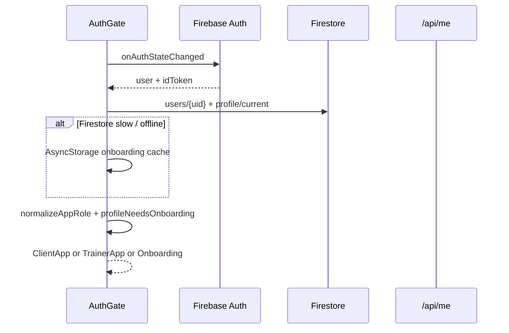
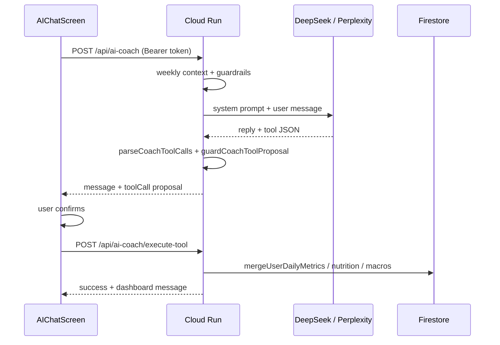

# Coach Connect — System Design

High-level design for the Expo client + Cloud Run API + Firebase backend. Complements [`ARCHITECTURE.md`](../ARCHITECTURE.md).

## 1. Actors

| Actor | App shell | Primary data |
|-------|-----------|--------------|
| Client | `ClientApp` | Own `users/{uid}`, daily logs, nutrition, workouts |
| Trainer | `TrainerApp` | CRM clients, sessions, notes, marketplace profile |
| Server | Cloud Run | Admin SDK writes, AI orchestration, food APIs |

## 2. Request flows

### 2.1 Authentication bootstrap



Firestore-first bootstrap; `/api/me` is used for **refresh** (`refetchUserData`), not initial routing.

### 2.2 AI Coach message + tool



Client-side fallbacks exist for `logNutrition` and `deleteLog` so the Nutrition tab updates immediately with the correct local date.

### 2.3 Daily dashboard metrics

| Write path | Reader |
|------------|--------|
| `mergeClientDailyMetrics` → `dailyLogs/{date}` | Home cards, `MyDashboardScreen`, coach context |
| Mirror inside service → `daily_tracking/{date}` | Legacy docs only |

Midnight rollover: `dailyDashboardDayRollover.js` archives prior day to `daily_logs/{uid}_{date}`.

### 2.4 Nutrition food search

```
FoodSearchScreen
  → foodSearchProvider (client)
  → GET /api/food/search | barcode | nutrition-details
  → server: FatSecret / USDA / Serper / OpenFoodFacts merge
  → foodNormalize.js + servingMath.js (client)
  → nutritionService.addFoodLog → Firestore food_logs
```

## 3. Security model

| Surface | Control |
|---------|---------|
| Firestore rules | Owner read/write; trainer CRM link; conversation participants |
| API routes | `verifyFirebaseBearerToken`; uid must match body `userId` |
| Tool proposals | `validateCoachToolProposal` / `isValidCoachToolProposal` — blocks informational-question false positives |
| Trainer invite code | Server `/api/onboarding/validate-trainer-code`; client fail-closed on network error |

## 4. Module boundaries

| Concern | Owns | Must not |
|---------|------|----------|
| `dailyMetricsService` | All dashboard metric writes | Duplicate writes from screens |
| `toolExecutor` | Tool name normalization + client/server routing | Direct Firestore from UI for coach tools |
| `coachToolProposalGuards` | Param sanitization + intent validation | Execute tools (proposal only) |
| `nutritionService` | Food log CRUD + goals | UI layout |
| `AuthGate` | Shell routing | Business logic for features |

## 5. Deployment

| Target | Command |
|--------|---------|
| iOS/Android dev | `npm start` / EAS development profile |
| API | `npm run api:deploy` → Cloud Run |
| Firestore indexes | `npm run test:firestore-indexes` then `firebase deploy --only firestore:indexes --project anatrox-auth` |

## 6. Observability

- Server audit logs on `execute-tool` (uid + tool name).
- `src/shared/services/monitoring.js` + `docs/MONITORING.md`.
- Client error sync: `utils/syncErrorsToServer.js`.

## 7. Future reorg (Phase 6–7)

Target layout from Desktop sessions groups files by feature (`src/ai/tools/`, `src/nutrition/food-search/`, `src/client/home/`). Use `scripts/applyFileRenames.js` with `--dry-run` before applying. See `CODEBASE_GUIDE.md`.
