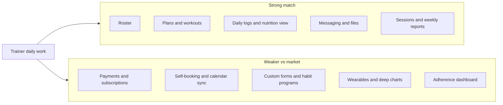

# Can you go on the web and check if I see a system on our app that matches exactly what ...

- **Session ID:** `bb3d5a73-d88d-46cf-8a31-7188bcafa0b3`
- **Last saved:** 2026-06-02 05:50:49
- **Messages:** 22 (5 from you)
- **Source:** `/Users/captainchris20/.cursor/projects/Users-captainchris20-Desktop-My-Coding-Portfolio-7th-Project-Coach-Connect-Mobile-App/agent-transcripts/bb3d5a73-d88d-46cf-8a31-7188bcafa0b3/bb3d5a73-d88d-46cf-8a31-7188bcafa0b3.jsonl`

---

## 1. You

Can you go on the web and check if I see a system on our app that matches exactly what clients or trainers want to manage? Is there anything on the app that matches exactly what trainers would like to manage and stuff from the end?

---

## 2. Cursor

Comparing industry expectations for trainer/client management with what Coach Connect actually offers. Researching both in parallel.

[REDACTED]

> *[WebSearch]*

> *[WebSearch]*

> *[SemanticSearch]*

> *[Read: /Users/captainchris20/Desktop/My-Coding-Portfolio/7th Project- Coach Connect Mobile App/docs/PRODUCT_REQUIREMENTS.md]*

---

## 3. Cursor

[REDACTED]

> *[Read: /Users/captainchris20/Desktop/My-Coding-Portfolio/7th Project- Coach Connect Mobile App/docs/TRAINER_APP_COMPETITOR_AUDI]*

> *[Read: /Users/captainchris20/Desktop/My-Coding-Portfolio/7th Project- Coach Connect Mobile App/docs/PRODUCT_REQUIREMENTS.md]*

> *[Grep: /Users/captainchris20/Desktop/My-Coding-Portfolio/7th Project- Coach Connect Mobile App/docs/PRODUCT_REQUIREMENTS.md]*

---

## 4. Cursor

[REDACTED]

> *[Grep: /Users/captainchris20/Desktop/My-Coding-Portfolio/7th Project- Coach Connect Mobile App/src]*

> *[Grep: /Users/captainchris20/Desktop/My-Coding-Portfolio/7th Project- Coach Connect Mobile App/src/trainer]*

---

## 5. Cursor

[REDACTED]

> *[Read: /Users/captainchris20/Desktop/My-Coding-Portfolio/7th Project- Coach Connect Mobile App/src/trainer/screens/PaymentsScre]*

---

## 6. Cursor

Short answer: **you cover most of what trainers and clients actually want to “manage” day to day**, but **nothing in the market matches “exactly”** what every coach wants—and Coach Connect is **strong on the coaching loop**, **weaker on running the business** (money, scheduling depth, wearables, custom forms).

Below is how that lines up with what competitors and 2025–2026 trainer software blogs emphasize, and what your own PRD and codebase say.

---

## What the market says people want to manage

From platforms like [FitPros](https://fitpros.io/personal-trainer-client-app), [Virtuagym](https://business.virtuagym.com/blog/apps-for-fitness-coaches/), [Hevy Coach](https://hevycoach.com/features/client-management/), and [CoreCoach](https://corecoach.app/), trainers typically want **one place** for:

| Area | What they want to manage |
|------|---------------------------|
| **Roster** | Client list, profiles, who’s active vs ghosting |
| **Programs** | Assign workouts, see completion/adherence |
| **Progress** | Weight, measurements, photos, check-ins |
| **Nutrition** | See what clients ate / macros |
| **Communication** | Messaging, sometimes video |
| **Schedule** | Sessions, reminders, sometimes client self-booking |
| **Business** | Payments, subscriptions, invoicing |
| **Engagement** | Habits, custom forms/check-ins, nudges |

Clients typically want to manage:

| Area | What they want |
|------|----------------|
| **Today** | Workout, log sets, watch demos |
| **Wellness** | Sleep, water, mood, habits |
| **Nutrition** | Log food, hit macros |
| **Coach relationship** | Message coach, accept sessions, see shared files |
| **Progress** | Photos, trends, “am I improving?” |

---

## What Coach Connect already matches well

Your product doc and internal [competitor audit](docs/TRAINER_APP_COMPETITOR_AUDIT.md) are aligned with the codebase: **the core coaching loop is real and shipped**, not just mock UI.

### Trainers — strong overlap

| What trainers want to manage | In your app? |
|------------------------------|--------------|
| Client roster | Yes — dashboard + client list + detail |
| Per-client CRM | Yes — **Progress, Nutrition, Calendar, Notes & Files** tabs |
| Workout plans | Yes — builder, generator, assign per client, PDF |
| See client logging | Yes — daily logs, nutrition read-only, weekly snapshot |
| Messaging | Yes — 1:1 conversations + unread badges |
| Sessions | Yes — create/edit, client accept/decline |
| Shared docs | Yes — notes/files (often *better* than bare attachments) |
| New leads | Yes — marketplace requests accept/decline |
| Weekly review | Yes — narrative weekly summaries (differentiator) |

### Clients — strong overlap

| What clients want to manage | In your app? |
|-----------------------------|--------------|
| Find / connect with a coach | Yes — marketplace + requests |
| Daily dashboard | Yes — home + My Dashboard |
| Log workouts | Yes — active workout + agenda |
| Log wellness | Yes — sleep, water, energy, mood, etc. |
| Nutrition | Yes — macro-focused logging |
| Talk to trainer | Yes — messaging |
| Sessions | Yes — invites on dashboard |
| Files & progress photos | Yes — Notes/Files + progress photos |
| AI help (bonus) | Yes — AI Coach (separate from human coach) |

So for the question *“Is there a system that matches what they want to manage?”* — **yes, for the day-to-day coaching relationship**: programs, logs, progress, chat, calendar, files. That’s the same center of gravity as Trainerize / TrueCoach / Everfit-style tools, which your PRD explicitly targets for **core loop**, not full parity.

---

## Where you do **not** match “exactly” (common gaps)

These are the things competitors often sell as “all-in-one business OS.” Your PRD marks several as **out of scope or partial**:

| Expectation (market) | Coach Connect today |
|----------------------|---------------------|
| **In-app client payments / subscriptions** | Mostly **outside the app**; PRD says coach charges off-platform. You have UI toward Stripe Connect (`PaymentsScreen`), but this isn’t the finished “Trainerize billing” story. |
| **Client self-booking (Calendly-style)** | Trainers **create** sessions; not full open booking + calendar sync |
| **Apple Health / Google Fit** | Not shipped |
| **Dedicated habit cards** (water/steps/meal prep as assignable habits) | Partial — daily logs cover much of this, but not a separate “habit program” like FitPros |
| **Custom check-in / intake forms per trainer** | Fixed onboarding only, not a form builder |
| **Adherence at a glance** (% complete, red/yellow/green roster) | **Partial** — check-in signals exist; explicit adherence UI is still thin |
| **Long-term charts** | Limited vs competitors’ trend graphs |
| **Video calls in-app** | Messaging yes; built-in video typically no |
| **Group / class training** | Not v1 |
| **Wearables** | Not v1 |

So trainers who say *“I want ONE app to run my entire business—CRM + Stripe + Calendly + habits + forms”* will feel gaps. Trainers who say *“I want to see what my clients did, adjust their plan, and message them”* will find a **close match**.

---

## Direct answer to your two questions

1. **“A system that matches exactly what clients or trainers want to manage”**  
   - **No product matches exactly**—trainers disagree on payments, forms, habits, and analytics depth.  
   - **Coach Connect matches the coaching-management stack well** (roster → client detail → workouts → logs → nutrition → messages → sessions → files → weekly report).  
   - It does **not** yet match the **business-management** stack many trainers expect (payments, deep scheduling, custom forms, wearables, roster adherence dashboards).

2. **“From the trainer end—anything that matches exactly what they’d like to manage?”**  
   - **Yes, for coaching operations** — the trainer dashboard + client detail tabs are structurally what the market describes as a client CRM.  
   - **No, for business operations** — money, automated follow-ups, client self-scheduling, and “compliance dashboard” are where you’re behind Hevy Coach / Trainerize-style positioning.

---

## Practical framing

**Bottom line:** You’re not missing a secret “trainer management” screen—the **trainer CRM shape is there and aligns with industry norms**. What you’re missing is the **second layer** trainers often lump into “manage”: **money, scheduling automation, and compliance visibility**. Clients get a strong **log + coach + plan** experience; trainers get a strong **see and coach** experience, less **run the business in-app**.

If you want to go deeper next, we can turn this into a simple **feature matrix** (Coach Connect vs Trainerize/TrueCoach row by row) or prioritize the top 3 gaps that would move the needle for *your* trainers.

[REDACTED]

---

## 7. You

so my product is great then right? Also, what do you recommend I do then for this? What do you recommend I add? Did I add anything new for now, or no?

---

## 8. Cursor

Checking recent project activity so I can answer whether anything new shipped and give focused recommendations.

[REDACTED]

> *[Shell: cd "/Users/captainchris20/Desktop/My-Coding-Portfolio/7th Project- Coach Connect Mobile App" && git log --oneline -15 2>]*

> *[Read: /Users/captainchris20/Desktop/My-Coding-Portfolio/7th Project- Coach Connect Mobile App/CHANGELOG.md]*

> *[Read: /Users/captainchris20/Desktop/My-Coding-Portfolio/7th Project- Coach Connect Mobile App/NEXT_STEPS.md]*

---

## 9. Cursor

[REDACTED]

> *[Shell: cd "/Users/captainchris20/Desktop/My-Coding-Portfolio/7th Project- Coach Connect Mobile App" && git status -sb | head -5]*

---

## 10. Cursor

## Is your product “great”?

**For what you’re building (a mobile coaching MVP), yes — it’s in a strong place.** You have a real two-sided loop: marketplace → link → messaging → plans → daily logs → nutrition → sessions → files → weekly reports. That’s more than many “fitness apps” that are only workouts or only chat.

**“Great” depends on who’s judging:**

| Audience | Likely reaction |
|----------|-----------------|
| **A client who wants one app with their coach** | Strong — logging, dashboard, trainer connection feel coherent. |
| **A trainer who only needs to coach, not bill** | Strong — roster + client detail tabs match how they actually work. |
| **A trainer who wants Trainerize + Stripe + Calendly in one** | Good core, but they’ll ask for payments, adherence dashboard, and scheduling polish. |

So: **great for launch and real coaching**, not yet **great as a full business OS**. That’s normal for v1 and your PRD already says that on purpose.

---

## What I recommend you do next

Order by **impact vs effort**, not “add more features” first.

### 1. Ship what you have (highest priority)
You have **a large amount of uncommitted work** (~173 files changed vs last commit). Before new features:

- Run your pre-release / QA path (`scripts/preReleaseCheck.sh`, AI coach tool tests, core client + trainer flows).
- **Commit and tag a test build** so you’re not guessing what’s in production.
- Fix anything that breaks the **trainer sees client data** path — that’s your product promise.

### 2. Polish what trainers feel every day (best ROI)
These close the gap vs competitors without rebuilding the app:

1. **Adherence / activity at a glance** on the trainer dashboard — e.g. “checked in today,” “workout done this week,” simple green/yellow/red per client (your PRD marks this partial).
2. **Push notifications end-to-end** — messages + session reminders (also partial in PRD).
3. **Clearer progress over time** — even 2–3 simple charts (weight, workouts/week) beat more AI surface area.

### 3. Pick one business feature, not three
Don’t spread across payments + calendar sync + wearables at once.

- If trainers are asking **“how do I get paid?”** → finish **Stripe Connect / Payments** (you already have `PaymentsScreen` and dashboard nudges).
- If they ask **“who showed up / who ghosted?”** → adherence dashboard first.
- If clients ask **“sync my Apple Watch”** → HealthKit — but that’s phase 2 in your docs.

### 4. De-prioritize for now
- Custom form builder  
- Group classes  
- Full MyFitnessPal-style nutrition  
- More AI tools until existing ones are tested and stable  

Your **AI Coach + daily metrics tools** are a differentiator only if they reliably update the dashboard — that’s a **quality** win, not a **breadth** win.

---

## Did you add anything new “for now”?

**In our chat:** No — we only compared your app to the market. Nothing was implemented in that conversation.

**In your repo:**

| When | What |
|------|------|
| **Last commits on `main` (May 13)** | Production checklist, ESLint/logging hardening, trainer client roster UI tweak, AI Coach/Food Search timeouts, dead code/asset cleanup. |
| **Documented but may be local (May 19 changelog)** | **6 new AI Coach tools** (water, steps, energy, mood, workout rating, sleep integration) + dashboard sync fixes — see `CHANGELOG.md` / `NEXT_STEPS.md`. |
| **Lots of local/uncommitted work (git status)** | Bigger refactors: server routes, AI coach capabilities, payments UI, macro recalibration, coach web search, trainer/client UI work, etc. — **not necessarily “new today,” but not all on `main` yet.** |

So: **you have added meaningful new stuff recently** (especially AI logging tools and infra polish), but **much of it may still be on your machine, not committed/pushed**. Until that’s committed and in a TestFlight/EAS build, it doesn’t count as “shipped.”

---

## One-line plan

**Stop adding features for a week.** Commit → test build → trainer adherence + notifications polish → then **either** finish payments **or** deepen progress charts — whichever your first 3 beta trainers complain about most.

If you tell me whether you’re aiming for **TestFlight soon** or **more building first**, I can narrow this to a 1-week checklist tied to your actual branch state.

[REDACTED]

---

## 11. You

so what about my app is great that ppl can move over here

---

## 12. Cursor

Pulling concrete differentiators from the product so we can frame what would make trainers and clients switch.

[REDACTED]

> *[SemanticSearch]*

> *[Grep: /Users/captainchris20/Desktop/My-Coding-Portfolio/7th Project- Coach Connect Mobile App/src]*

> *[Grep: /Users/captainchris20/Desktop/My-Coding-Portfolio/7th Project- Coach Connect Mobile App/src]*

---

## 13. Cursor

Here’s the honest “why move here” story — what’s **actually strong enough to pull people over**, not generic “we have workouts and chat.”

---

## The one sentence pitch

**Coach Connect is a single mobile home for the coach–client relationship** — find each other, train, log, message, share real files, and get weekly insight — **without** juggling texts, PDFs, MyFitnessPal, and a separate trainer app that feels like admin software.

People don’t switch for “another workout logger.” They switch when **their whole loop gets easier and feels more professional.**

---

## For **clients** — why they’d move

### 1. One app with their real coach (not a generic fitness app)
They get marketplace → request → linked coach → messaging, sessions, and shared files in one place. That beats: trainer on Instagram, plans in email, food in MFP, check-ins in a Google Form.

### 2. A dashboard that’s built for *accountability*, not just workouts
Sleep, water, energy, mood, weight, training agenda, nutrition card, weekly report — it’s a **daily hub**, not only “today’s workout.” Competitors have pieces of this; yours is wired as **home + My Dashboard** as the center of gravity.

### 3. AI Coach that *does things* (and stays separate from the human coach)
Your AI isn’t just chat — it can log water, steps, sleep, mood, nutrition, adjust macros, etc., and sync to the dashboard. Important selling point: **human trainer doesn’t automatically see AI chats** — less weird for clients who want a private assistant *and* a real coach.

### 4. Notes & files that feel like a shared workspace
Progress photos, PDFs, **spreadsheets in-app** — trainer uploads, client sees it live. Many apps stop at “attach a file in chat.” You’re closer to **shared coaching folder**.

### 5. Experience quality (underrated switch driver)
Your UI is premium and cohesive (dark-first, polished cards, trainer/client symmetry). Clients **feel** the difference vs clunky legacy trainer apps — that matters for retention even if feature lists look similar on paper.

**Client switch line:** *“Everything with my coach lives in one beautiful app — my plan, my logs, our files, and my week in review.”*

---

## For **trainers** — why they’d move

### 1. Built-in client discovery (not just delivery)
Marketplace + profiles + filters + accept/decline requests means trainers aren’t only managing existing clients — they can **grow on-platform**. Trainerize/TrueCoach are strong for *existing* clients; **finding** clients often still happens elsewhere. That’s a real wedge if you market it.

### 2. A real CRM per client, not scattered tools
Roster → client detail with **Progress, Nutrition, Calendar, Notes & Files** — that’s the exact mental model trainers expect. They can see daily logs, nutrition, sessions, and files without exporting spreadsheets.

### 3. Weekly reports that do the recap for them
Your weekly summaries aren’t just charts — they include narrative, wins, focus areas, pros/cons (from logged data). That saves the Sunday-night “let me DM everyone how their week went” grind. **Coaching time back** is a concrete switch reason.

### 4. Workout delivery + builder + PDF + AI assist
Plan builder, exercise library, assign per client, PDF export/send to trainer flow — covers “program delivery” without forcing trainers to live in Google Docs. AI workout generation is a **speed** story for busy coaches (experimental, but compelling in demos).

### 5. Richer document workflow than most competitors
Shared PDFs and spreadsheets, realtime sync — good for meal plans, periodization sheets, assessment forms stored as docs. Trainers who live in **Sheets + PDFs** today feel at home.

### 6. Lower friction than “enterprise” stacks (today)
No forced Stripe/subscription complexity on day one (payments are evolving). For coaches leaving spreadsheets + WhatsApp, **“start coaching tomorrow”** can beat “configure billing + integrations first.”

**Trainer switch line:** *“I get clients, coach them, see their week, and share plans — without five apps and weekend recap DMs.”*

---

## What’s **not** your main “move here” pitch (be honest)

Don’t lead with these when recruiting switchers — they’ll compare you to Trainerize and bounce:

- In-app payments / full billing (still maturing vs display-only history)
- Apple Health / wearables
- Client self-booking like Calendly
- Group classes
- Custom form builder

Lead with **coaching loop + marketplace + weekly intelligence + files + AI that executes + polish.**

---

## Who will actually move (target personas)

| Person | Likely to switch |
|--------|------------------|
| Coach on **WhatsApp + PDFs + Excel** | High — you’re a huge upgrade |
| Coach on **Trainerize** who hates cost/complexity and doesn’t need billing in-app | Medium — if you nail adherence + reports |
| Coach who **needs** Stripe + habits + HealthKit on day one | Low until those ship |
| Client whose trainer **already** adopted Coach Connect | High — follows the coach |
| Client shopping for a coach in-app | High — marketplace is the hook |

---

## How to say it in marketing (3 bullets you can use)

1. **All-in-one coaching home** — plans, logs, nutrition, messages, sessions, files.  
2. **Smarter weeks** — auto weekly reports from what clients actually log.  
3. **Find + grow** — marketplace for trainers; clients discover coaches in-app.

Plus a fourth only if it’s stable in your build: **AI that logs and updates your dashboard**, private from your human coach.

---

## Bottom line

Your app is “great” for switching when the buyer is tired of **fragmented coaching** (texts + PDFs + separate loggers). It’s **not** yet the obvious switch for someone who only cares about **billing + wearables + Calendly**.

**Best migration story today:** trainers leaving chaos; clients who want one professional app with *their* coach; anyone who values **weekly recap + shared files + AI logging** over enterprise billing.

If you want, I can turn this into a short **landing page draft** (trainer version + client version) or a **30-second demo script** that hits only these switch reasons.

[REDACTED]

---

## 14. You

is it also great for trainers who already have clients and clients already have trainers, and is also good for clients that don't even want a trainer, they just want to track products and stuff

---

## 15. Cursor

Checking how the app behaves with an existing coach link vs. no trainer, and what solo clients can use.

[REDACTED]

> *[SemanticSearch]*

> *[Grep: /Users/captainchris20/Desktop/My-Coding-Portfolio/7th Project- Coach Connect Mobile App/src/app/ClientApp.js]*

> *[Grep: /Users/captainchris20/Desktop/My-Coding-Portfolio/7th Project- Coach Connect Mobile App/docs/PRODUCT_REQUIREMENTS.md]*

---

## 16. Cursor

[REDACTED]

> *[Grep: /Users/captainchris20/Desktop/My-Coding-Portfolio/7th Project- Coach Connect Mobile App/src/client]*

> *[Read: /Users/captainchris20/Desktop/My-Coding-Portfolio/7th Project- Coach Connect Mobile App/docs/PRODUCT_REQUIREMENTS.md]*

> *[Grep: /Users/captainchris20/Desktop/My-Coding-Portfolio/7th Project- Coach Connect Mobile App/src/client/screens/MyDashboardSc]*

---

## 17. Cursor

[REDACTED]

> *[Grep: /Users/captainchris20/Desktop/My-Coding-Portfolio/7th Project- Coach Connect Mobile App/src/trainer]*

> *[Grep: /Users/captainchris20/Desktop/My-Coding-Portfolio/7th Project- Coach Connect Mobile App/src/client/navigation/ClientMain]*

> *[Read: /Users/captainchris20/Desktop/My-Coding-Portfolio/7th Project- Coach Connect Mobile App/src/settings/screens/HelpFAQScre]*

---

## 18. Cursor

[REDACTED]

> *[Read: /Users/captainchris20/Desktop/My-Coding-Portfolio/7th Project- Coach Connect Mobile App/src/client/navigation/ClientMain]*

> *[Read: /Users/captainchris20/Desktop/My-Coding-Portfolio/7th Project- Coach Connect Mobile App/src/trainer/screens/TrainerMessa]*

---

## 19. Cursor

[REDACTED]

> *[Grep: /Users/captainchris20/Desktop/My-Coding-Portfolio/7th Project- Coach Connect Mobile App/src/client]*

---

## 20. Cursor

Here’s a straight split across the three situations you asked about.

---

## 1. Trainers who **already have clients**

**Yes — this is one of your best fits**, as long as you frame it correctly.

Those coaches aren’t buying “find new clients” first; they’re buying **one place to run the relationship**:

- Roster + per-client CRM (progress, nutrition, calendar, notes/files)
- Messaging and session invites
- Workout plans assigned per client
- Weekly snapshots from what clients log

They can bring people over without the marketplace: **add/link clients** from the trainer side (roster / messaging flows), and the client links when the relationship is accepted in-app.

**What to expect in real life:**

| Good | Friction |
|------|----------|
| Less WhatsApp + PDF + spreadsheet chaos | Everyone must **sign up** and get linked |
| Professional client experience | **Old history** (Trainerize logs, years of MFP) doesn’t auto-import |
| Weekly reports from new logging | First 1–2 weeks feel “empty” until they log in your app |

**Pitch for them:** *“Keep your clients; upgrade how you deliver and review their week — not ‘start over on a new platform.’”*

**Not “great” yet if** they need in-app billing, Calendly-style booking, or custom intake forms on day one.

---

## 2. Clients who **already have a trainer**

**Also a strong fit** — but the **coach usually has to drive the switch**.

The app is built for that loop: message coach, accept sessions, see shared files, trainer sees their logs. Your FAQ already describes that: request → accept → messaging, files, scheduling.

**Good for them when:**

- Their trainer moves the whole practice to Coach Connect
- They want one app for plan + logs + coach chat + weekly recap
- They like AI Coach **on the side** (private from the human coach)

**Awkward when:**

- Trainer stays on Trainerize but client downloads you alone → **half the product** (solo tracking + AI, no human-coach integration)
- They only wanted a food logger and their coach isn’t on the app

**Pitch for them:** *“Everything with **your** coach in one app”* — not *“best solo fitness app on earth.”*

---

## 3. Clients who **don’t want a trainer** — just want to track

**Good enough as a secondary use case; not what the product is optimized for.**

Your PRD explicitly supports **client with no trainer**: onboarding → home → dashboard, workouts, nutrition, AI Coach. The marketplace hero only shows when they **don’t** have a trainer; the rest of the app still works.

**What solo users can do well today:**

- Daily dashboard (sleep, water, mood, energy, weight, etc.)
- Workouts (plans, logging, exercise library)
- Nutrition (macro-focused logging, barcode, etc.)
- AI Coach to log and answer fitness/nutrition questions
- Progress photos / personal files
- Weekly-style reports from **their own** logging

**Where they’ll compare you to MyFitnessPal / Strong / Apple Health and feel gaps:**

- No Apple Health / Google Fit sync (yet)
- Nutrition is **macro coaching**, not “every product in the universe”
- UI and copy still **assume** many users will find or have a coach (marketplace, trainer card, session flows)
- Some value (shared files, session invites, trainer-visible progress) **doesn’t apply** without a coach

**Honest positioning:**  
Coach Connect can work as **“track + AI coach”** for people without a trainer, but it’s **not** the #1 reason to download today. It’s more **“I’m training solo for now, and I might get a coach later without switching apps.”**

If you marketed hard to “no trainer, just products/macros,” you’d compete with MFP on depth and lose unless you lean into **AI + weekly recap + workouts in one polished app**.

---

## Quick matrix

| User | Great fit today? | Why |
|------|------------------|-----|
| Trainer + existing roster | **Yes** | CRM + delivery + reports replace their current stack |
| Client + existing trainer (both on app) | **Yes** | Full coach–client loop |
| Client + trainer **not** on app | **Meh** | Solo features only; coach features idle |
| Client, no trainer, solo tracking | **Okay / partial** | Works, but not your sharpest edge vs pure trackers |

---

## One line for each audience

- **Trainer with clients:** “Move your roster here; coach better with less admin.”  
- **Client with trainer:** “One app with your coach — not another generic fitness app.”  
- **Client, no trainer:** “Track and use AI Coach now; add a human coach later if you want — but we’re not trying to beat MyFitnessPal at product search alone.”

---

## If you want solo trackers to feel “great” later (optional product direction)

You wouldn’t need a rebuild — mostly **positioning + a few product choices**:

1. **“Solo mode”** onboarding path: “No coach right now” → hide marketplace pressure, emphasize dashboard + AI + workouts  
2. **Health sync** (biggest solo complaint in your FAQ)  
3. **Clearer nutrition story** for self-trackers (favorites, recent foods, supplements if that’s what you mean by “products”)

---

**Bottom line:** You’re **great** for *existing coach–client pairs moving together*. You’re **good but not primary** for *people who only want tracking and will never use a trainer* — unless you deliberately productize that path.

If “track products” meant **supplements / retail products** rather than food logging, say so — that’s a different feature set than what the app is built around today.

[REDACTED]

---

## 21. You

do i need to add wearable right now or no

---

## 22. Cursor

**No — you don’t need wearables right now** for launch or for the core coach–client product to work.

Your own docs already treat it that way:

- **PRD non-goals (v1):** Apple Health / Google Fit sync is **Phase 2**
- **Competitor audit:** wearables are **not a launch blocker**; many trainer apps ship without them first
- **FAQ:** progress comes from what users log in-app — no Health sync today

---

## When wearables *do* matter

Add them **later** if you hear the same thing repeatedly from real users:

- Solo clients: *“I already track steps/sleep on my Watch — why re-log?”*
- Trainers: *“I need steps/sleep without nagging clients”*
- You’re marketing hard against **Apple Health / Whoop / Oura** as a daily tracker

Until then, it’s **nice-to-have**, not **must-have**.

---

## What to do instead right now (higher ROI)

1. **Ship and stabilize** linking, logging, messaging, plans, weekly reports  
2. **Trainer adherence view** (who logged today / this week)  
3. **Push notifications** working end-to-end  
4. **Optional:** let AI Coach accept steps/sleep from voice/chat (you’re partly there) so power users aren’t blocked

---

## Practical rule

| Stage | Wearables? |
|--------|------------|
| First TestFlight / beta with coaches | **No** |
| 10+ trainers asking for Health sync | **Plan it** |
| Positioning as “best solo tracker” vs MFP/Apple Health | **Yes, sooner** |

**Bottom line:** Skip wearables for now. Finish the coaching loop and get trainers + clients logging **in your app** first; add HealthKit/Google Fit when retention data or user feedback says you’re losing people because of double entry.

[REDACTED]

---
