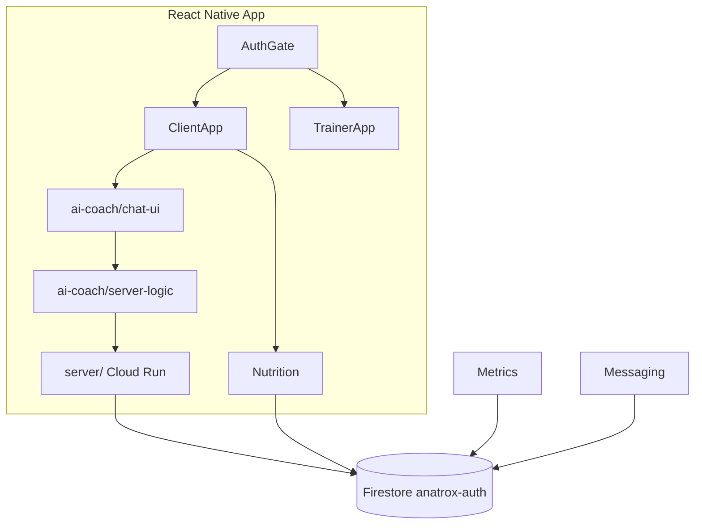

# Coach Connect — Architecture Guide

Where code lives after the 2026 folder rename, and where to put new code.

Firebase production project ID: **`anatrox-auth`** (never rename in config).

---

## High-level map

```
App.js
 └── src/app-start/AuthGate.js          ← auth + role routing
      ├── src/auth/                     ← login, onboarding (pre-shell)
      ├── src/client-app/               ← client role UI + navigation
      ├── src/trainer-app/              ← trainer role UI + navigation
      └── shared shells import from ↓

Feature domains (imported by role apps):
 ├── src/nutrition/
 ├── src/workouts/
 ├── src/ai-coach/          ← chat UI + client-side coach API helpers
 ├── src/messaging/         ← trainer/client chat screens
 ├── src/metrics/           ← daily metrics + quotes
 ├── src/notifications/     ← push tokens + notification copy
 └── src/settings/          ← legal, support, settings screens

Shared layers (any feature may import):
 ├── src/shared/            ← API clients, Firestore helpers, big components
 ├── src/shared-ui/         ← theme, layout, glass UI primitives
 ├── src/shared-utils/      ← pure functions (dates, sanitize, format)
 ├── src/navigation/        ← route names, linking, bottom nav
 └── src/utils/             ← app-wide utilities (logout, error sync)

Backend (separate tree):
 └── server/                ← Express API on Cloud Run
```

---

## Folder responsibilities

### `app-start/`

Entry orchestration only: `AuthGate`, `ClientApp`, `TrainerApp`, Firebase `config.js`.

- Do **not** put feature screens here.
- Do **not** add business logic — delegate to feature folders.

### `client-app/` and `trainer-app/`

Role-specific composition layers.

| Subfolder | Purpose |
|-----------|---------|
| `navigation/` | Stack/tab navigators, overlay screens, nav hooks |
| `screens/` | Thin wrappers or role-specific screens |
| `components/` | Role-only UI pieces |
| `hooks/` | Role data-fetching hooks |
| `home/`, `dashboard/` | Home tab composition |
| Feature mirrors | e.g. `workout-plans/`, `weekly-report/` when trainer/client differ |

Import **canonical implementations** from `shared/`, `messaging/`, `nutrition/`, etc. Prefer re-export shims in `screens/` only when navigation expects a local path.

### `ai-coach/`

All AI coach functionality, split by concern:

```
ai-coach/
├── chat-ui/           ← React Native screens, modals, formatting
│   ├── chat-thread/   ← main chat screen
│   ├── chat-home/     ← coach home (re-export entry)
│   ├── tool-modals/   ← macro/goal adjustment sheets
│   ├── components/    ← reply bubbles, markdown, web search UI
│   ├── lib/           ← parsing, clipboard, markdown styles
│   └── persistence/   ← Firestore message save/load
├── server-logic/      ← client-side API + context (calls Cloud Run)
│   ├── chat-api/
│   ├── context/
│   ├── tools/
│   ├── trainer-messaging/   ← Firestore chat CRUD (shared with messaging/)
│   └── services/
└── tools/             ← tool call parsing shared by UI + server-logic
```

Server-side AI routing lives in **`server/`**, not here.

### `nutrition/`, `workouts/`

Self-contained feature domains. Structure by user flow:

- `screens/` or flow folders (`food-search/`, `daily-log/`, `plan-builder/`)
- `components/` for reusable pieces within the domain
- Firestore writes in dedicated modules (e.g. `logFoodToFirestore.js`)

### `metrics/`

Daily dashboard data — **`daily-metrics/`** is the only place that should write `users/{uid}/dailyLogs/{date}`.

### `messaging/`

Canonical chat UI: conversation list + message thread.

Firestore service layer: **`ai-coach/server-logic/trainer-messaging/sendTrainerNotification.js`**.

### `shared/`, `shared-ui/`, `shared-utils/`

| Layer | Import when… |
|-------|----------------|
| `shared-utils/` | Pure function, no React, no Firebase |
| `shared-ui/` | Theme, layout, glass components |
| `shared/` | API clients, Firestore queries, large cross-feature components |

**Dependency rule:** `shared-utils` → nothing in src. `shared-ui` → may use `shared-utils`. `shared` → may use both. Features → may use all three. Never import `client-app` from `trainer-app` or vice versa.

### Assets

| Location | Use for |
|----------|---------|
| `/assets/` (repo root) | Expo `icon.png`, `splash.png` only |
| `/src/assets/` | In-app images, Lottie JSON, onboarding art |

---

## Data flow (simplified)



---

## Adding new code — decision tree

1. **Is it only used in one role (client or trainer)?**  
   → `client-app/` or `trainer-app/`

2. **Is it a full product feature (food, workouts, coach)?**  
   → top-level feature folder (`nutrition/`, `workouts/`, `ai-coach/`)

3. **Is it a pure helper with no UI?**  
   → `shared-utils/`

4. **Is it a reusable UI primitive?**  
   → `shared-ui/`

5. **Is it used by 2+ features?**  
   → `shared/` (pick `components/`, `services/`, or `api/`)

6. **Is it a new API route or secret-bearing logic?**  
   → `server/` (never put API keys in `src/`)

7. **Is it a test?**  
   → `src/__tests__/unit/` or `integration/` mirroring the module path

---

## Related docs

- [`SRC_FILE_CATALOG.md`](SRC_FILE_CATALOG.md) — every file described
- [`AUDIT_REPORT.md`](AUDIT_REPORT.md) — structure audit findings
- [`NAMING_CONVENTIONS.md`](NAMING_CONVENTIONS.md) — file naming rules
- [`FEATURE_TEMPLATE.md`](FEATURE_TEMPLATE.md) — scaffold for new features
- [`STYLE_GUIDE.md`](STYLE_GUIDE.md) — imports and dependency rules
- [`../CODEBASE_GUIDE.md`](../CODEBASE_GUIDE.md) — quick start at repo root
